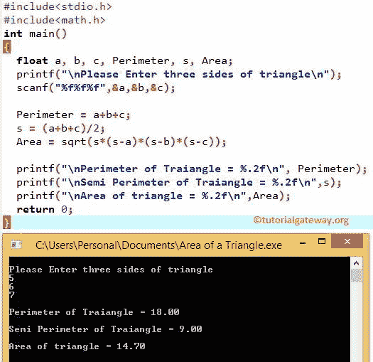

# C 程序：寻找三角形面积

> 原文：<https://www.tutorialgateway.org/c-program-to-find-area-of-a-triangle/>

如何用例子编写 C 程序求三角形的面积和周长？。在我们进入 C 中三角形面积的程序之前，让我们看看周长和面积后面的定义和公式。

## 三角形的面积

如果我们知道一个三角形的三条边的长度，我们可以用 Heron 的公式 来计算三角形的面积

三角形的面积=√(s *(s-a)*(s-b)*(s-c))
s =(a+b+ c)/2(这里 s =半周长，a、b、c 是三角形的三条边)

三角形的周长= a+b+c

### 求三角形面积和周长的 c 程序

这个 c 中三角形面积的程序允许用户输入三角形的三条边。使用这些值，我们将计算三角形的周长，三角形的半周长，然后三角形的面积。

```c
#include<stdio.h>
#include<math.h>

int main()
{
  float a, b, c, Perimeter, s, Area;

  printf("\nPlease Enter three sides of triangle\n");
  scanf("%f%f%f",&a,&b,&c);

  Perimeter = a+b+c;
  s = (a+b+c)/2;
  Area = sqrt(s*(s-a)*(s-b)*(s-c));

  printf("\n Perimeter of Traiangle = %.2f\n", Perimeter);
  printf("\n Semi Perimeter of Traiangle = %.2f\n",s);
  printf("\n Area of triangle = %.2f\n",Area);

  return 0;
}
```

第一步:在这个 [C 程序](https://www.tutorialgateway.org/c-programming-examples/)中，用户将输入三角形 a、b、C 的三条边。

第二步:用公式 P = a+b+c 计算三角形的周长

第三步:用公式(a+b+c)/2 计算半周长。虽然我们可以写半周长=(周长/2)，但我们想展示后面的公式。这就是为什么我们使用了标准公式

第四步:使用赫伦公式计算三角形的面积:

sqrt(s *(s-a)*(s-b)*(s-c))；

[sqrt()函数](https://www.tutorialgateway.org/c-sqrt-function/)是 [C 编程](https://www.tutorialgateway.org/c-programming/)数学函数，用于计算平方根。请小心放置开括号和闭括号，如果放置错误，可能会改变整个计算。



### 用函数求三角形面积的 c 程序

c 程序中三角形的这个区域允许用户输入三角形的三条边。我们将把这三个值传递给函数参数来计算三角形的面积。

```c
#include<stdio.h>
#include<math.h>

float AreaofaTriangle(float, float, float);

main()
{
   float a, b, c, Area;

   printf("\n Please Enter the three sides of triangle\n");
   scanf("%f%f%f",&a,&b,&c);

   Area = AreaofaTriangle(a, b, c);
   printf("\nArea of triangle = %.2f\n", Area);

   return 0;
}

float AreaofaTriangle( float a, float b, float c )
{
   float s, Area;

   s = (a+b+c)/2;
   Area = sqrt(s*(s-a)*(s-b)*(s-c));
   return Area;
}
```

```c
 Please Enter the three sides of triangle
5
6
7

Area of triangle = 14.70
```

我们在头文件后面用三个参数声明了这个函数。用户将输入三角形的三条边 a、b、c。

接下来，通过调用我们在 main()开头声明的函数来计算三角形的周长。该函数将调用主函数，该主函数的执行将从这里 开始

*   这里，我们将半周长值声明为 s 和面积。
*   接下来，我们使用公式(a+b+c)/2 计算半周长。
*   用 Heron 公式计算三角形的 C 面积:sqrt(s *(s-a)*(s-b)*(s-C))；(sqrt()是数学函数，用于计算平方根。

完成函数执行后，将返回面积值。接下来，打印输出