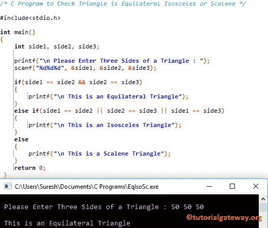

# C 程序：检查三角形是等边等腰还是不等边

> 原文：<https://www.tutorialgateway.org/c-program-check-triangle-equilateral-isosceles-scalene/>

用实例编写一个 C 程序来检验三角形是等边等腰三角形还是不等边三角形。例如，a、b 和 c 是边。

*   等边:如果所有边都相等，那么它就是等边三角形。a= b = c
*   等腰:如果两条边中的任何一条相等，它就是等腰三角形。a= b 或 a= c 或 b = c
*   斜角:如果两边都不相等，那就是斜角三角形。a！= b！= c

## 检查三角形是等边等腰还是不等边的 c 程序示例

这个[程序](https://www.tutorialgateway.org/c-programming-examples/)帮助用户输入三角形的所有边。然后[程序](https://www.tutorialgateway.org/c-programming/)使用[否则](https://www.tutorialgateway.org/else-if-statement-in-c/)找出它是等边三角形、等腰三角形还是不等边三角形。

```c
/* C Program to Check Triangle is Equilateral Isosceles or Scalene */

#include<stdio.h>

int main()
{
	int side1, side2, side3;

  	printf("\n Please Enter Three Sides of a Triangle : ");
  	scanf("%d%d%d", &side1, &side2, &side3);

  	if(side1 == side2 && side2 == side3)
  	{
  		printf("\n This is an Equilateral Triangle");
 	}
 	else if(side1 == side2 || side2 == side3 || side1 == side3)
 	{
 		printf("\n This is an Isosceles Triangle");
	}
	else
	{
		printf("\n This is a Scalene Triangle");
	}  
 	return 0;
 }
```



让我试试另一个值

```c
 Please Enter Three Sides of a Triangle : 60 40 60

 This is an Isosceles Triangle
```

另一个

```c
 Please Enter Three Sides of a Triangle : 60 50 40

 This is a Scalene Triangle
```