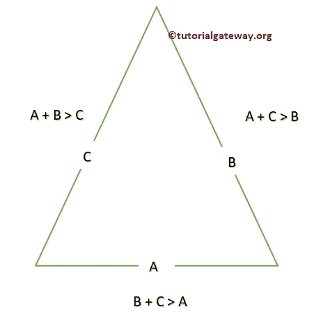
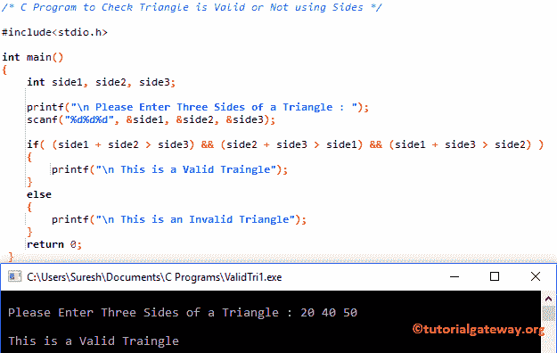

# C 程序：用边检查三角形是否有效

> 原文：<https://www.tutorialgateway.org/c-program-check-triangle-valid-not-using-sides/>

写一个 C 程序来检查三角形是否有效。如果三角形的两条边之和大于第三条边，那么任何三角形都是有效的。例如，A、B 和 C 是三角形的边:



## 用边检查三角形是否有效的程序示例 1

这个程序帮助用户输入三角形的所有边。然后用 [If Else](https://www.tutorialgateway.org/if-else-statement-in-c/) 检查是否有效。

```c
/* C Program to Check Triangle is Valid or Not using Sides */

#include<stdio.h>

int main()
{
	int side1, side2, side3;

  	printf("\n Please Enter Three Sides of a Triangle : ");
  	scanf("%d%d%d", &side1, &side2, &side3);

  	if( (side1 + side2 > side3) && (side2 + side3 > side1) && (side1 + side3 > side2) )
  	{
  		printf("\n This is a Valid Tringle");
 	}
	else
	{
		printf("\n This is an Invalid Triangle");
	}  
 	return 0;
 }
```



让我试试另一个值

```c
 Please Enter Three Sides of a Triangle : 20 30 90

 This is an Invalid Triangle
```

## 使用边检查三角形是否有效的程序示例 2

在这个[程序](https://www.tutorialgateway.org/c-programming-examples/)中，我们使用 [C 编程](https://www.tutorialgateway.org/c-programming/)嵌套 If 语句来检查三角形是否有效。

```c
/* C Program to Check Triangle is Valid or Not using Sides */

#include<stdio.h>

int main()
{
	int side1, side2, side3;

  	printf("\n Please Enter Three Sides of a Triangle : ");
  	scanf("%d%d%d", &side1, &side2, &side3);

  	if(side1 + side2 > side3)
  	{
  		if(side2 + side3 > side1)
  		{
  			if(side1 + side3 > side2)
  			{
  				printf("\n This is a Valid Tringle");

			}
			else
			{
				printf("\n This is an Invalid Triangle");
			}			  
		}
		else
		{
			printf("\n This is an Invalid Triangle");
		}
 	}
	else
	{
		printf("\n This is an Invalid Triangle");
	}  
 	return 0;
 }
```

```c
 Please Enter Three Sides of a Triangle : 25 65 56

 This is a Valid Triangle
```

### 使用边检查三角形是否有效的程序示例 3

这个程序和上面的一样，但是这次，我们删除了 Else 块。如果[嵌套内的条件为真，那么标志值将增加到 1。接下来，我们使用](https://www.tutorialgateway.org/nested-if-in-c/) [If 语句](https://www.tutorialgateway.org/if-statement-in-c/)来检查标志值是否打开。

```c
/* C Program to Check Triangle is Valid or Not using Sides */

#include<stdio.h>

int main()
{
	int side1, side2, side3; 
	int flag = 0;

  	printf("\n Please Enter Three Sides of a Triangle : ");
  	scanf("%d%d%d", &side1, &side2, &side3);

  	if(side1 + side2 > side3)
  	{
  		if(side2 + side3 > side1)
  		{
  			if(side1 + side3 > side2)
  			{
  				flag = 1;				
			}			  
		}
 	}
 	if(flag == 1)
 	{
 		printf("\n This is a Valid Tringle");
	}
	else
	{
		printf("\n This is an Invalid Triangle");
	}  
 	return 0;
 }
```

```c
 Please Enter Three Sides of a Triangle : 7 5 6

 This is a Valid Tringle
```