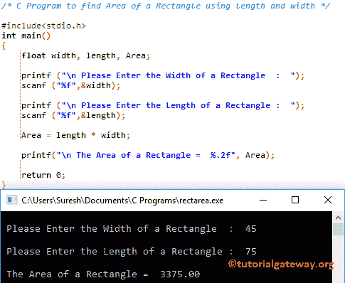

# C 程序：用长度和宽度计算矩形面积

> 原文：<https://www.tutorialgateway.org/c-program-find-area-rectangle-using-length-width/>

用例子写一个 C 程序，用长度和宽度来计算矩形的面积。

## 用长度和宽度计算矩形面积的程序

该[程序](https://www.tutorialgateway.org/c-programming-examples/)允许用户输入矩形的长度和宽度。使用这些值， [C 编程](https://www.tutorialgateway.org/c-programming/)将计算矩形的面积。

提示:如果我们知道矩形的长度和宽度，那么我们可以用公式计算矩形的面积:面积=长度*宽度

```c
/* C Program to find Area of a Rectangle using length and width */

#include<stdio.h>
int main()
{
  	float width, length, Area; 

  	printf ("\n Please Enter the Width of a Rectangle  :  ");
  	scanf ("%f",&width);

  	printf ("\n Please Enter the Length of a Rectangle :  ");
  	scanf ("%f",&length);

  	Area = length * width;

	printf("\n The Area of a Rectangle =  %.2f", Area);

  	return 0;
}
```

