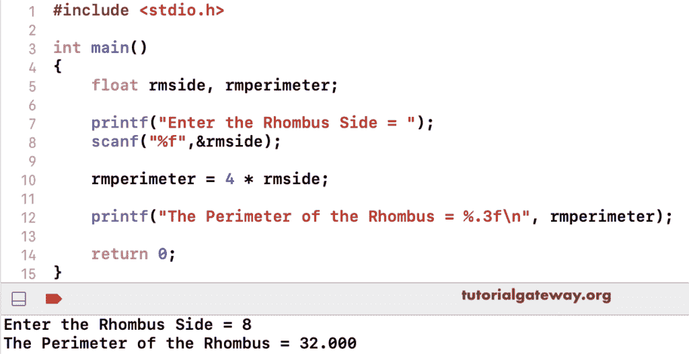

# C 程序：计算菱形周长

> 原文：<https://www.tutorialgateway.org/c-program-to-find-perimeter-of-a-rhombus/>

用例子写一个求菱形周长的 C 程序。求菱形周长的数学公式是 4 *边。这个 C 例子允许输入菱形边并返回周长。

```c
#include <stdio.h>

int main()
{
    float rmside, rmperimeter;

    printf("Enter the Rhombus Side = ");
    scanf("%f",&rmside);

    rmperimeter = 4 * rmside;

    printf("The Perimeter of the Rhombus = %.3f\n", rmperimeter);

    return 0;
}
```



在这个 C 程序中，我们创建了一个函数来计算和返回菱形周长。

```c
#include <stdio.h>

float rhombusPerimeter(float side)
{
    return 4 * side;
}

int main()
{
    float rmside, rmperimeter;

    printf("Enter the Rhombus Side = ");
    scanf("%f",&rmside);

    rmperimeter = rhombusPerimeter(rmside);

    printf("The Perimeter of a Rhombus = %.3f\n", rmperimeter);

    return 0;
}
```

```c
Enter the Rhombus Side = 12
The Perimeter of a Rhombus = 48.000
```

用指针计算菱形周长的 c 程序。

```c
#include <stdio.h>

void rhombusPerimeter(float *rmside, float *rmperimeter)
{
    *rmperimeter = 4 * (*rmside);
}

int main()
{
    float rmside, rmperimeter;

    printf("Enter the Rhombus Side = ");
    scanf("%f",&rmside);

    rhombusPerimeter(&rmside, &rmperimeter);

    printf("The Perimeter of a Rhombus = %.3f\n", rmperimeter); 

    return 0;
}
```

```c
Enter the Rhombus Side = 32
The Perimeter of a Rhombus = 128.000
```