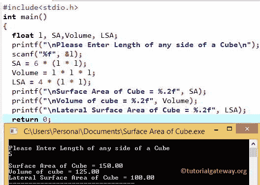

# C 程序：求立方体体积和表面积

> 原文：<https://www.tutorialgateway.org/c-program-to-find-volume-and-surface-area-of-a-cube/>

如何用例子编写 C 程序求立方体的体积和表面积？。在我们进入 C 程序寻找立方体的体积和表面积之前，让我们看看立方体表面积和立方体体积背后的定义和公式。

## c 立方结构

立方体中的所有边都有相同的长度。我们可以说，立方体只不过是六个相等的正方形。

### 立方体的表面积

如果我们知道立方体中一条边的长度，那么我们可以使用以下公式计算立方体的表面积:

*   立方体的表面积= 6l(其中 l 是立方体任意一边的长度)。
*   因为立方体是由 6 个相等的正方形组成的，所以立方体的表面积= 6l

如果我们已经知道立方体的表面积，那么我们可以通过改变上面的公式来计算任意边的长度:

*   l = √sa / 6 (sa =立方体的表面积)

### 立方的体积

立方体内部称为体积的空间量。如果我们知道立方体任何一条边的长度，那么我们可以用下面的公式计算立方体的体积:

*   体积= l * l * l
*   立方体的侧面面积= 4 *(1 * 1)

## 求立方体体积和表面积的程序

这个 C 程序允许用户输入立方体的任何一面。通过使用这个值，这个 C 程序将根据公式计算出立方体的表面积、体积和侧面面积。

```c
/* C Program to find Volume and Surface Area of a Cube */

#include 

int main()
{
  float l, SA,Volume, LSA;

  printf("\n Please Enter Length of any side of a Cube \n");
  scanf(" %f ", &l);

  SA = 6 * (l * l);
  Volume = l * l * l;
  LSA = 4 * (l * l);

  printf("\n Surface Area of Cube = %.2f", SA);
  printf("\n Volume of cube = %.2f", Volume);
  printf("\n Lateral Surface Area of Cube = %.2f", LSA);

  return 0;
}
```



在这个 [C 程序](https://www.tutorialgateway.org/c-programming-examples/)中，我们输入了立方体任意一边的长度= 5

立方体的表面积为
立方体的表面积= 6 *长度*长度
立方体的表面积= 6 * 5 * 5
立方体的表面积= 150

立方体的体积为
立方体的体积=长度*长度*长度
立方体的体积= 5 * 5 * 5；
立方体的体积= 125

立方体的侧表面积为
立方体的侧表面积= 4 *长度*长度
立方体的侧表面积= 4 * 5 * 5
立方体的侧表面积= 100

在上面的 [C 编程](https://www.tutorialgateway.org/c-programming/)例子中，当长度= 5 时，我们得到了立方体的表面积= 150。让我们用相反的方法(用表面积= 150 来计算立方体的长度)

立方体长度= √sa / 6
立方体长度= √150 / 6
立方体长度= √25
立方体长度= 5