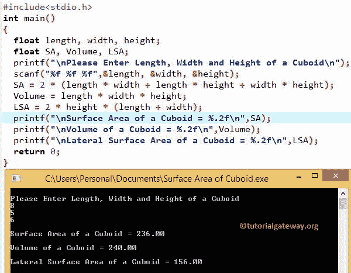

# C 程序：求长方体体积和表面积

> 原文：<https://www.tutorialgateway.org/c-program-to-find-volume-and-surface-area-of-a-cuboid/>

如何用实例编写 C 程序求长方体的体积和表面积？在我们进入 C 程序寻找长方体的体积和表面积之前，让我们看看长方体的表面积、顶面和底面面积、侧面面积和体积后面的定义和公式

## 长方体

长方体是由 6 个矩形组成的三维物体。所有相对的面(即顶面和底面)都是相等的。

### 长方体的表面积

长方体的总表面积是长方体中所有 6 个矩形面积的总和。如果我们知道长方体的长度、宽度和高度，那么我们可以使用以下公式计算总表面积:

*   顶面和底面面积= lw+lw = 2w
*   前后表面面积=左侧+左侧= 2 小时
*   两侧面积= wh + wh = 2wh

长方体的总表面积是所有 6 个面的总和。因此，我们必须将所有这些面积相加来计算最终的表面积

*   长方体的总表面积= 21w+2lh+2wh
*   相等:总表面积= 2 (lw + lh +wh)

### 长方体的体积

长方体内部的空间量叫做体积。如果我们知道长方体的长、宽、高，那么我们可以用公式计算体积:

*   长方体的体积=长*宽*高
*   长方体的体积=磅
*   长方体的侧面面积= 2h (l + w)

## 求长方体体积和表面积的 c 程序

这个 C 程序允许用户输入长方体的长度、宽度和高度。通过使用这些值，C 程序将根据公式计算长方体的表面积、体积和侧面表面积。

```c
/* C Program to find Volume and Surface Area of a Cuboid */
#include <stdio.h>

int main()
{
  float length, width, height;
  float SA, Volume, LSA;

  printf("\nPlease Enter Length, Width and Height of a Cuboid\n");
  scanf("%f %f %f",&length, &width, &height);

  SA = 2 * (length * width + length * height + width * height);
  Volume = length * width * height;
  LSA = 2 * height * (length + width);

  printf("\n The Surface Area of a Cuboid = %.2f\n",SA);
  printf("\n The Volume of a Cuboid = %.2f\n",Volume);
  printf("\n The Lateral Surface Area of a Cuboid = %.2f\n",LSA);

  return 0;
}
```



在上面的 [C 程序](https://www.tutorialgateway.org/c-programming-examples/)中，为了计算长方体的体积和表面积，我们插入了长度= 8，宽度= 5 和高度= 6 的值

给定度量的 C 中长方体体积为:
长方体体积= lbh = l * w * h
长方体体积=长*宽*高
长方体体积= 8 * 5 * 6
长方体体积= 240
长方体体积为 240

[C 编程](https://www.tutorialgateway.org/c-programming/)中给定度量的长方体总表面积为:
长方体总表面积= 2lw + 2lh + 2wh
长方体总表面积= 2 (lw + lh +wh)
长方体总表面积= 2*(长*宽+长*高+宽*高)
长方体总表面积= 2 *(8 * 5)+(8 * 6) + (5 * 6) )
长方体总表面积= 2 * (40 + 48 + 30)
长方体总表面积= 2 * 118
长方体总表面积= 236
长方体总表面积为 236

C 中给定度量的长方体侧面面积为:
长方体侧面面积= 2lh + 2wh
长方体侧面面积= 2h (l + w)
长方体侧面面积= 2 *高*(长+宽)
长方体侧面面积= 2 * 6 * (8 + 5)
长方体侧面面积= 2 * 6 * (13 )
长方体侧面面积= 156
长方体侧面面积为