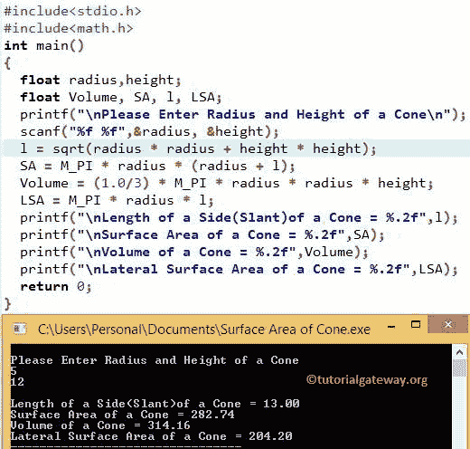

# C 程序：求圆锥体积和表面积

> 原文：<https://www.tutorialgateway.org/c-program-to-find-volume-and-surface-area-of-a-cone/>

如何用例子编写 C 程序求圆锥的体积和表面积？。在我们进入 C 程序寻找圆锥的体积和表面积之前，让我们看看圆锥的表面积和圆锥的体积后面的定义和公式。

## 圆锥的表面积

如果我们知道圆锥的半径和倾斜度，我们就可以用下面的公式计算圆锥的表面积:

*   表面积=圆锥的面积+圆的面积
*   表面积=πR1+πr

其中 r=半径，l =倾斜度(从圆锥体顶部到圆锥体边缘的边的长度)

如果我们知道圆锥体的半径和高度，我们使用下面的公式计算圆锥体的表面积:

*   表面积= πr +πr √h + r

我们也可以把它写成表面积= πr (r+√h + r )
因为半径、高度和斜面使形状成为直角三角形。所以，用毕达哥拉斯定理:

*   l = h + r
*   l = √h + r

### 圆锥的体积

圆锥内部的空间量称为体积。如果我们知道圆锥体的半径和高度，那么我们可以使用以下公式计算体积:

*   体积= 1/3 πr h(其中 h=圆锥体的高度)
*   圆锥的侧面面积=πR1

## 求圆锥体积和表面积的程序

这个 C 程序允许用户输入圆锥的半径和高度值。使用这些值，这个 C 程序将根据公式计算圆锥的表面积、体积、边长(倾斜)和侧表面积。

```c
/* C Program to find Volume and Surface Area of a Cone */
#include <stdio.h>
#include <stdio.h>

int main()
{
  float radius, height;
  float Volume, SA, l, LSA;

  printf("\n Please Enter Radius and Height of a Cone\n");
  scanf("%f %f", &radius, &height);

  l = sqrt(radius * radius + height * height);
  SA = M_PI * radius * (radius + l);
  Volume = (1.0/3) * M_PI * radius * radius * height;
  LSA = M_PI * radius * l;

  printf("\n Length of a Side (Slant)of a Cone = %.2f", l);    
  printf("\n Surface Area of a Cone = %.2f", SA);
  printf("\n Volume of a Cone = %.2f", Volume);
  printf("\n Lateral Surface Area of a Cone = %.2f", LSA);

  return 0;
}
```



在这个 [C 程序](https://www.tutorialgateway.org/c-programming-examples/)中，为了找到圆锥体的体积和表面积的例子，我们输入了圆锥体的半径= 5 和高度= 12

根据勾股定理，我们可以计算出斜面(边长):
l = h+r
l =√h+r
l =√12+5
l =√144+25
l =√169
l = 13

圆锥体的表面积为
圆锥体的表面积= πr +πrl
圆锥体的表面积= πr (r + l)
圆锥体的表面积= M_PI *半径*(半径+ l)
圆锥体的表面积= 3.14 * 5 * ( 5 +13)
圆锥体的表面积= 3.14 * 5 * 18
圆锥体的表面积= 282.6

[C 编程](https://www.tutorialgateway.org/c-programming/)中圆锥的体积为
圆锥的体积= 1/3 πr h
圆锥的体积= (1.0/3) * M_PI *半径*半径*高度
圆锥的体积=(1.0/3)* 3.14 * 5 * 5 * 12；
圆锥体的体积= 314

C 中圆锥的侧表面积为
侧表面积= πrl
侧表面积= M_PI *半径* l
侧表面积= 3.14 * 5 * 13
侧表面积= 204.1

让我们使用半径而不使用斜面(标准公式)来计算圆锥的半径:
圆锥的表面积= πr +πr √h + r
圆锥的表面积= πr (r + √h + r )

表面积= M_PI *半径*(半径+ sqrt((高度*高度)+(半径*半径)))
圆锥体的表面积= 3.14 * 5 * ( 5 + √12 + 5 )
圆锥体的表面积= 3.14 * 5 * ( 5 + √169)
圆锥体的表面积= 3.14 * 5 * ( 5 + 13)
圆锥体的表面积= 3.14 * 5 * 18
圆锥体的表面积