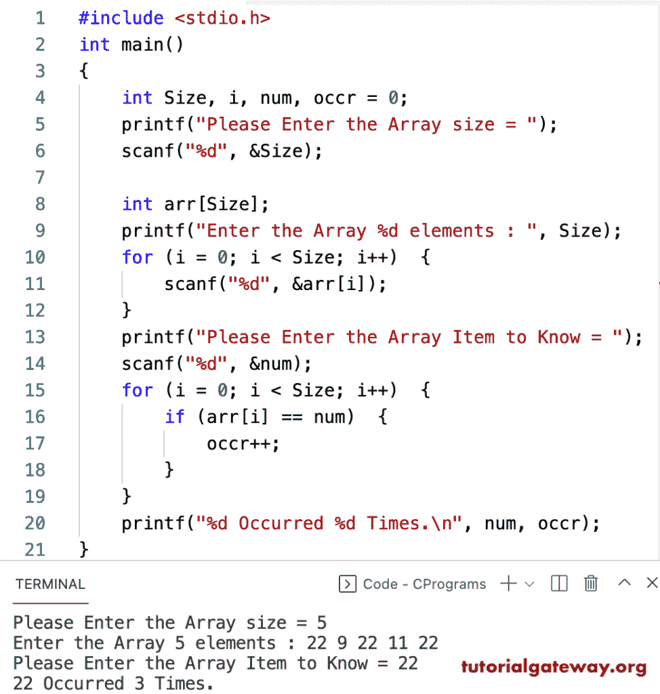

# C 程序：计算数组中一个元素出现次数

> 原文：<https://www.tutorialgateway.org/c-program-to-count-occurrence-of-an-element-in-an-array/>

编写一个 C 程序，使用 for 循环计算数组中某个元素的出现次数。

```c
#include <stdio.h>

int main()
{
	int Size, i, num, occr = 0;

	printf("Please Enter the Array size = ");
	scanf("%d", &Size);

	int arr[Size];

	printf("Enter the Array %d elements : ", Size);
	for (i = 0; i < Size; i++)
	{
		scanf("%d", &arr[i]);
	}

	printf("Please Enter the Array Item to Know = ");
	scanf("%d", &num);

	for (i = 0; i < Size; i++)
	{
		if (arr[i] == num)
		{
			occr++;
		}
	}

	printf("%d Occurred %d Times.\n", num, occr);
}
```



使用 while 循环计算数组中某个元素出现次数的程序。

```c
#include <stdio.h>

int main()
{
	int Size, i, num, occr = 0;
	printf("Please Enter the Array size = ");
	scanf("%d", &Size);

	int arr[Size];

	printf("Enter the Array %d elements : ", Size);
	i = 0;
	while (i < Size)
	{
		scanf("%d", &arr[i]);
		i++;
	}

	printf("Please Enter the Array Item to Know = ");
	scanf("%d", &num);

	i = 0;
	while (i < Size)
	{
		if (arr[i] == num)
		{
			occr++;
		}
		i++;
	}

	printf("%d Occurred %d Times.\n", num, occr);
}
```

```c
Please Enter the Array size = 10
Enter the Array 10 elements : 2 22 33 2 44 2 55 7 2 90
Please Enter the Array Item to Know = 2
2 Occurred 4 Times.
```

在这个 [C 示例](https://www.tutorialgateway.org/c-programming-examples/)中，我们移除了额外的循环，并计算了 do while 循环中给定数组元素的出现次数。

```c
#include <stdio.h>

int main()
{
	int Size, i, num, occr = 0;

	printf("Please Enter the Array Item to Know = ");
	scanf("%d", &num);

	printf("Please Enter the Array size = ");
	scanf("%d", &Size);

	int arr[Size];

	printf("Enter the Array %d elements : ", Size);
	i = 0;
	do
	{
		scanf("%d", &arr[i]);
		if (arr[i] == num)
		{
			occr++;
		}

	} while (++i < Size);

	printf("%d Occurred %d Times.\n", num, occr);
}
```

```c
Please Enter the Array Item to Know = 50
Please Enter the Array size = 7
Enter the Array 7 elements : 50 90 120 50 70 50 100
50 Occurred 3 Times.
```