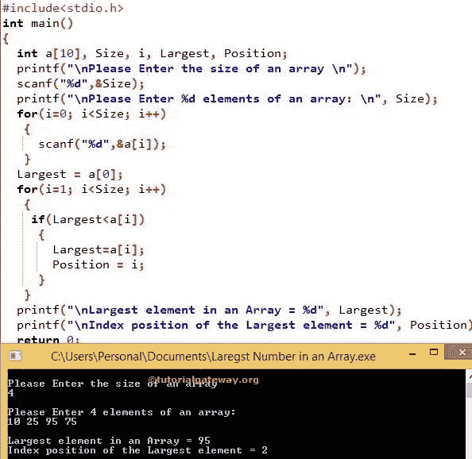

# C 程序：寻找数组中最大数

> 原文：<https://www.tutorialgateway.org/c-program-to-find-largest-number-in-an-array/>

如何写 C 程序求数组中最大数？。或者，如何找到一维数组中最大或最大的数字。以及数组中最大数字的索引位置。在进入这个寻找数组中最大数的 C 程序示例之前。

## 寻找数组中最大数的 c 程序示例

这个寻找数组中最大数的 C 程序要求用户输入数组大小，数组元素。接下来，它将使用 For 循环找到这个数组中最大的元素。

```c
#include<stdio.h>

int main()
{
  int a[10], Size, i, Largest, Position;

  printf("\nPlease Enter the size of an array \n");
  scanf("%d",&Size);

  printf("\nPlease Enter %d elements of an array: \n", Size);
  for(i=0; i<Size; i++)
   {
     scanf("%d",&a[i]);
   }   

  Largest = a[0];
  for(i=1; i<Size; i++)
   {
    if(Largest<a[i])
     {
       Largest=a[i];
       Position = i;
     }   
   }

  printf("\nLargest element in an Array = %d", Largest);
  printf("\nIndex position of the Largest element = %d", Position);

  return 0;
}
```



在这个寻找数组中最大数的 C 程序中，下面的 [For 循环](https://www.tutorialgateway.org/for-loop-in-c-programming/)将迭代出现在[4]数组中的每个单元格。for 循环内的条件(i <大小)将确保编译器不超过数组限制。请参考 C 中的[数组，了解数组大小、索引位置等概念。](https://www.tutorialgateway.org/array-in-c/)

for 循环中的 scanf 语句将在每个单独的数组元素中存储用户输入的值，如[0]、a[1]、a[2]、a[3]。在下一个 [C 编程](https://www.tutorialgateway.org/c-programming/)行中，我们给最大变量分配了一个【0】值。

在这个 C 最大数组数程序的下一行，我们还有一个 for 循环。它用于迭代数组中的每个元素。[如果语句](https://www.tutorialgateway.org/if-statement-in-c/)在里面，它通过比较数组中的每个元素和最大值来找到数组中最大的数字。

从上面 C 程序查找数组中最大数字的示例截图中，可以观察到用户插入的值有

a[4] = {10，25，95，75}
最大= a[0] = 10

第一次迭代
I 的值为 1，条件(i < 4)为真。因此，它将开始执行循环中的语句，直到条件失败。

If 语句(最大< a[i]) inside the for loop is True because (10 < 25)
最大= a[i] = > a[1]
最大= 25
位置= 1

第二次迭代:I 的值为 2，条件(2 < 4)为真。

If 语句(最大< a[2]) inside the for loop is True because (25 < 95)
最大= a[2] = 95
位置= 2

第三次迭代:I 的值为 3，条件(3 < 4)为真。

If 语句(最大< a[3]) inside the for loop is False because (95 < 75). So, the largest value will not be updated. It means
最大= 95
位置= 2

c 程序求数组第四次迭代中最大数
I 值递增后，I 变为 5，条件(i < Size)失效。所以，它将从循环中退出。

下面的 printf 语句用于打印数组中的最大数字。在这个例子中，它是 95。

```c
printf("\nLargest element in an Array = %d", Largest);
```

下面的 printf 语句用于打印数组中最大数字的索引位置。在这个 [C 程序](https://www.tutorialgateway.org/c-programming-examples/)的例子中，它发生在位置 2

```c
printf("\nIndex position of the Largest element = %d", Position);
```