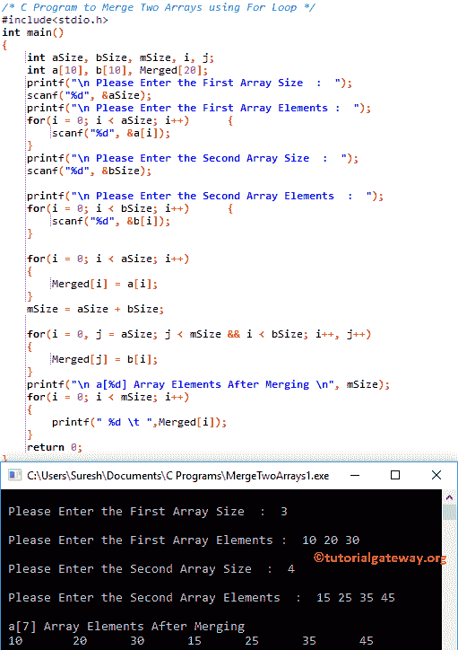

# C 程序：合并两个数组

> 原文：<https://www.tutorialgateway.org/c-program-to-merge-two-arrays/>

如何用例子编写合并两个数组的 C 程序？。在进入这个 C 程序合并两个数组的例子之前。

## 合并两个数组的 c 程序示例 1

这个用 c 语言合并两个数组的程序允许用户输入数组大小，两个不同数组的数组元素。接下来，它将使用 For 循环一个接一个地合并两个数组。

```c
/* C Program to Merge Two Arrays using For Loop */
#include<stdio.h>

int main()
{
 	int aSize, bSize, mSize, i, j;
	int a[10], b[10], Merged[20];

 	printf("\n Please Enter the First Array Size  :  ");
 	scanf("%d", &aSize);

 	printf("\nPlease Enter the First Array Elements :  ");
 	for(i = 0; i < aSize; i++)
  	{
      	scanf("%d", &a[i]);
  	}
  	printf("\n Please Enter the Second Array Size  :  ");
 	scanf("%d", &bSize);

 	printf("\nPlease Enter the Second Array Elements  :  ");
 	for(i = 0; i < bSize; i++)
  	{
      	scanf("%d", &b[i]);
  	}

  	for(i = 0; i < aSize; i++)
  	{
      	Merged[i] = a[i];
  	}

	mSize = aSize + bSize;

 	for(i = 0, j = aSize; j < mSize && i < bSize; i++, j++)
  	{
  		Merged[j] = b[i];
  	}

 	printf("\n a[%d] Array Elements After Merging \n", mSize); 
 	for(i = 0; i < mSize; i++)
  	{
    	printf(" %d \t ",Merged[i]);
  	}

  	return 0;
}
```



在这个 C 合并两个数组的例子中，下面的 [For 循环](https://www.tutorialgateway.org/for-loop-in-c-programming/)将有助于迭代出现在【3】数组中的每个单元格。for 循环内的条件(i <大小)将确保编译器不超过数组限制。请参考 C 文章中的[数组，了解数组大小、索引位置等概念。](https://www.tutorialgateway.org/array-in-c/)

在循环的 [C 编程](https://www.tutorialgateway.org/c-programming/)中，我们将每个 arr 数组元素分配给合并数组。意思是，合并[0] = arr[0]，合并[1] = arr[1]，合并[2] = arr[2]，合并[3] = arr[3]，合并[4] = arr[4]

```c
for(i = 0; i < aSize; i++)
{
      	Merged[i] = a[i];
}

```

现已合并【3】= { 10，20，30}

在下一行中，我们还有一个 for 循环来将第二个数组元素插入到合并数组中

```c
for(i = 0, j = aSize; j < mSize && i < bSize; i++, j++)
{
	Merged[j] = b[i];
}
```

从上面 C 中合并两个数组的程序截图中，可以观察到第二个数组元素是 b[4] = {15，25，35，45}

第一次迭代:对于(i = 0，j = aSizej < mSize && i < bSize; i++, j++)
为(i = 0，j = 3；3<7&&0<4；0++，3++)
条件(3 < 7 & & 0 < 4)为真。
合并[j] = b[i]
合并[3] = b[0]
合并[3] = 15

第二次迭代:对于(i = 1，j = 4；4 < 7 && 1 < 4; 1++, 4++)
条件(4 < 7 & & 1 < 4)为真。
合并[j] = b[i]
合并[4] = b[1]
合并[4] = 25

第三次迭代:对于(i = 2，j = 5；5 < 7 && 2 < 4; 2++, 5++)
条件(5 < 7 & & 2 < 4)为真。
合并[j] = b[i]
合并[5] = b[2]
合并[5] = 35

第四次迭代:对于(i = 3，j = 6；6 < 7 && 3 < 4; 3++, 6++)
条件(6 < 7 & & 3 < 4)为真。
合并【j】= b【I】
合并【6】= b【3】
合并【6】= 45T5T7】

第五次迭代:对于(i = 4，j = 7；7 < 7 && 4 < 4; 4++, 7++)
条件(7<7&T3】4<4)为假。因此，它将从 For 循环中退出

接下来，我们使用一个 for 循环来打印输出。我建议你参考[打印数组元素](https://www.tutorialgateway.org/c-program-to-print-elements-in-an-array/)文章来理解这个循环。

## 合并两个数组的 c 程序示例 2

这个合并两个数组的程序将合并两个数组。在合并时，它会检查哪个数字是最小的值，然后首先插入最小的数字

```c
#include<stdio.h>

int main()
{
 	int aSize, bSize, mSize, i, j, k;
	int a[10], b[10], Merged[20];

 	printf("\n Please Enter the First Array Size  :  ");
 	scanf("%d", &aSize);

 	printf("\nPlease Enter the First Array Elements :  ");
 	for(i = 0; i < aSize; i++)
  	{
      	scanf("%d", &a[i]);
  	}
  	printf("\n Please Enter the Second Array Size  :  ");
 	scanf("%d", &bSize);

 	printf("\nPlease Enter the Second Array Elements  :  ");
 	for(i = 0; i < bSize; i++)
  	{
      	scanf("%d", &b[i]);
  	}

	mSize = aSize + bSize;

	i = 0;
	j = 0;

 	for(k = 0; k < mSize; k++)
  	{
  		if(i >= aSize || j >= bSize)
  		{
  			break;
	  	}
	  	if(a[i] < b[j])
	  	{
	  		Merged[k] = a[i];
	  		i++;
		}
		else
		{
			Merged[k] = b[j];
			j++;
		}
  	}

  	while(i < aSize)
  	{
  		Merged[k] = a[i];
  		k++;
  		i++;
	}

  	while(j < bSize)
  	{
  		Merged[k] = b[j];
  		k++;
  		j++;
	}

 	printf("\n a[%d] Array Elements After Merging \n", mSize); 
 	for(i = 0; i < mSize; i++)
  	{
    	printf(" %d \t ",Merged[i]);
  	}

  	return 0;
}
```

合并两个数组输出

```c
Please Enter the First Array Size  :  5

Please Enter the First Array Elements :  10 20 30 40 50

 Please Enter the Second Array Size  :  6

Please Enter the Second Array Elements  :  5 7 15 35 95 17

 a[11] Array Elements After Merging 
 5 	  7 	  10 	  15 	  20 	  30 	  35 	  40 	  50 	  95 	  17 
```

## 合并两个数组的程序示例 3

这个[程序](https://www.tutorialgateway.org/c-programming-examples/)合并两个数组同上，但是我们用了[函数](https://www.tutorialgateway.org/functions-in-c/)的概念来安排代码

```c
#include<stdio.h>

void Merge_Array(int a[], int aSize, int b[], int bSize, int Merged[]);

int main()
{
 	int aSize, bSize, mSize, i, j, k;
	int a[10], b[10], Merged[20];

 	printf("\n Please Enter the First Array Size  :  ");
 	scanf("%d", &aSize);

 	printf("\nPlease Enter the First Array Elements :  ");
 	for(i = 0; i < aSize; i++)
  	{
      	scanf("%d", &a[i]);
  	}
  	printf("\n Please Enter the Second Array Size  :  ");
 	scanf("%d", &bSize);

 	printf("\nPlease Enter the Second Array Elements  :  ");
 	for(i = 0; i < bSize; i++)
  	{
      	scanf("%d", &b[i]);
  	}

  	Merge_Array(a, aSize, b, bSize, Merged);

	mSize = aSize + bSize;

	printf("\n a[%d] Array Elements After Merging \n", mSize); 
 	for(i = 0; i < mSize; i++)
  	{
    	printf(" %d \t ",Merged[i]);
  	}

  	return 0;
} 

void Merge_Array(int a[], int aSize, int b[], int bSize, int Merged[])
{
	int i, j, k, mSize;
	j = k = 0;
	mSize = aSize + bSize;

	for(i = 0; i < mSize;)
	{
		if(j < aSize && k < bSize)
		{
			if(a[j] < b[k])
			{
				Merged[i] = a[j];
				j++;
			}
			else
			{
				Merged[i] = b[k];
				k++;
			}
			i++;
		}
		else if(j == aSize)
		{
			while(i < mSize)
			{
				Merged[i] = b[k];
				k++;
				i++;
			}
		}
		else
		{
			while(i < mSize)
			{
				Merged[i] = a[j];
				j++;
				i++;
			}
		}
	}
}
```

```c
 Please Enter the First Array Size  :  5

Please Enter the First Array Elements :  10 20 30 40 50

 Please Enter the Second Array Size  :  8

Please Enter the Second Array Elements  :  25 9 35 45 85 89 75 125

 a[13] Array Elements After Merging 
 10 	  20 	  25 	  9 	  30 	  35 	  40 	  45 	  50 	  85 	  89 	  75 	  125 
```