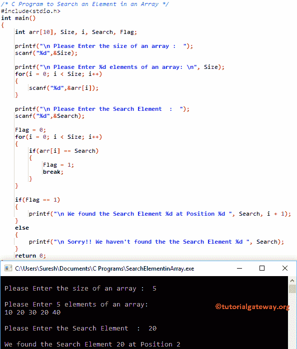

# C 程序：在数组中搜索元素

> 原文：<https://www.tutorialgateway.org/c-program-to-search-an-element-in-an-array/>

如何用例子编写 C 程序搜索数组中的元素？。在进入这个 C 程序搜索数组中的元素之前。

## 在数组中搜索元素的程序

该程序要求用户输入数组大小、元素和搜索项值。接下来，这个在数组中搜索元素的 C 程序将检查用户输入的搜索项是否存在于其中，或者是否使用 For 循环。

```c
/* C Program to Search an Element in an Array */

#include<stdio.h>

int main()
{
  	int arr[10], Size, i, Search, Flag;

  	printf("\n Please Enter the size of an array :  ");
  	scanf("%d",&Size);

  	printf("\n Please Enter %d elements of an array: \n", Size);
  	for(i = 0; i < Size; i++)
   	{
   	 	scanf("%d",&arr[i]);
   	}

	printf("\n Please Enter the Search Element  :  ");
  	scanf("%d",&Search);      

  	Flag = 0;
  	for(i = 0; i < Size; i++)
   	{
   		if(arr[i] == Search)
     	{
       		Flag = 1;
       		break;
	 	}   
   	}

  	if(Flag == 1)
  	{
  		printf("\n We found the Search Element %d at Position %d ", Search, i + 1);
	}
	else
	{
		printf("\n Sorry!! We haven't found the the Search Element %d ", Search);
	}	
  	return 0;
}
```



在这个搜索数组中的元素的 C 程序中，我们声明了 1 个大小为 10 的一维数组[]并声明了 I 来迭代元素。请参考 C 文章中的[数组，了解数组大小、索引位置等概念。](https://www.tutorialgateway.org/array-in-c/)

在[下方，C 编程](https://www.tutorialgateway.org/c-programming/)语句要求用户输入 arr[]大小(它可以处理的元质数量)，并将用户输入的值分配给大小变量。

```c
printf("\n Please Enter the size of an array \n");
scanf("%d",&Size);
```

在[下方的 For 循环](https://www.tutorialgateway.org/for-loop-in-c-programming/)有助于迭代数组中的每个单元格。for 循环条件确保编译器不会超过限制。

for 循环中的 scanf 语句将用户输入的值存储到单个数组元素中，如 arr[0]、arr[1]、arr[2]、arr[3]、arr[4]

```c
for(i = 0; i < Size; i++)
   	{
   	 	scanf("%d",&arr[i]);
   	}
```

在这个 [C 程序](https://www.tutorialgateway.org/c-programming-examples/)的下一行中，我们还有一个 for 循环，用于迭代数组中的每个元素。[如果 For 循环中的语句](https://www.tutorialgateway.org/if-statement-in-c/)将检查 arr[i]是否等于搜索项。如果是真的，那么标志将变为 1 并退出循环(使用[中断声明](https://www.tutorialgateway.org/break-statement-in-c/)

```c
for(i = 0; i < Size; i++)
   	{
   		if(arr[i] == Search)
     	{
       		Flag = 1;
       		break;
	 	}   
   	}
```

从上面的截图可以观察到，用户为数组中的元素插入的值为

a[5] = {10，20，30，20，40}和搜索项目= 20

第一次迭代

I 的值将为 0，条件(i < 5)为真。因此，它将开始执行循环中的语句，直到条件失败。

如果(arr[i] ==搜索)= >如果(10 = = 20)-条件为假

第二次迭代:I 的值将变为 1，条件(1 < 5)为真。

if(arr[1]= = Search)= > if(20 = = 20)–条件为真
标志= 1

接下来，Break 语句将从循环中退出

接下来，我们使用 If Else 语句来检查标志值是否等于 1。如果为真，则项目存在，否则不存在。

让我试试不同的元素

```c
 Please Enter the size of an array :  10

 Please Enter 10 elements of an array: 
10 20 30 40 50 60 70 10 20 50

 Please Enter the Search Element  :  100

 Sorry!! We haven't found the the Search Element 100
```