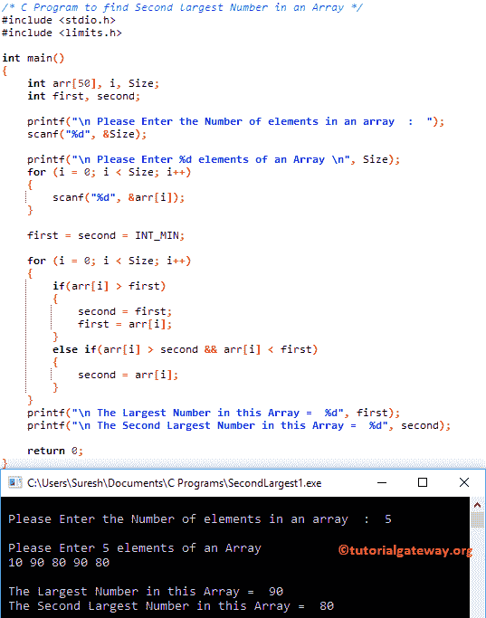

# C 程序：寻找数组中第二大数字

> 原文：<https://www.tutorialgateway.org/c-program-to-find-second-largest-number-in-an-array/>

如何用例子写 C 程序求数组中的第二大数？？在进入 c 例子中的第二大数字之前。

## 寻找数组中第二大数字的程序

这个寻找 c 数组中第二大数字的程序要求用户输入数组大小、数组元素和搜索项值。接下来，这个 C 程序将使用 For 循环找到这个数组中的第二大数字。

```c
/* C Program to find Second largest Number in an Array */

#include <stdio.h>
#include <limits.h>

int main()
{
	int arr[50], i, Size;
	int first, second;

	printf("\n Please Enter the Number of elements in an array  :  ");
	scanf("%d", &Size);

	printf("\n Please Enter %d elements of an Array \n", Size);
	for (i = 0; i < Size; i++)
	{
		scanf("%d", &arr[i]);
    }

	first = second = INT_MIN;  

	for (i = 0; i < Size; i++)
	{
		if(arr[i] > first)
		{
			second = first;
			first = arr[i];
		}
		else if(arr[i] > second && arr[i] < first)
		{
			second = arr[i];
		}	
	}
	printf("\n The Largest Number in this Array =  %d", first);
	printf("\n The Second Largest Number in this Array =  %d", second);

	return 0;
}
```



在这个寻找数组中第二大数字的 C 程序中，我们声明了 1 个大小为 10 的一维数组 arr[]，还声明了 I 来迭代数组元素。请参考 C 文章中的[数组。](https://www.tutorialgateway.org/array-in-c/)

下面的语句将要求用户输入数组 arr[]大小(数组可以容纳的元素数量)，并将用户输入的值分配给 size 变量。

```c
printf("\n Please Enter the size of an array \n");
scanf("%d",&Size);
```

在[下方的 For 循环](https://www.tutorialgateway.org/for-loop-in-c-programming/)将有助于迭代[5]数组中的每个单元格。for 循环内的条件(i <大小)将确保编译器不会超过数组限制。

for 循环中的 [C 编程](https://www.tutorialgateway.org/c-programming/) scanf 语句将用户输入的值存储到单个数组元素中，如 arr[0]、arr[1]、arr[2]、arr[3]、arr[4]

```c
for(i = 0; i < Size; i++)
{
 	scanf("%d",&arr[i]);
}
```

在下一行中，我们还有一个 for 循环，用于迭代数组中的每个元素。[如果 For 循环中的语句](https://www.tutorialgateway.org/if-statement-in-c/)将检查 arr[i]是否等于搜索项。如果为真，则标志将变为 1 并退出循环(使用[中断语句](https://www.tutorialgateway.org/break-statement-in-c/))

```c
for (i = 0; i < Size; i++)
{
	if(arr[i] > first)
	{
		second = first;
		first = arr[i];
	}
	else if(arr[i] > second && arr[i] < first)
	{
		second = arr[i];
	}	
}
```

从上面的截图可以观察到，用户为 C 插入的数值第二大的数字是
a[5] = {10，90，80，90，80}

第一次迭代:对于(I = 0；0 < 5;0++)

I 的值将为 0，条件(i < 5) is True. So, [程序](https://www.tutorialgateway.org/c-programming-examples/)将开始执行循环内的语句，直到条件失败。

如果(arr[i]>搜索)= >如果(10 > Int _ Min)–条件为真
秒= Int_Min
秒= 10

第二次迭代:对于(I = 1；1 < 5; 1++)
条件(1 < 5)为真。
If (arr[i] >搜索)=>If(90>10)–条件为真
秒= 10
秒= 90

第三次迭代:for(I = 2；2 < 5;2++)–条件(2 < 5)为真。

如果(arr[i]>搜索)= >如果(80 > 90)–条件为假。因此，它将进入[否则如果](https://www.tutorialgateway.org/else-if-statement-in-c/)阻挡

否则如果(arr[i]>第二&& arr[i]

= >否则 if(80 > 10 && 80 < 90) – Condition is True
秒= arr[i] = 80

第四次迭代:for(I = 3；3 < 5; 3++) – The condition (3 < 5) is True.

如果(arr[i]>搜索)= >如果(90 > 90)–条件为假。因此，它将进入[否则如果](https://www.tutorialgateway.org/else-if-statement-in-c/)块

否则，如果(arr[i]>第二个&& arr[i] < first) =>,否则，如果(90 > 80 & > 90< 90)
条件为假

第五次迭代:for(I = 4；4 < 5; 4++) – The condition (4 < 5) is True.

如果(arr[i]>搜索)= >如果(80 > 90)–条件为假。因此，它将进入[否则如果](https://www.tutorialgateway.org/else-if-statement-in-c/)块

否则如果(arr[i]>第二个&& arr[i] < first) =>)否则如果(80 > 80 & > 80 < 90)–条件为假

第六次迭代:for(I = 5；5 < 5; 5++)
条件(4 < 5)为假。因此，它将退出“For Loop”

让我为 C 程序尝试不同的数组元素来寻找数组中的第二大数

```c
 Please Enter the Number of elements in an array  :  10

 Please Enter 10 elements of an Array 
10 10 10 10 10 -5 -5 -2 10 10

 The Largest Number in this Array =  10
 The Second Largest Number in this Array =  -2
```