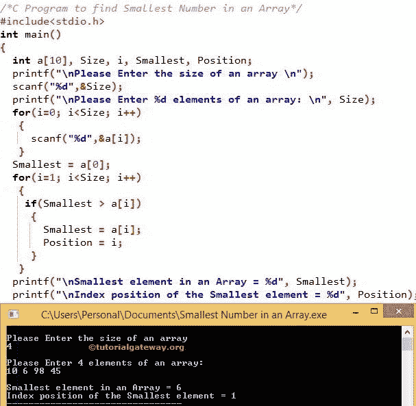

# C 程序：寻找数组中最小数

> 原文：<https://www.tutorialgateway.org/c-program-to-find-smallest-number-in-an-array/>

如何写 C 程序求数组(一维数组)中的最小数？。以及数组中最小数字的索引位置。在进入 C 文章中数组中这个最小的数字之前。

## 寻找数组中最小数的 c 程序

在这个寻找数组中最小数字的 C 程序中，我们声明了 1 个一维数组，大小为 10。我们还声明迭代数组元素，最小变量保存数组中最小的元素。和位置变量，用于保存数组中最小元素的索引位置。

```c
/* C Program to find Smallest Number in an Array */

#include<stdio.h>
int main()
{
  int a[10], Size, i, Smallest, Position;

  printf("\nPlease Enter the size of an array \n");
  scanf("%d",&Size);

  printf("\nPlease Enter %d elements of an array: \n", Size);
  for(i=0; i<Size; i++)
   {
   	 scanf("%d",&a[i]);
   }   

  Smallest = a[0];
  for(i=1; i<Size; i++)
   {
    if(Smallest > a[i])
     {
       Smallest = a[i];
       Position = i;
	 }   
   }

  printf("\nSmallest element in an Array = %d", Smallest);
  printf("\nIndex position of the Smallest element = %d", Position);

  return 0;
}
```



在这个寻找数组中最小数字的 C 程序中，下面的 [For 循环](https://www.tutorialgateway.org/for-loop-in-c-programming/)有助于迭代[4]数组中的每个单元格。for 循环内的条件(i <大小)将确保编译器不超过数组限制。参考 C 文章中的[数组，了解数组大小、索引位置等概念。](https://www.tutorialgateway.org/array-in-c/)

for 循环中的 scanf 语句将在每个单独的数组元素中存储用户输入的值，如[0]、a[1]、a[2]、a[3]

```c
for(i=0; i<Size; i++) 
{ 
   scanf("%d",&a[i]); 
}
```

在数组中最小的 C 数的下一行，我们给最小的变量分配了一个[0]值。

```c
Smallest = a[0];
```

在下一个 [C 编程](https://www.tutorialgateway.org/c-programming/)行中，我们还有一个循环。它是迭代数组中的每个元素。 [If 语句](https://www.tutorialgateway.org/if-statement-in-c/)通过将每个元素与最小值进行比较，找到数组中最小的数字。

```c
for(i=1; i<Size; i++) 
{ 
  if(Smallest > a[i]) 
  { 
    Smallest = a[i]; Position = i; 
  } 
}

```

从上面 C 程序查找数组中最小数字的示例截图中，可以观察到用户插入的值是
a[4] = {10，6，98，45}
最大= a[0] = 10

第一次迭代
I 的值为 1，条件(i < 4)为真。因此，它将开始执行循环中的语句，直到条件失败。

如果 for 循环中的语句(最小> a[i])为真，因为(10 > 6)
最小= a[i] = a[1]
最小= 6
位置= 1

第二次迭代
i = 2，条件(2 < 4)为真。

如果 for 循环中的语句(最小> a[i])为假，因为(6 < 98) so, the smallest value will not be updated. It means
最小= 6
位置= 1

寻找数组中最小数的 c 程序–第三次迭代
i = 3，条件(3 < 4)为真。

如果 for 循环中的语句(最小> a[i])为假，因为(6 < 45). So smallest value will not be updated. It means
最小= 6
位置= 1

第四次迭代
I 的值递增后，我会变成 5。因此，条件(i < Size)将失败，编译器将退出循环。

下面的 printf 语句用于打印数组中的最小数字。在这个 [C 程序](https://www.tutorialgateway.org/c-programming-examples/)的例子中，是 6。

```c
printf("\nSmallest element in an Array = %d", Smallest);
```

下面的 printf 语句用于打印数组中最大数字的索引位置。在本例中，它发生在位置 2

```c
printf("\nIndex position of the Smallest element = %d", Position);
```