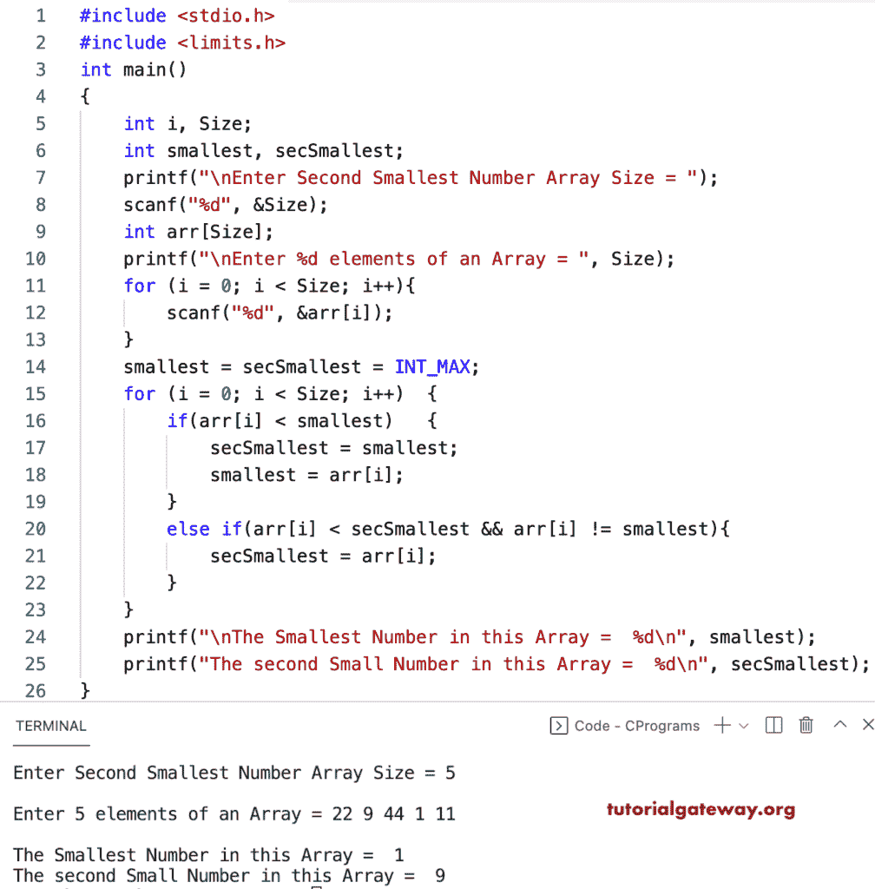

# C 程序：寻找数组中第二小元素

> 原文：<https://www.tutorialgateway.org/c-program-to-find-the-second-smallest-element-in-an-array/>

编写一个 C 程序，使用 for 循环查找数组中的第二小元素。在这个 c 示例中，if 语句检查数组项是否小于最小变量，并存储第二小数组元素。

```c
#include <stdio.h>
#include <limits.h>

int main()
{
	int i, Size;
	int smallest, secSmallest;

	printf("\nEnter Second Smallest Number Array Size = ");
	scanf("%d", &Size);

	int arr[Size];

	printf("\nEnter %d elements of an Array = ", Size);
	for (i = 0; i < Size; i++)
	{
		scanf("%d", &arr[i]);
    }

	smallest = secSmallest = INT_MAX;  

	for (i = 0; i < Size; i++)
	{
		if(arr[i] < smallest)
		{
			secSmallest = smallest;
			smallest = arr[i];
		}
		else if(arr[i] < secSmallest && arr[i] != smallest)
		{
			secSmallest = arr[i];
		}	
	}
	printf("\nThe Smallest Number in this Array =  %d\n", smallest);
	printf("The second Small Number in this Array =  %d\n", secSmallest);

}

```



在这个 [c 程序](https://www.tutorialgateway.org/c-programming-examples/)中，我们按照降序对数组进行排序，所以最后一个元素是第二个最小的数组元素。

```c
#include <stdio.h>
#include <limits.h>

int main()
{
	int Size, i;

	printf("\nEnter Second Smallest Number Array Size = ");
	scanf("%d", &Size);

	int arr[Size];

	printf("\nEnter %d elements of an Array = ", Size);
	for (i = 0; i < Size; i++)
	{
		scanf("%d", &arr[i]);
    }

	for (i = 0; i < Size; i++)
	{
		int temp;
		for(int j = i + 1; j < Size; j++)
		{
			if(arr[i] < arr[j])
			{
				temp = arr[i];
				arr[i] = arr[j];
				arr[j] = temp;
			}
		}
	}
	printf("\nThe Smallest Number in this Array =  %d\n", arr[Size - 1]);
	printf("The second Small Number in this Array =  %d\n", arr[Size - 2]);

}

```

```c
Enter Second Smallest Number Array Size = 8

Enter 8 elements of an Array = 11 99 14 22 7 90 3 20

The Smallest Number in this Array =  3
The second Small Number in this Array =  7
```