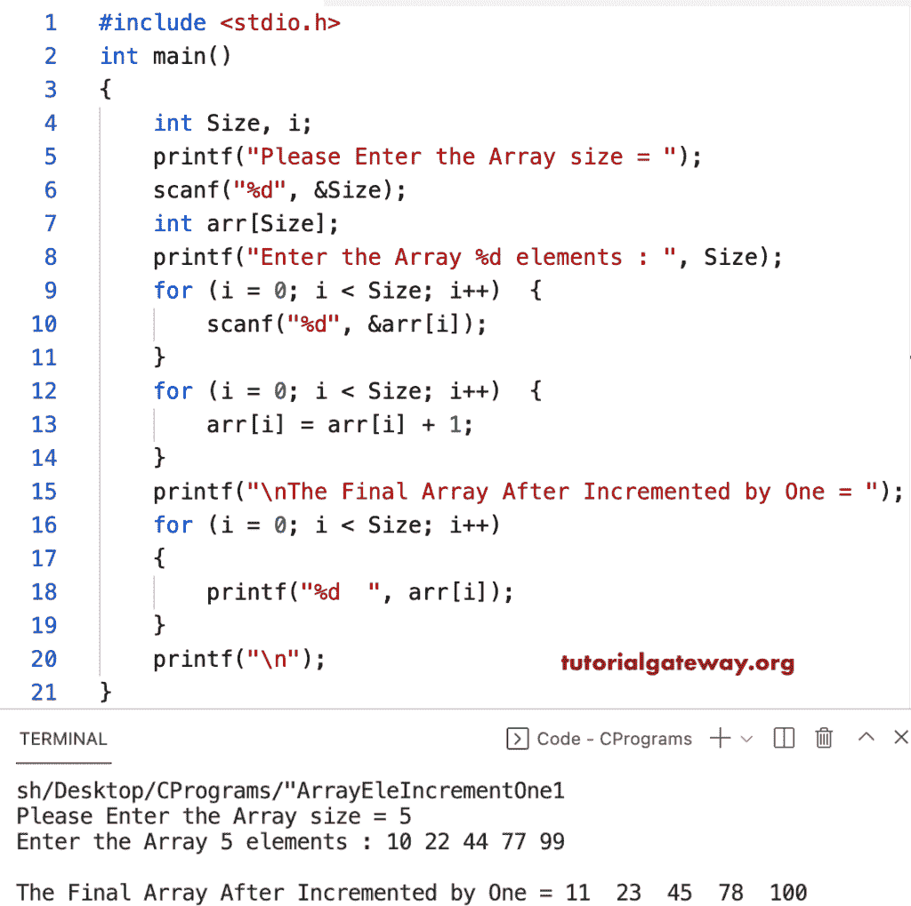

# C 程序：将数组中的所有元素递增 1 

> 原文：<https://www.tutorialgateway.org/c-program-to-increment-all-elements-of-an-array-by-one/>

编写一个 C 程序，使用 for 循环将数组中的所有元素递增一。在这个 C 示例中，我们在迭代数组项的 for 循环中将每个数组元素递增 1。

```c
#include <stdio.h>

int main()
{
	int Size, i;

	printf("Please Enter the Array size = ");
	scanf("%d", &Size);

	int arr[Size];

	printf("Enter the Array %d elements : ", Size);
	for (i = 0; i < Size; i++)
	{
		scanf("%d", &arr[i]);
	}

	for (i = 0; i < Size; i++)
	{
		arr[i] = arr[i] + 1;
	}

	printf("\nThe Final Array After Incremented by One = ");
	for (i = 0; i < Size; i++)
	{
		printf("%d  ", arr[i]);
	}
	printf("\n");
}
```



在这个 [C 示例](https://www.tutorialgateway.org/c-programming-examples/)中，我们在赋值的同时增加了数组元素，并移除了多余的 for 循环。

```c
#include <stdio.h>

int main()
{
	int Size, i;

	printf("Please Enter the Array size = ");
	scanf("%d", &Size);

	int arr[Size];

	printf("Enter the Array %d elements : ", Size);
	for (i = 0; i < Size; i++)
	{
		scanf("%d", &arr[i]);
		arr[i] = arr[i] + 1;
	}

	printf("\nThe Final Array After Incremented by One = ");
	for (i = 0; i < Size; i++)
	{
		printf("%d  ", arr[i]);
	}
	printf("\n");
}
```

```c
Please Enter the Array size = 8
Enter the Array 8 elements : 10 20 30 40 50 60 70 80

The Final Array After Incremented by One = 11  21  31  41  51  61  71  81 
```

使用 while 循环将数组中的所有元素递增 1 的程序。

```c
#include <stdio.h>

int main()
{
	int Size, i;

	printf("Please Enter the Array size = ");
	scanf("%d", &Size);

	int arr[Size];

	printf("Enter the Array %d elements : ", Size);
	i = 0;
	while (i < Size)
	{
		scanf("%d", &arr[i]);
		arr[i] = arr[i] + 1;
		i++;
	}

	printf("\nThe Final Array After Incremented by One =  ");
	i = 0;
	while (i < Size)
	{
		printf("%d  ", arr[i]);
		i++;
	}
	printf("\n");
}
```

```c
Please Enter the Array size = 5
Enter the Array 5 elements : 12 22 44 66 77

The Final Array After Incremented by One =  13  23  45  67  78 
```