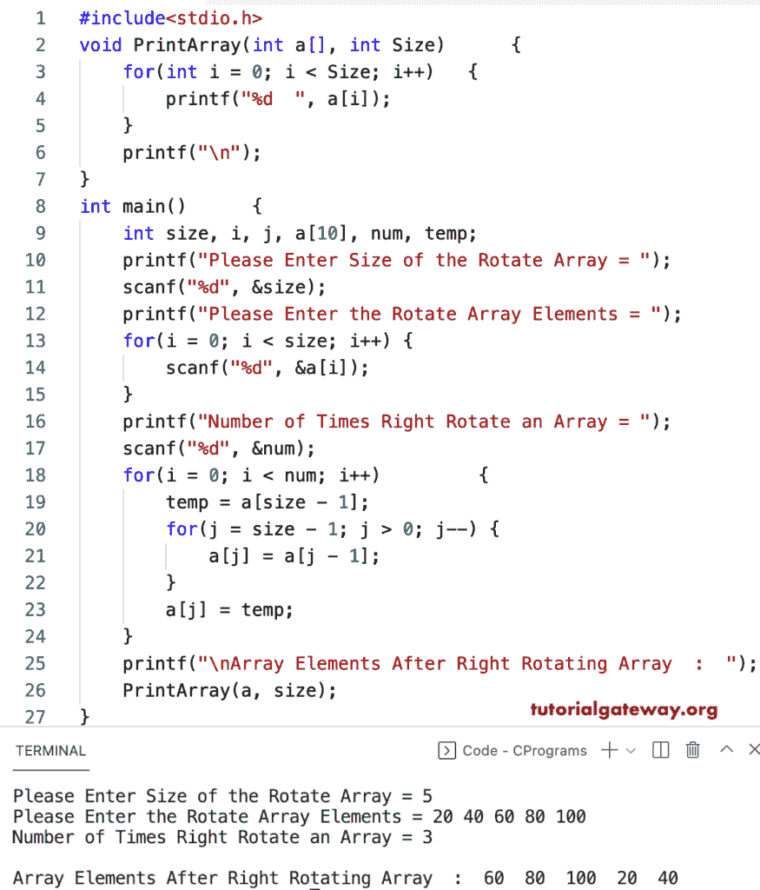

# C 程序：向右旋转数组元素

> 原文：<https://www.tutorialgateway.org/c-program-to-right-rotate-array-elements/>

编写一个 C 程序，使用 for 循环将数组元素向右旋转给定的次数。这个 C 示例允许用户输入数组大小、数组项目以及数组向右旋转的次数。接下来，我们使用嵌套 for 循环在一个临时变量的帮助下移动数组项的位置。

```c
#include<stdio.h>

void PrintArray(int a[], int Size) 
{		
 	for(int i = 0; i < Size; i++)  	
    {
        printf("%d  ", a[i]);
    }
    printf("\n");
} 

int main()
{
    int size, i, j, a[10], num, temp;

    printf("Please Enter Size of the Rotate Array = ");
    scanf("%d", &size);

    printf("Please Enter the Rotate Array Elements = ");
    for(i = 0; i < size; i++) {
        scanf("%d", &a[i]);
    }

    printf("Number of Times Right Rotate an Array = ");
    scanf("%d", &num);

    for(i = 0; i < num; i++) 
    {
        temp = a[size - 1];
        for(j = size - 1; j > 0; j--)
        {
            a[j] = a[j - 1];
        }
        a[j] = temp;
    }

    printf("\nArray Elements After Right Rotating Array  :  ");
    PrintArray(a, size);
}
```



这个 [C 程序](https://www.tutorialgateway.org/c-programming-examples/)使用函数在右侧旋转数组元素给定的次数。

```c
#include<stdio.h>

void PrintArray(int a[], int Size) 
{		
 	for(int i = 0; i < Size; i++)  	
    {
        printf("%d  ", a[i]);
    }
    printf("\n");
} 

void rightRotateArray(int a[], int size, int num)
{
    int i, j, temp;

    for(i = 0; i < num; i++) 
    {
        temp = a[size - 1];
        for(j = size - 1; j > 0; j--)
        {
            a[j] = a[j - 1];
        }
        a[j] = temp;
    }
}

int main()
{
    int size, i, a[10], num, temp;

    printf("Please Enter Size of the  Rotate Array = ");
    scanf("%d", &size);

    printf("Please Enter the Rotate Array Elements = ");
    for(i = 0; i < size; i++) {
        scanf("%d", &a[i]);
    }

    printf("Number of Times Right Rotate an Array = ");
    scanf("%d", &num);

    rightRotateArray(a, size, num);

    printf("\nArray Elements After Right Rotating Array  =  ");
    PrintArray(a, size);
    return 0;
}
```

```c
Please Enter Size of the  Rotate Array = 7
Please Enter the Rotate Array Elements = 10 20 30 40 50 60 70
Number of Times Right Rotate an Array = 5

Array Elements After Right Rotating Array  =  30  40  50  60  70  10  20
```