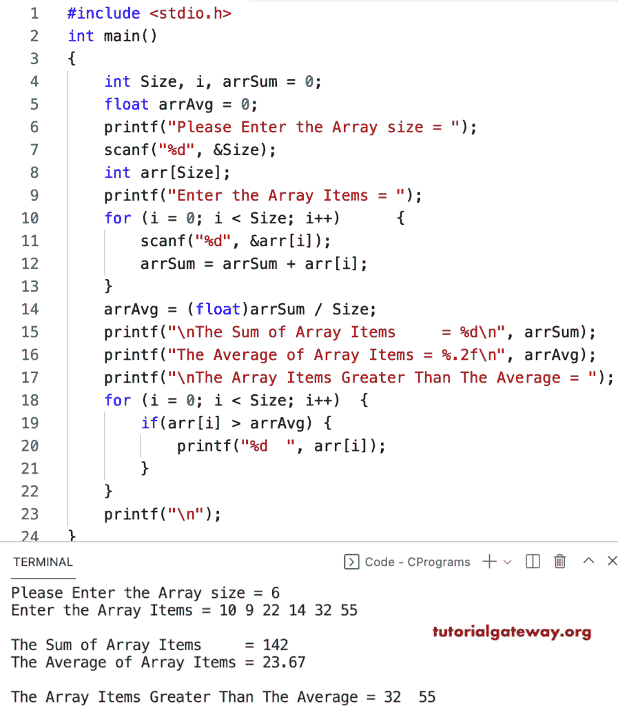

# C 程序：寻找大于平均值的数组元素

> 原文：<https://www.tutorialgateway.org/c-program-to-find-array-elements-greater-than-average/>

写一个 c 程序来寻找大于循环平均值的数组元素。在这个 c 例子中，首先，我们找到数组元素的和与均值。接下来，我们使用 if 语句(if(arr[i] > arrAvg))检查每个数组元素是否大于平均值。如果为真，将打印该数组元素。

```c
#include <stdio.h>

int main()
{
	int Size, i, arrSum = 0;
	float arrAvg = 0;

	printf("Please Enter the Array size = ");
	scanf("%d", &Size);

	int arr[Size];

	printf("Enter the Array Items = ");
	for (i = 0; i < Size; i++)
	{
		scanf("%d", &arr[i]);
		arrSum = arrSum + arr[i];
	}

	arrAvg = (float)arrSum / Size;

	printf("\nThe Sum of Array Items     = %d\n", arrSum);
	printf("The Average of Array Items = %.2f\n", arrAvg);

	printf("\nThe Array Items Greater Than The Average = ");

	for (i = 0; i < Size; i++)
	{
		if(arr[i] > arrAvg)
		{
			printf("%d  ", arr[i]);
		}
	}
	printf("\n");
}
```



这个 [c 程序](https://www.tutorialgateway.org/c-programming-examples/)使用 while 循环计算数组元素的平均值，并打印大于平均值的数组项目。

```c
#include <stdio.h>

int main()
{
	int Size, i, arrSum = 0;
	float arrAvg = 0;

	printf("Please Enter the Array size = ");
	scanf("%d", &Size);

	int arr[Size];

	printf("Enter the Array Items = ");
	i = 0; 
	while(i < Size)
	{
		scanf("%d", &arr[i]);
		arrSum = arrSum + arr[i];
		i++;
	}

	arrAvg = (float)arrSum / Size;

	printf("\nThe Sum of Array Items     = %d\n", arrSum);
	printf("The Average of Array Items = %.2f\n", arrAvg);

	printf("\nThe Array Items Greater Than The Average\n");

	i = 0; 
	while(i < Size)
	{
		if(arr[i] > arrAvg)
		{
			printf("%d  ", arr[i]);
		}
		i++;
	}
	printf("\n");
}
```

```c
Please Enter the Array size = 8
Enter the Array Items = 22 33 98 67 12 19 55 7

The Sum of Array Items     = 313
The Average of Array Items = 39.12

The Array Items Greater Than The Average
98  67  55 
```