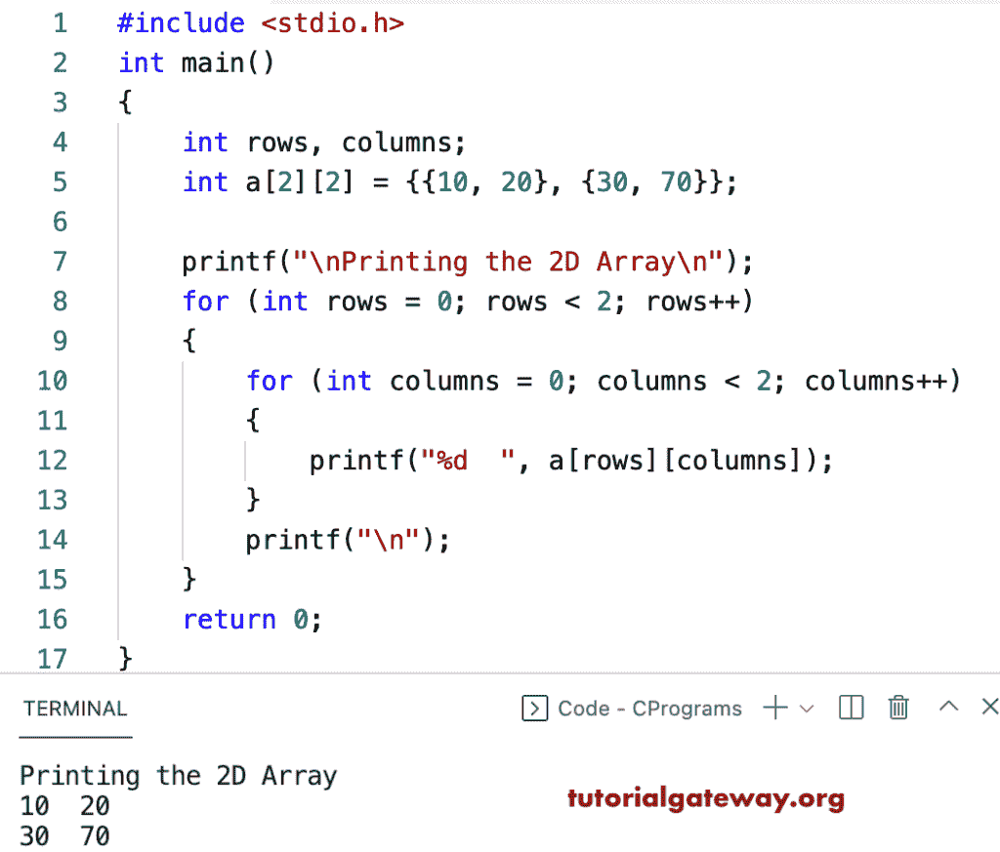

# C 程序：打印 2D 数组元素

> 原文：<https://www.tutorialgateway.org/c-program-to-print-2d-array-elements/>

编写一个 C 程序，使用 for 循环打印 2D 数组元素或二维数组项。在这个 c 示例中，第一个 for 循环迭代行，第二个循环迭代列。在 C for 循环中，我们打印 2D 数组元素，并为每一行迭代插入一个新行(printf("\n "))。

```c
#include<stdio.h>

int main()
{
 	int rows, columns;

	int a[2][2] = {{10, 20}, {30, 70}};

	printf("\nPrinting the 2D Array\n");
 	for(int rows = 0; rows < 2; rows++)
  	{
  		for(int columns = 0; columns < 2; columns++)
  		{
  			printf("%d  ", a[rows][columns]);
		}
   		printf("\n");
  	}  	

 	return 0;
} 

```



这个 C [程序](https://www.tutorialgateway.org/c-programming-examples/)允许用户输入行、列和 2D 数组元素，并打印这些二维数组项目。

```c
#include<stdio.h>

int main()
{
 	int i, j, rows, columns;

 	printf("\nEnter 2D Array rows and columns =  ");
 	scanf("%d %d", &i, &j);

	int a[i][j];

 	printf("\nPlease Enter the 2D Array Elements \n");
 	for(rows = 0; rows < i; rows++)
  	{
   		for(columns = 0; columns < j; columns++)
    	{
      		scanf("%d", &a[rows][columns]);
    	}
  	}
	printf("\nPrinting the 2D Array\n");
 	for(rows = 0; rows < i; rows++)
  	{
  		for(columns = 0;columns < j; columns++)
  		{
  			printf("%d  ", a[rows][columns]);
		}
   		printf("\n");
  	}  	

 	return 0;
} 

```

```c
Enter 2D Array rows and columns =  3 3

Please Enter the 2D Array Elements 
11 22 33 44 55 66 77 88 99

Printing the 2D Array
11  22  33  
44  55  66  
77  88  99 
```

## 使用 while 循环打印 2D 数组元素的 c 程序

```c
#include <stdio.h>

int main()
{
	int i, j, rows, columns;

	printf("\nEnter 2D Array rows and columns =  ");
	scanf("%d %d", &i, &j);

	int a[i][j];

	printf("\nPlease Enter the 2D Array Elements \n");
	rows = 0;
	while (rows < i)
	{
		columns = 0;
		while (columns < j)
		{
			scanf("%d", &a[rows][columns]);
			columns++;
		}
		rows++;
	}
	printf("\nPrinting the 2D Array\n");
	rows = 0;
	while (rows < i)
	{
		columns = 0;
		while (columns < j)
		{
			printf("%d  ", a[rows][columns]);
			columns++;
		}
		printf("\n");
		rows++;
	}
}

```

```c
Enter 2D Array rows and columns =  3 4

Please Enter the 2D Array Elements 
10 20 30 40
50 60 70 80
90 11 22 33

Printing the 2D Array
10  20  30  40  
50  60  70  80  
90  11  22  33 
```