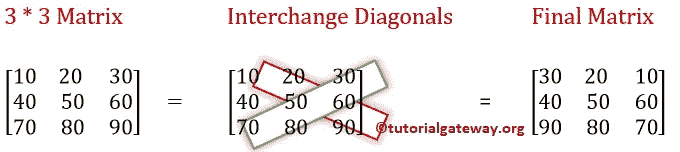
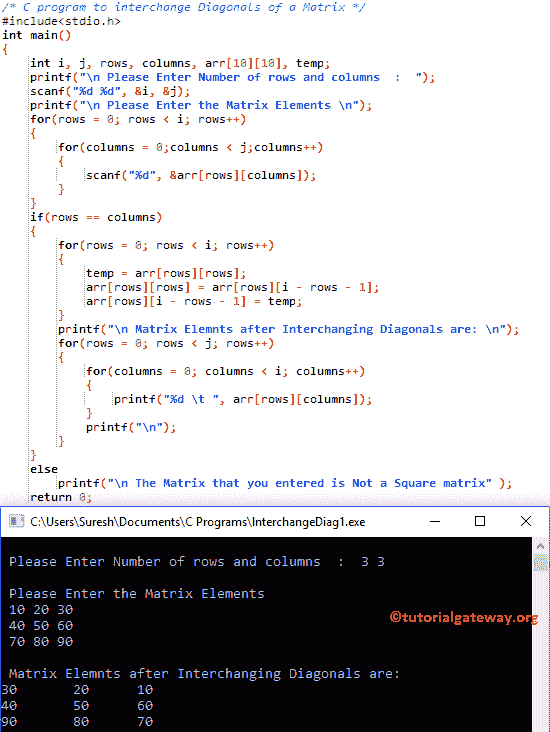

# C 程序：交换矩阵对角线

> 原文：<https://www.tutorialgateway.org/c-program-to-interchange-diagonals-of-a-matrix/>

如何用例子编写一个交换矩阵对角线的 C 程序？。



## 交换矩阵对角线的 c 程序示例

该程序允许用户输入矩阵的行数和列数。接下来，我们将使用 For 循环交换给定矩阵的对角线。

```c
/* C program to interchange Diagonals of a Matrix */

#include<stdio.h>

int main()
{
 	int i, j, rows, columns, arr[10][10], temp;

 	printf("\n Please Enter Number of rows and columns  :  ");
 	scanf("%d %d", &i, &j);

 	printf("\n Please Enter the Matrix Elements \n");
 	for(rows = 0; rows < i; rows++)
  	{
   		for(columns = 0;columns < j;columns++)
    	{
      		scanf("%d", &arr[rows][columns]);
    	}
  	}

  	if(rows == columns)
  	{
  		for(rows = 0; rows < i; rows++)
  		{
  			temp = arr[rows][rows];
  			arr[rows][rows] = arr[rows][i - rows - 1];
  			arr[rows][i - rows - 1] = temp;
	   	}		

 		printf("\n Matrix Elemnts after Interchanging Diagonals are: \n");
 		for(rows = 0; rows < j; rows++)
  		{
   			for(columns = 0; columns < i; columns++)
    		{
      			printf("%d \t ", arr[rows][columns]);
    		}
    		printf("\n");
  		}
  	}
  	else
  	{
  		printf("\n The Matrix that you entered is Not a Square matrix" );
	}

 	return 0;
}
```



在这个程序中，我们声明了单个 10 * 10 大小的二维数组乘法。下面的 [C 编程](https://www.tutorialgateway.org/c-programming/)语句要求用户输入矩阵大小(行数和列数。例如 2 行 2 列= a[2][2])

```c
printf("\n Please Enter Number of rows and columns  :  ");
scanf("%d %d", &i, &j);
```

接下来，我们使用 for 循环来迭代[2][2]矩阵中的每个单元格。循环((行< i)和(列< j))的[内的条件将确保编译器不会超过](https://www.tutorialgateway.org/for-loop-in-c-programming/)[矩阵](https://www.tutorialgateway.org/two-dimensional-array-in-c/)的限制。否则，矩阵会溢出。for 循环中的 scanf 语句将在每个单独的数组元素中存储用户输入的值，如[0][0]、a[0][1]、…..

```c
for(rows = 0; rows < i; rows++).
{
  for(columns = 0; columns < j; columns++)
   {
     scanf("%d", &a[rows][columns]);
   }
}
```

接下来，我们使用 If Else 语句来检查给定的矩阵是否是方阵。如果为真，编译器将交换对角线。否则，它将打印 else 块中存在的消息。

```c
for(rows = 0; rows < i; rows++)
{
	temp = arr[rows][rows];
	arr[rows][rows] = arr[rows][i - rows - 1];
	arr[rows][i - rows - 1] = temp;
}
```

接下来，我们使用另一个 for 循环来打印数组。用户为交换矩阵对角线的 C 程序插入的值是:a[3][3] = {{10，20，30}，{ 40，50，60}，{70，80，90}}

行第一次迭代:对于(行= 0；行< 3; 0++)
条件(0 < 3)为真。

列第一次迭代:对于(列= 0；0 < 3; 0++)
条件(列< 3)为真。
temp = arr[row][row]= 10
arr[0][0]= arr[0][3–0–1]=>arr[0][2]
arr[0][0]= 30
arr[0][3–0–1]=>arr[0][2]= temp
arr[0][2]= 10
对其余迭代执行相同操作。

## 交换矩阵对角线的 c 程序示例 2

这个用于矩阵对角交换的 [C 程序](https://www.tutorialgateway.org/c-programming-examples/)同上，但是这次我们使用了[函数](https://www.tutorialgateway.org/functions-in-c/)的概念来操作代码。

```c
/* C program to interchange Diagonals of a Matrix */

#include<stdio.h>
void interchnage_Diagonals(int arr[10][10], int i, int j);

int main()
{
 	int i, j, rows, columns, arr[10][10], temp;

 	printf("\n Please Enter Number of rows and columns  :  ");
 	scanf("%d %d", &i, &j);

 	printf("\n Please Enter the Matrix Elements \n");
 	for(rows = 0; rows < i; rows++)
  	{
   		for(columns = 0;columns < j;columns++)
    	{
      		scanf("%d", &arr[rows][columns]);
    	}
  	}

  	if(rows == columns)
  	{
  		interchnage_Diagonals(arr, i, j);
  	}
  	else
  	{
  		printf("\n The Matrix that you entered is Not a Square matrix" );
	}

 	return 0;
}

void interchnage_Diagonals(int arr[10][10], int i, int j)
{
	int rows, columns, temp;
	for(rows = 0; rows < i; rows++)
  	{
  		temp = arr[rows][rows];
  		arr[rows][rows] = arr[rows][i - rows - 1];
  		arr[rows][i - rows - 1] = temp;
	}		

 	printf("\n Matrix Elemnts after Interchanging Diagonals are: \n");
 	for(rows = 0; rows < j; rows++)
  	{
   		for(columns = 0; columns < i; columns++)
    	{
    		printf("%d \t ", arr[rows][columns]);
    	}
    	printf("\n");
  	}
}
```

矩阵对角交换输出

```c
 Please Enter Number of rows and columns  :  2 2

 Please Enter the Matrix Elements 
10 20
30 40

 Matrix Elemnts after Interchanging Diagonals are: 
20 	 10 	 
40 	 30 
```