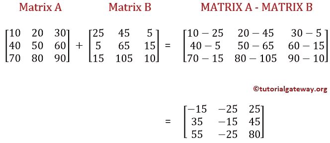
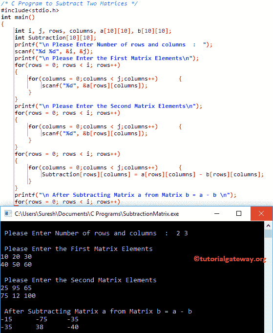

# C 程序：两个矩阵相减

> 原文：<https://www.tutorialgateway.org/c-program-to-subtract-two-matrices/>

如何编写一个 C 程序来减去两个矩阵？。或者，如何用例子写一个 C 程序从另一个矩阵中减去一个多维数组。



## 两个矩阵相减的 c 程序

该程序允许用户输入两个矩阵的行数和列数。接下来，我们将使用 C For Loop 从另一个矩阵中减去一个矩阵。

```c
/* C Program to Subtract Two Matrices */

#include<stdio.h>

int main()
{
 	int i, j, rows, columns, a[10][10], b[10][10];
 	int Subtraction[10][10];

 	printf("\n Please Enter Number of rows and columns  :  ");
 	scanf("%d %d", &i, &j);

 	printf("\n Please Enter the First Matrix Elements\n");
 	for(rows = 0; rows < i; rows++)
  	{
   		for(columns = 0;columns < j;columns++)
    	{
      		scanf("%d", &a[rows][columns]);
    	}
  	}

 	printf("\n Please Enter the Second Matrix Elements\n");
 	for(rows = 0; rows < i; rows++)
  	{
   		for(columns = 0;columns < j;columns++)
    	{
      		scanf("%d", &b[rows][columns]);
    	}
  	}

 	for(rows = 0; rows < i; rows++)
  	{
   		for(columns = 0;columns < j;columns++)
    	{
      		Subtraction[rows][columns] = a[rows][columns] - b[rows][columns];    
   	 	}
  	}

 	printf("\n After Subtracting Matrix a from Matrix b = a - b \n");
 	for(rows = 0; rows < i; rows++)
  	{
   		for(columns = 0; columns < j; columns++)
    	{
      		printf("%d \t ", Subtraction[rows][columns]);
    	}
    	printf("\n");
  	}
 	return 0;
}
```



在这个 [C 程序](https://www.tutorialgateway.org/c-programming-examples/)中，我们声明了 3 个大小为 10 * 10 的二维数组 a，b 和减法。

在[下方，C 编程](https://www.tutorialgateway.org/c-programming/)语句要求用户输入矩阵 a、b 的大小(行数和列数。例如 2 行 3 列= a[2][3]和 b[2][3])

```c
printf("\n Please Enter Number of rows and columns  :  ");
scanf("%d %d", &i, &j);
```

接下来，我们使用[进行循环](https://www.tutorialgateway.org/for-loop-in-c-programming/)来迭代[2][3]矩阵中的每个单元格。for 循环(行< i)和(列< j)内的条件将确保编译器不会超过矩阵限制。否则，[矩阵](https://www.tutorialgateway.org/two-dimensional-array-in-c/ "Two Dimensional Array in C")将溢出

for 循环中的 scanf 语句将在每个单独的数组元素中存储用户输入的值，如[0][0]、a[0][1]、a[0][2]、a[1][0]、a[1][1]、a[1][2]

```c
for(rows = 0; rows < i; rows++).
{
  for(columns = 0; columns < j; columns++)
   {
     scanf("%d", &a[rows][columns]);
   }
}
```

接下来，for Loop 是将用户输入的值存储到 b[2][3]矩阵中。

在下一行中，我们还有一个 for 循环来执行减法。

```c
for(rows = 0; rows < i; rows++)
  {
   for(columns = 0;columns < j;columns++)
    {
      Subtraction[rows][columns] = a[rows][columns] - b[rows][columns];   
    }
  }

```

用户为此 C 程序插入的值为
a[2][3] = {{10，20，30}，{ 40，50，60}}
b[2][3] = {{25，95，65}，{ 75，12，100}}

C 程序减去两个矩阵的第一行迭代:对于(行= 0；行< 2; 0++)
条件(0 < 2)为真。因此，它将进入第二个 for 循环

列第一次迭代:对于(列= 0；0 < 3; 0++)
条件(列< 3)为真。因此，它将开始执行循环内的语句
减法[行][列] = a[行][列]–b[行][列]= a[0][0]–b[0][0]
减法[0][0]= 10–25 =-15

列第二次迭代:对于(列= 1；1 < 3; 1++)
条件(1 < 3)为真。
减法[0][1]= a[0][1]–b[0][1]
减法[0][1]= 20–95 =-75

列第二次迭代:对于(列= 2；2 < 3; 2++)
条件(1 < 3)为真。
减法[0][2]= a[0][2]–b[0][2]
减法[0][2]= 30–65 =-35

接下来，j 值递增。增量后，条件内第二个为循环(列< 3) will fail. So it will exit from the loop.

接下来，行的值将递增(行将变为 1)，并开始第二次行迭代。

请按照行= 1 的相同步骤操作

最后，我们使用另一个 for 循环来打印减法矩阵