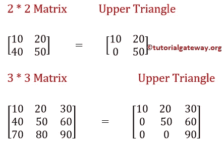
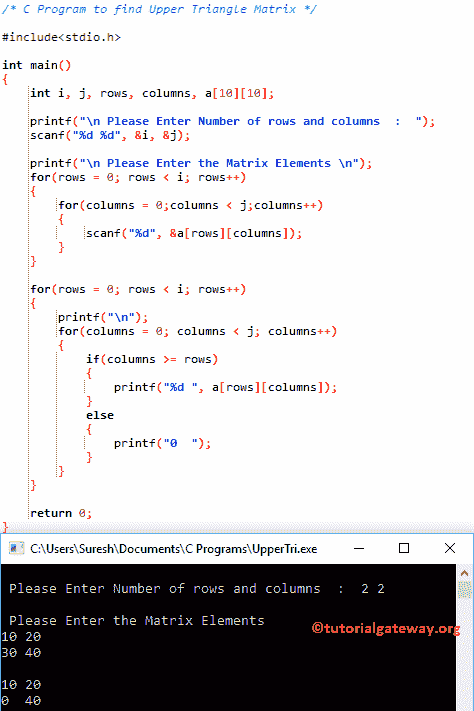

# C 程序：求上三角矩阵

> 原文：<https://www.tutorialgateway.org/c-program-to-find-upper-triangle-matrix/>

如何用例子编写 C 程序求上三角矩阵？。C 中的上三角矩阵是一个正方形矩阵，其中主对角线以下的元素为零。



## 求上三角矩阵例题的 c 程序

这个寻找上三角矩阵的 C 程序允许用户输入矩阵的行数和列数。接下来，我们将使用 For 循环来查找 C 中的上三角矩阵。

```c
/* C Program to find Upper Triangle Matrix */

#include<stdio.h>

int main()
{
 	int i, j, rows, columns, a[10][10];

 	printf("\n Please Enter Number of rows and columns  :  ");
 	scanf("%d %d", &i, &j);

 	printf("\n Please Enter the Matrix Elements \n");
 	for(rows = 0; rows < i; rows++)
  	{
   		for(columns = 0;columns < j;columns++)
    	{
      		scanf("%d", &a[rows][columns]);
    	}
  	}

 	for(rows = 0; rows < i; rows++)
  	{
  		printf("\n");
   		for(columns = 0; columns < j; columns++)
    	{
    		if(columns >= rows)
    		{
    			printf("%d ", a[rows][columns]);
			}
			else
			{
				printf("0  ");
			}
   	 	}
  	}

 	return 0;
}
```



在这个寻找上三角矩阵的 C 程序中，我们声明了单个 10 * 10 大小的二维数组乘法。以下语句要求用户输入矩阵大小(行数和列数。例如 2 行 2 列= a[2][2])

```c
printf("\n Please Enter Number of rows and columns  :  ");
scanf("%d %d", &i, &j);
```

接下来，我们使用 [C 编程](https://www.tutorialgateway.org/c-programming/)进行循环，以迭代出现在[2][2]矩阵中的每个单元。循环((行< i)和(列< j))的[内的条件将确保编译器不会超过](https://www.tutorialgateway.org/for-loop-in-c-programming/)[矩阵](https://www.tutorialgateway.org/two-dimensional-array-in-c/)的限制。否则，矩阵将溢出

for 循环中的 scanf 语句将在每个单独的数组元素中存储用户输入的值，如[0][0]、a[0][1]、…..

```c
for(rows = 0; rows < i; rows++).
{
  for(columns = 0; columns < j; columns++)
   {
     scanf("%d", &a[rows][columns]);
   }
}
```

在下一个[程序](https://www.tutorialgateway.org/c-programming-examples/)行中，我们还有一个 for 循环来寻找矩阵的上三角形

```c
for(rows = 0; rows < i; rows++)
{
	printf("\n");
	for(columns = 0; columns < j; columns++)
    	{
    		if(columns >= rows)
    		{
    			printf("%d ", a[rows][columns]);
		}
		else
		{
			printf("0  ");
		}
 	}
}
```

用户为 C 中的上三角矩阵插入的值是:a[2][2] = {{10，20}，{ 30，40}}

寻找上三角矩阵的 C 程序后面的 For 循环迭代是:

行第一次迭代:对于(行= 0；行< 2; 0++)
条件(0 < 2)为真。

列第一次迭代:对于(列= 0；0 < 2; 0++)
条件(列< 2)为真。因此，它将开始执行循环中的语句

如果(列> =行)= >如果(0 > = 0)–条件为真。因此，它将打印一个[0][0] = 10

列第二次迭代:对于(列= 1；1 < 2; 1++)
条件(列< 2)为真。

如果(列> =行)= >如果(1 > = 0)–条件为真。因此，它将打印一个[0][1] = 20

列第三次迭代:对于(列= 2；2 < 2; 2++)
条件(列< 2)为假。所以它会从循环中退出。

接下来，行值将增加到 1。

行第二次迭代:对于(行= 1；行< 2; 1++)
条件(1 < 2)为真。

列第一次迭代:对于(列= 0；0 < 2; 0++)
条件(列< 2)为真。因此，如果(列> =行)= >如果(0>= 1)–该条件为假，它将开始执行循环内的语句。因此，它将打印 0

列第二次迭代:对于(列= 1；1 < 2; 1++)
条件(列< 2)为真。
if(列> =行)=>if(1>= 1)–该条件为真。所以，它会打印一个[1][1] = 40

列第三次迭代:对于(列= 2；2 < 2; 2++)
条件(列< 2)为假。所以它会从循环中退出。

接下来，行值将增加到 1。增量后，第一个 for 循环(行< 2)内的条件将失败。所以它会从循环中退出。

让我用 3 * 3 矩阵试试，上三角矩阵是

```c
 Please Enter Number of rows and columns  :  3 3

 Please Enter the Matrix Elements 
10 20 30
40 50 60
70 80 90

10 20 30 
0  50 60 
0  0  90 
```