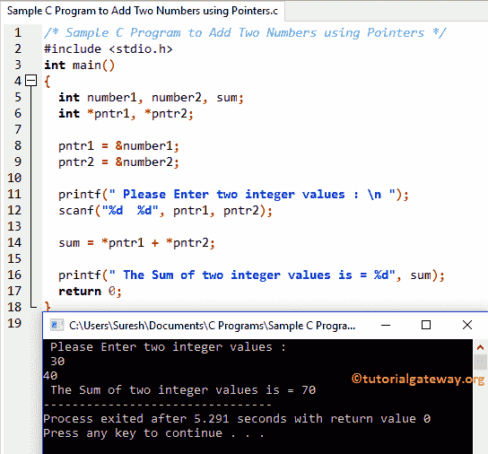

# C 程序：使用指针将两个数字相加

> 原文：<https://www.tutorialgateway.org/sample-c-program-add-two-numbers-using-pointers/>

如何编写一个示例 C 程序用指针加两个数并打印输出？。我建议你参考指针介绍来了解指针的基础知识。

## 使用指针将两个数字相加的 C 程序示例

这个 C 程序允许用户输入两个整数值。然后我们要用指针的概念把这两个数字相加。稍后我们将把总数分配给变量 sum。

```c
/* Sample C Program to Add Two Numbers using Pointers */
#include <stdio.h>
int main()
{
  int number1, number2, sum;
  int *pntr1, *pntr2;

  pntr1 = &number1;
  pntr2 = &number2;

  printf(" Please Enter two integer values : \n ");
  scanf("%d  %d", pntr1, pntr2);

  sum = *pntr1 + *pntr2;

  printf(" The Sum of two integer values is = %d", sum);
  return 0;
}
```



首先，我们声明了三个称为 number1、number2 和 sum 的整数值。然后，我们声明了两个整数类型的[指针](https://www.tutorialgateway.org/pointers-in-c/)变量。

```c
  int number1, number2, sum;
  int *pntr1, *pntr2;
```

接下来，我们将数字 1、数字 2 的地址分配给指针 pntr1、pntr2。

```c
  pntr1 = &number1;
  pntr2 = &number2;
```

以下语句要求用户输入两个整数。下一个 [C 编程](https://www.tutorialgateway.org/c-programming/) scanf 语句将把用户输入的值分配给已经声明的指针变量 pntr1、pntr2。这里，pntr1、pntr2 是数字 1 和数字 2 的地址位置。

```c
  printf(" Please Enter two integer values : \n ");
  scanf("%d  %d", pntr1, pntr2);
```

这个 [C 程序](https://www.tutorialgateway.org/c-programming-examples/)的下一行，我们使用[算术运算符](https://www.tutorialgateway.org/arithmetic-operators-in-c/ "ARITHMETIC OPERATORS IN C") +将整数值相加，然后将该总和赋给 sum。

```c
sum = *pntr1 + *pntr2;
```

下面的 printf 语句将输出 sum 变量(22 + 44 = 66)。

```c
printf(" The Sum of two integer values is = %d", sum);
```