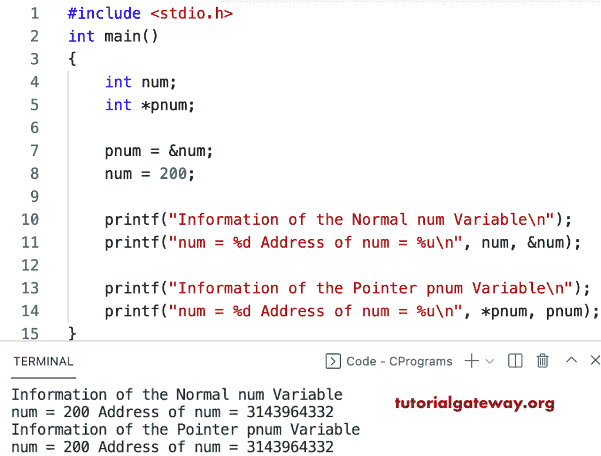

# C 程序：创建、初始化和访问指针变量

> 原文：<https://www.tutorialgateway.org/c-program-to-create-initialize-and-access-a-pointer-variable/>

用一个例子编写一个 c 程序来创建、初始化和访问指针变量。在这个 c 示例中，我们声明了一个整数值，将其分配给 int 类型的指针，并打印了该指针值和地址。

```c
#include <stdio.h>

int main()
{   
    int num;
    int *pnum;

    pnum = &num;
    num = 200;

    printf("Information of the Normal num Variable\n");
    printf("num = %d Address of num = %u\n", num, &num);

    printf("Information of the Pointer pnum Variable\n");
    printf("num = %d Address of num = %u\n", *pnum, pnum);

}
```



这个 [c 程序](https://www.tutorialgateway.org/c-programming-examples/)创建了一个字符变量，用一个随机字符初始化，并访问或打印该字符指针。

```c
#include <stdio.h>

int main()
{   
    char ch;
    char *pch;

    pch = &ch;

    printf("Please Enter Any Charcater = ");
    scanf("%c", &ch);

    printf("Information of the ch Variable\n");
    printf("num = %c Address of num = %p\n", ch, &ch);

    printf("Information of the Pointer pch Variable\n");
    printf("num = %c Address of num = %p\n", *pch, pch);

}
```

```c
Please Enter Any Charcater = o
Information of the ch Variable
num = o Address of num = 0x7ff7b26716af
Information of the Pointer pch Variable
num = o Address of num = 0x7ff7b26716af
```