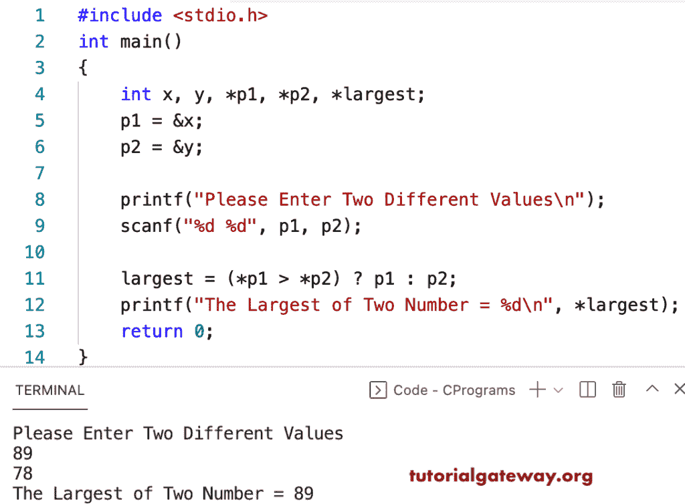

# C 程序：用指针寻找两个数中的最大值

> 原文：<https://www.tutorialgateway.org/c-program-to-find-the-largest-of-two-numbers-using-a-pointer/>

写一个 C 程序，用指针找到两个数字中的最大值。它允许用户输入两个整数值，然后我们将它们分配给两个整数类型的指针变量。在这个 c 例子中，我们使用 else if 语句来查找两个指针数中的最大值。

```c
#include <stdio.h>     

int main() {  

    int x, y, *p1, *p2;  

    printf("Please Enter Two different values\n");  
    scanf("%d %d", &x, &y);  

    p1 = &x;
    p2 = &y;

    if(*p1 > *p2) 
	{
         printf("The Largest of Two Numbers = %d\n", *p1);  
    } 
	else if (*p2 > *p1)
	{ 
        printf("The Largest of Two Numbers = %d\n", *p2); 
    } 
	else 
	{
		printf("Both are Equal\n");
    }

    return 0;  
} 

```

```c
Please Enter Two different values
99
15
The Largest of Two Numbers = 99

Please Enter Two different values
12
19
The Largest of Two Numbers = 19

Please Enter Two different values
15
15
Both are Equal
```

这个 [c 程序](https://www.tutorialgateway.org/c-programming-examples/)使用条件运算符和指针来寻找两个数字中最大的数字。

```c
#include <stdio.h>  

int main() 
{  
    int x, y, *p1, *p2, *largest;

    p1 = &x;
    p2 = &y;

    printf("Please Enter Two Different Values\n");  
    scanf("%d %d", p1, p2);  

    largest = (*p1 > *p2) ? p1 : p2;
    printf("The Largest of Two Number = %d\n", *largest);

    return 0;  
} 

```

