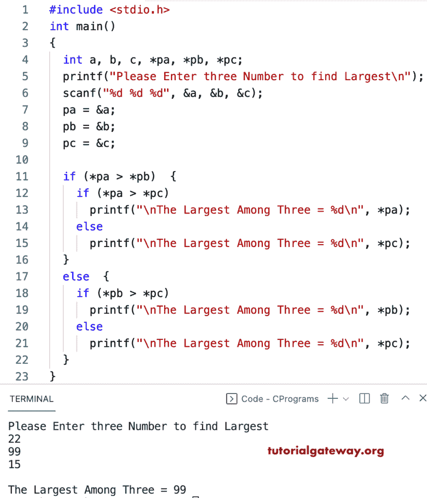

# C 程序：用指针寻找三个数中的最大值

> 原文：<https://www.tutorialgateway.org/c-program-to-find-the-largest-of-three-numbers-using-a-pointer/>

写一个 C 程序，用指针找到三个数字中的最大值。首先，我们将用户输入的三个整数赋给指针。接下来，这个 c 示例使用嵌套的 if else 语句来检查并找到这三个中最大的指针数。

```c
#include <stdio.h>

int main()
{
  int a, b, c, *pa, *pb, *pc;

  printf("Please Enter three Number to find Largest\n");
  scanf("%d %d %d", &a, &b, &c);

  pa = &a;
  pb = &b;
  pc = &c;

  if (*pa > *pb)
  {
    if(*pa > *pc)
    {
      printf("\nThe Largest Among Three = %d\n", *pa);
    }
    else
    {
      printf("\nThe Largest Among Three = %d\n", *pc);
    }
  }
  else
  {
    if(*pb > *pc)
    {
      printf("\nThe Largest Among Three = %d\n", *pb);
    }
    else
    {
      printf("\nThe Largest Among Three = %d\n", *pc);
    }
  }
}

```



这个 c 程序使用 else if 语句和指针来查找三个数字中的最大值。

```c
#include <stdio.h>
int main()
{
  int a, b, c, *pa, *pb, *pc;

  printf("Please Enter three Number to find Largest\n");
  scanf("%d %d %d", &a, &b, &c);

  pa = &a;
  pb = &b;
  pc = &c;

  if (*pa > *pb && *pa > *pc)
  {
    printf("\nThe Largest Among Three = %d\n", *pa);
  }
  else if (*pb > *pa && *pb > *pc)
  {
    printf("\nThe Largest Among Three = %d\n", *pb);
  }
  else if (*pc > *pa && *pc > *pb)
  {
    printf("\nThe Largest Among Three = %d\n", *pc);
  }
}

```

```c
Please Enter three Number to find Largest
19
90
120

The Largest Among Three = 120
```

在这个 [c 例子](https://www.tutorialgateway.org/c-programming-examples/)中，我们使用了嵌套的条件运算符和指针来寻找三个数字中的最大值。

```c
#include<stdio.h>

int main()
{
  int a, b, c, *pa, *pb, *pc, *largest;

  printf("Please Enter three Number to find Largest\n");
  scanf("%d %d %d", &a, &b, &c);

  pa = &a;
  pb = &b;
  pc = &c;

 largest =((*pa > *pb && *pa > *pc)? pa: (*pb > *pc) ? pb : pc);
 printf("\nThe Largest number Among three = %d\n", *largest);
 return 0;
}

```

```c
Please Enter three Number to find Largest
22
44
19

The Largest number Among three = 44
```