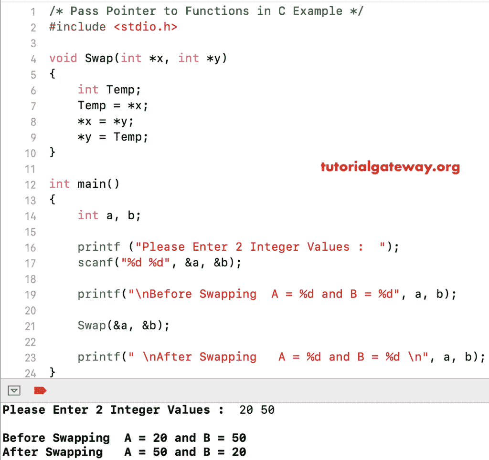

# C 程序：将指针传递给函数

> 原文：<https://www.tutorialgateway.org/pass-pointers-to-functions-in-c/>

如何编写 C 程序将指针传递给函数？。或者用一个实际的例子来说明 C 编程中的函数指针是如何工作的。

## 将指针传递给 C 示例 1 中的函数

在这个传递指针到 C 程序中的函数中，我们创建了一个接受两个整数变量并交换这两个变量的函数。建议大家参考 [C 程序对换两个数字](https://www.tutorialgateway.org/c-program-to-swap-two-numbers/)一文了解逻辑。

像任何其他变量一样，您可以将指针作为函数参数传递。我建议您参考[按值调用和按引用调用](https://www.tutorialgateway.org/call-by-value-and-call-by-reference-in-c/)和[指针](https://www.tutorialgateway.org/pointers-in-c/)文章来理解 [C](https://www.tutorialgateway.org/c-programming/) 函数参数和指针

```c
/* Pass Pointers to Functions in C Example  */

#include<stdio.h>

void Swap(int *x, int *y)
{
    int Temp;
    Temp = *x;
    *x = *y;
    *y = Temp;
}

int main()
{
    int a, b;

    printf ("Please Enter 2 Integer Values :  ");
    scanf("%d %d", &a, &b);

    printf("\nBefore Swapping  A = %d and B = %d", a, b);

    Swap(&a, &b);

    printf(" \nAfter Swapping   A = %d and B = %d \n", a, b);
}
```



## 将指针传递给函数示例 2

在这个传递指针到函数[程序](https://www.tutorialgateway.org/c-programming-examples/)中，我们创建了一个接受数组指针及其大小的函数。请参考 [C 程序求数组中所有元素的和](https://www.tutorialgateway.org/c-program-to-find-sum-of-elements-in-an-array/)一文了解逻辑。在主传递指向函数的指针程序中，我们使用[进行循环](https://www.tutorialgateway.org/for-loop-in-c-programming/)来迭代[数组](https://www.tutorialgateway.org/array-in-c/)。接下来，将用户给定的值传递给一个数组。接下来，我们将数组传递给函数

```c
/* Pass Pointers to Functions in C Example  */

#include<stdio.h>

int SumofArrNumbers(int *arr, int Size)
{
    int sum = 0;
    for(int i = 0; i < Size; i++)
    {
        sum = sum + arr[i];
    }
    return sum;
}
int main()
{
    int i, Addition, Size, a[10];
    printf("Please Enter the Size of an Array : ");
    scanf("%d", &Size);

    printf("\nPlease Enter Array Elements  :  ");
    for(i = 0; i < Size; i++)
    {
        scanf("%d", &a[i]);
    }

    Addition = SumofArrNumbers(a, Size);
    printf("Sum of Elements in this Array = %d \n", Addition);
    return 0;
}
```

```c
Please Enter the Size of an Array : 7

Please Enter Array Elements  :  10 20 200 30 500 40 50
Sum of Elements in this Array = 850 
```