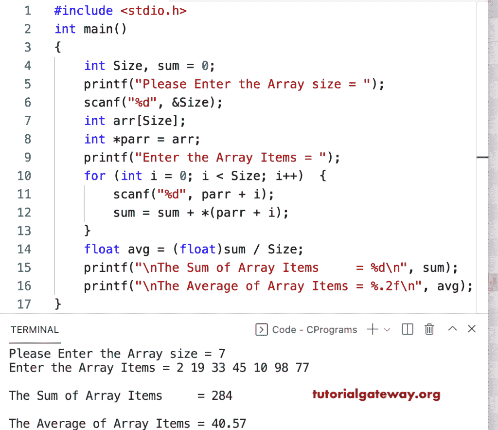

# C 程序：用指针求数组元素的和与均值

> 原文：<https://www.tutorialgateway.org/c-program-to-find-sum-and-average-of-array-elements-using-a-pointer/>

写一个 c 程序，用指针找到数组元素的和与均值，并举例说明。在这个 c 示例中，我们将数组分配给指针变量，并使用指针来读取和查找数组元素的总和和平均值。

```c
#include <stdio.h>

int main()
{
	int Size, i, sum = 0;

	printf("Please Enter the Array size = ");
	scanf("%d", &Size);

	int arr[Size];

	int *parr = arr;

	printf("Enter the Array Items = ");
	for (i = 0; i < Size; i++)
	{
		scanf("%d", parr + i);
	}

	for (i = 0; i < Size; i++)
	{
		sum = sum + *(parr + i);
	}

	float avg = (float)sum / Size;

	printf("\nThe Sum of Array Items     = %d\n", sum);
	printf("\nThe Average of Array Items = %.2f\n", avg);
}
```

```c
Please Enter the Array size = 9
Enter the Array Items = 21 31 41 51 61 71 81 91 121

The Sum of Array Items     = 569

The Average of Array Items = 63.22
```

在这个 [c 程序](https://www.tutorialgateway.org/c-programming-examples/)中，我们移除了循环的多余部分，并使用指针计算数组元素的总和和平均值。

```c
#include <stdio.h>

int main()
{
	int Size, sum = 0;

	printf("Please Enter the Array size = ");
	scanf("%d", &Size);

	int arr[Size];

	int *parr = arr;

	printf("Enter the Array Items = ");
	for (int i = 0; i < Size; i++)
	{
		scanf("%d", parr + i);
		sum = sum + *(parr + i);
	}

	float avg = (float)sum / Size;

	printf("\nThe Sum of Array Items     = %d\n", sum);
	printf("\nThe Average of Array Items = %.2f\n", avg);
}
```

