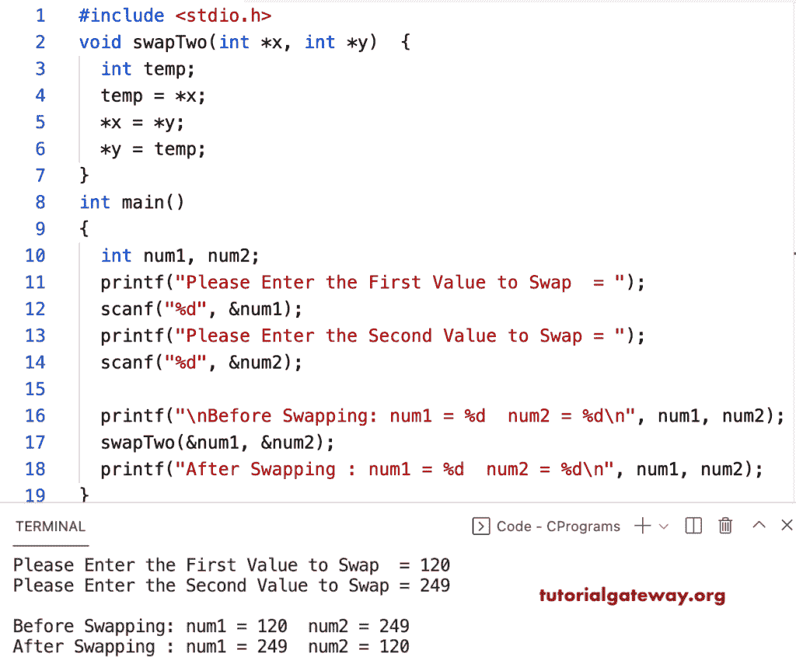

# C 程序：用指针交换两个数字

> 原文：<https://www.tutorialgateway.org/c-program-to-swap-two-numbers-using-pointer/>

写一个 C 程序，用指针和临时变量交换两个数字。在这个 C 例子中，swapTwo 函数接受两个整数类型的指针变量。接下来，使用临时变量，我们交换了那些指针。

```c
#include <stdio.h>

void swapTwo(int *x, int *y)
{
  int temp;
  temp = *x;
  *x = *y;
  *y = temp;
}

int main()
{
  int num1, num2;

  printf("Please Enter the First Value to Swap  = ");
  scanf("%d", &num1);

  printf("Please Enter the Second Value to Swap = ");
  scanf("%d", &num2);

  printf("\nBefore Swapping: num1 = %d  num2 = %d\n", num1, num2);

  swapTwo(&num1, &num2);

  printf("After Swapping : num1 = %d  num2 = %d\n", num1, num2);

}

```

