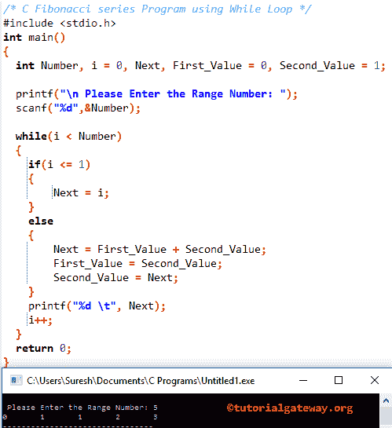

# 斐波那契数列程序

> 原文：<https://www.tutorialgateway.org/c-fibonacci-series-program/>

如何用 While 循环、For 循环、函数和递归编写 C 程序打印斐波那契数列？。

## C 语言中的斐波那契数列

C 中的斐波那契数列或斐波那契数列是按以下顺序显示的数字:0、1、1、2、3、5、8、13、21、34、…

如果观察上面的模式，第一个值是 0，第二个值是 1，下面的数字是前面两个数字相加的结果。例如，第三个值是(0 + 1)，第四个值是(1 + 1)等等。

## 使用 While 循环的 C 语言中的斐波那契数列

该程序允许用户输入任意正整数。然后，使用 C 编程中的 While 循环显示从 0 到用户指定数字的斐波那契数列。

```c
#include <stdio.h>
int main()
{
  int Number, i = 0, Next, First_Value = 0, Second_Value = 1;

  printf("\n Please Enter the Range Number: ");
  scanf("%d",&Number);

  while(i < Number) 
  {
  	if(i <= 1)
  	{
  		Next = i;
	}
	else
	{
		Next = First_Value + Second_Value;
		First_Value = Second_Value;
		Second_Value = Next;
	}
    printf("%d \t", Next);
   	i++;  
  }
  return 0;
}
```



在这个 c 程序中的斐波那契数列中，首先，我们声明了四个整数变量 Number，I，First_Value，Second_Value，以及赋值，如上所示。第一个 printf 和 scanf 语句要求用户输入任意正整数，并将其赋给一个 Number 变量。

这个 c 斐波那契数列程序中的 While 循环将确保循环从 0 开始，并且小于用户指定的数字。在 [While 循环](https://www.tutorialgateway.org/while-loop-in-c/)中，我们使用了 [If Else 语句](https://www.tutorialgateway.org/if-else-statement-in-c/)。

*   如果 I 值小于或等于 1，I 值将被分配给 Next。
*   如果 I 值大于 1，则在 Else 块内执行计算。

让我们以迭代的方式看看 c 中斐波那契数列的 while 循环的工作原理。从上面 [C 编程](https://www.tutorialgateway.org/c-programming/)截图可以观察到，用户输入的值是 Number= 5，i = 0，First_Value = 0，Second_Value = 1

**第一次迭代**

While (0 < 5)中的条件返回真。因此，斐波那契数列 c 程序将开始执行 while 循环中的语句

在 while 循环中，我们有 [If Else 语句](https://www.tutorialgateway.org/if-else-statement-in-c/)，条件 if (0 < = 1)返回真，因此 Next = 0，编译器将从 If 语句块退出

Print 语句 printf("%d "，Next)将打印 0。

最后，我将增加到 1。请参考 C 文章中的[递增和递减运算符来理解++符号。](https://www.tutorialgateway.org/increment-and-decrement-operators-in-c/)

**C 斐波那契二次迭代**

*   条件 While (1 < 5)返回真
*   If 条件 if (1 <= 1)返回真。因此，Next = 1，编译器将从 if 语句块退出
*   printf("%d "，下一步)将打印值 1
*   最后，我将增加到 1

T **hird 迭代**

*   而(2 < 5)返回真
*   if (2 <= 1)返回 FALSE。因此，else 块中的语句将开始执行
    *   下一个=第一个值+第二个值==> 0 + 1 = 1
    *   第一个值=第二个值= 1
    *   第二个 _ 值=下一个= 1
*   接下来，Print 语句 printf("%d "，Next)将打印值 1。
*   我增加了 1

**C 斐波那契第四次迭代**

*   而(3 < 5)返回真
*   if (3 <= 1)返回 FALSE。所以，编译器执行 else 块
    *   下一个=第一个值+第二个值==> 1 + 1 = 2
    *   第一个值和第二个值= 1
    *   第二个 _ 值=下一个= 2
*   接下来，printf("%d "，Next)打印 2。接下来，我将是 4 岁

**第五次迭代:**而(4 < 5) =真

*   If 条件 if (4 <= 1)返回 FALSE
    *   下一个= 1 + 2 => 3
    *   第一个值=第二个值= 2
    *   第二个 _ 值=下一个= 3
*   我变成了 5 岁

第六次迭代:While (5 < 5) returns FALSE. So, the compiler exits from the while loop.

从上面，我们的最终输出的 C 斐波那契数列程序下一个值是:0 1 1 2 3

## 用于循环的斐波那契数列程序

这个 [C 程序](https://www.tutorialgateway.org/c-programming-examples/)允许用户输入任意正整数。然后，这个 C 程序将使用 For 循环打印从 0 到 n 的斐波那契数列

```c
#include <stdio.h>
int main()
{
	int Number, Next, i, First_Value = 0, Second_Value = 1;

	printf("\n Please Enter the Range Number: ");
	scanf("%d",&Number);

	/* Find & Displaying */
	for(i = 0; i <= Number; i++) 
	{
		if(i <= 1)
		{
			Next = i;
	    }
		else
		{
			Next = First_Value + Second_Value;
			First_Value = Second_Value;
			Second_Value = Next;
		}
		printf("%d \t", Next);
	}
	return 0;
}
```

```c
Please Enter the Range Number: 10
0 	1 	1 	2 	3 	5 	8 	13 	21 	34 	55
```

我们刚刚用 For 循环替换了上面 c 例子中斐波那契数列中的 While 循环。C 篇循环请参考[。](https://www.tutorialgateway.org/for-loop-in-c-programming/)

## 用函数计算 C 中的斐波那契数列

这个 C 程序使用函数打印从 0 到 100 斐波那契数列

当编译器到达斐波那契数列(Number)时；行那么编译器会立即跳转到下面的[函数](https://www.tutorialgateway.org/functions-in-c/)作废斐波那契 _ 数列

```c
#include<stdio.h>
void Fibseries(int Number) ;
int main()
{
   int Number;

   printf("Enter the number of terms\n");
   scanf("%d", &Number);

   printf("First %d :\n", Number);
   Fibseries(Number) ;

   return 0;
}
void Fibseries(int Number) 
{
   int i, First_Value = 0, Second_Value = 1, Next;
   for(i = 0; i <=Number; i++) 
   {
	if(i <= 1)
	{
	   Next = i;
        }
	else
	{
	   Next = First_Value + Second_Value;
	   First_Value = Second_Value;
	   Second_Value = Next;
	}
	printf("%d\t", Next);
   }
}
```

```c
Enter the number of terms
15
First 15 :
0	1	1	2	3	5	8	13	21	34	55	89	144	233	377	610
```

## 用递归法计算 C 中的斐波那契数列

这个程序使用递归打印从 0 到用户指定值的斐波那契数列。

```c
#include<stdio.h>

int FibSeries(int);

int main()
{
   int Num, i = 0, j;

   printf("\n Please Enter upto which you want too print: ");
   scanf("%d", &Num);

   printf("Fib series\n");

   for ( j = 0 ; j <= Num ; j++ )
   {
      printf("%d\t", FibSeries(j));
   }
    return 0;
}

int FibSeries(int Num)
{
   if ( Num == 0 )
      return 0;
   else if ( Num == 1 )
      return 1;
   else
      return ( FibSeries(Num - 1) + FibSeries(Num - 2) );
}
```

```c
Please Enter upto which you want too print: 20
Fib series
0	1	1	2	3	5	8	13	21	34	55	89	144	233	377	610	987	1597	2584	4181	6765
```

类别分析:

下面的函数将接受整数作为参数值并返回一个整数。

```c
int FibSeries(int Num)
```

让我们看看上面指定的[递归](https://www.tutorialgateway.org/recursion-in-c/)函数 中的 [Else If 语句](https://www.tutorialgateway.org/else-if-statement-in-c/)

*   if (Num == 0)检查给定的数字是否为 0。当它为真时，函数将返回零。
*   if (Num == 1)检查数字是否等于 1。如果为真，函数返回 1。
*   如果大于 1，编译器将执行 else 块中的语句。

在这个使用递归程序的 C 斐波那契数列的 Else 块中，我们递归调用斐波那契数列函数来显示斐波那契数列。

```c
return ( FibSeries(Num - 1) + FibSeries(Num - 2) );
```

例如，Num = 2

(fibs series(num-2)+fibs series(num-1))

(斐波那契数列(2–2)+斐波那契数列(2–1))，意思是

(斐波那契数列(0)+斐波那契数列(1))

返回(0 + 1) =返回 1

注意:对于递归函数，在递归使用函数之前放置一个条件是非常重要的。否则，我们将会在无限执行中结束(像无限循环一样)。