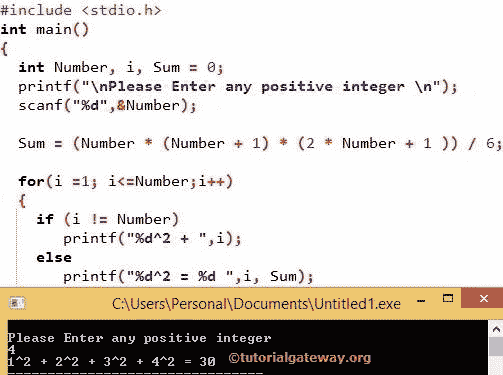

# C 程序：求数列 1 +2 +3 +和。+n

> 原文：<https://www.tutorialgateway.org/c-program-to-find-sum-of-series-1%c2%b22%c2%b23%c2%b2-n%c2%b2/>

如何编写 C 程序求数列 1 +2 +3 +的和……+n 使用 For 循环，函数示例。在我们进入例子之前，C 程序求数列 1 +2 +3 +和的数学公式…+n = ( n (n+1) (2n+1)) / 6

## 求数列 1 +2 +3 +和的 c 程序。+n

在这个 C 程序中，用户要求输入任意正整数。然后使用该值，编译器将使用上述公式找到系列 1<sup>2</sup>+2<sup>2</sup>+3<sup>2</sup>+…+n<sup>2</sup>的和。

在 main()函数中，我们声明了 2 个整数变量 Number 和 Sum。printf 语句将要求用户输入任何整数值。下面的 [C 编程](https://www.tutorialgateway.org/c-programming/) scanf 语句将为变量名 Number 分配用户整数值

```c
/* C Program to Calculate Sum of series 1²+2²+3²+....+n² */
#include <stdio.h>

int main()
{
  int Number, Sum = 0;

  printf("\n Please Enter any positive integer \n");
  scanf(" %d",&Number);

  Sum = (Number * (Number + 1) * (2 * Number + 1 )) / 6;

  printf("\n The Sum of Series for %d = %d ",Number, Sum);

}
```

```c
 Please Enter any positive integer 
5

 The Sum of Series for 5 = 55
```

下一行，我们用上面的公式
计算数列 1 +2 +3 +4 +5 的和=(数*(数+ 1) * (2 *数+1))/6；
总和= (5 * (5 + 1) * (2 * 5 +1)) / 6
总和= (5 * 6 * 11) / 6
总和= 330 /6
总和= 55

求数列 1 +2 +3 +和的 C 程序。+n 最终输出为 5 = 55

## 计算数列 1 +2 +3 +和的 c 程序。+n

如果你想在程序输出中显示序列顺序 1<sup>2</sup>+2<sup>2</sup>+3<sup>2</sup>+4<sup>2</sup>+5<sup>2</sup>，那么我们必须添加额外的 For 循环来显示如下

```c
#include <stdio.h>

int main()
{
  int Number, i, Sum = 0;

  printf("\nPlease Enter any positive integer \n");
  scanf("%d",&Number);

  Sum = (Number * (Number + 1) * (2 * Number + 1 )) / 6;

  for(i =1; i<=Number;i++)
  {
    if (i != Number)
       printf("%d^2 + ",i);

    else
       printf("%d^2 = %d ",i, Sum);
  }
}

```



主功能中的 [For 循环](https://www.tutorialgateway.org/for-loop-in-c-programming/)将遍历每个成员并显示输出。

在上图截图中，用户输入的数值是 4 So，

总和=(数*(数+ 1) * (2 *数+1))/6；
总和= (4 * (4 + 1) * (2 * 4 +1))/6
总和= (4 * 5 * 9) / 6
= 180 /6
总和= 30

现在，编译器将进入 for 循环

第一次迭代
i = 1，因此 for 循环(i < = Number)内的条件为真(1 < =4)。接下来，它将转到 if 条件(I！=数字)。意思是(1！= 4)–这是真的。因此，它将输出打印为 1 +

i = 2。重复同样的步骤，直到我达到 4 岁。当 i = 4 时，如果条件失败。因此，将打印 Else 语句。

最终输出将是 1 +2 +3 +4 = 30

## 求数列 1 +2 +3 +和的 c 程序。+n 使用函数

在这个 [C 程序](https://www.tutorialgateway.org/c-programming-examples/)中，用户输入任意正整数，然后使用该值，编译器将使用[函数](https://www.tutorialgateway.org/functions-in-c/ "FUNCTIONS")找到数列 1<sup>2</sup>+2<sup>2</sup>+3<sup>2</sup>+…+n<sup>2</sup>的和。

```c
#include <stdio.h>

void Sum_Of_Series(int);

int main()
{
  int Number;

  printf("\n Please Enter any positive integer \n");
  scanf("%d",&Number);

  Sum_Of_Series(Number);
}

void Sum_Of_Series(int Number)
{
  int i, Sum;
  Sum = (Number * (Number + 1) * (2 * Number + 1 )) / 6;

  for(i =1;i<=Number;i++)
  {
   if (i != Number)
     printf("%d^2 + ",i);
   else
     printf(" %d^2 = %d ", i, Sum); 
  } 
}
```

```c
 Please Enter any positive integer 
9
1^2 + 2^2 + 3^2 + 4^2 + 5^2 + 6^2 + 7^2 + 8^2 +  9^2 = 285 
```

## 求数列 1 +2 +3 +和的程序。使用递归

请参考系列 1 +2 +3 +的求和…+n 使用递归在[递归](https://www.tutorialgateway.org/recursion-in-c/ "RECURSION")文章中查看代码和工作原理。