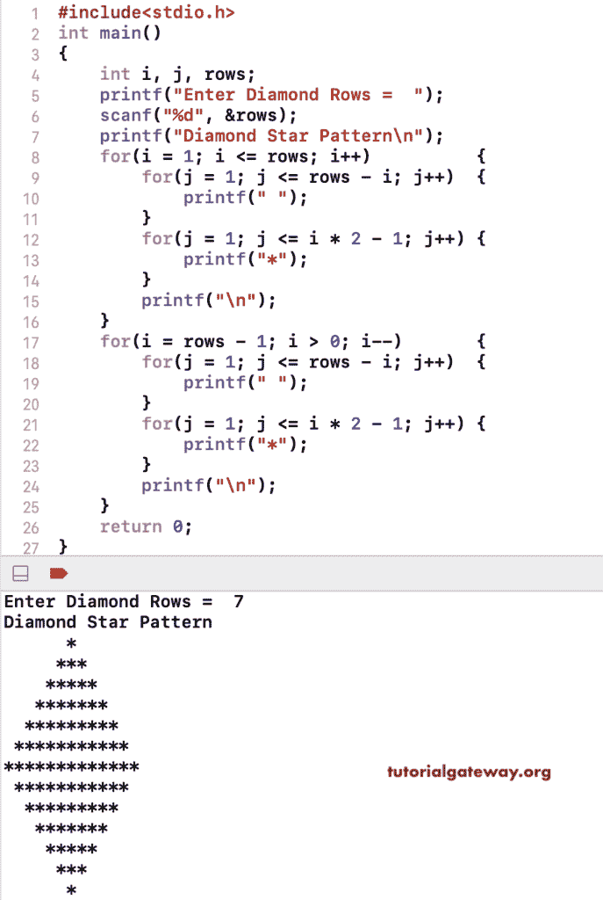

# C 程序：打印菱形星形图案

> 原文：<https://www.tutorialgateway.org/c-program-to-print-diamond-star-pattern/>

写一个 C 程序打印菱形星形图案用于循环。这个 c 菱形星形图案示例使用两组 for 循环来打印菱形的上部和下部。有嵌套的 for 循环来迭代行和列并打印菱形星形模式。

```c
#include<stdio.h>
int main()
{
 	int i, j, rows; 
 	printf("Enter Diamond Rows =  ");
 	scanf("%d", &rows);

    printf("Diamond Star Pattern\n");
	for(i = 1; i <= rows; i++)
	{
		for(j = 1; j <= rows - i; j++)
		{
			printf(" ");
		}
        for(j = 1; j <= i * 2 - 1; j++)
        {
            printf("*");
        }
		printf("\n");
	}

    for(i = rows - 1; i > 0; i--)
	{
		for(j = 1; j <= rows - i; j++)
		{
			printf(" ");
		}
        for(j = 1; j <= i * 2 - 1; j++)
        {
            printf("*");
        }
		printf("\n");
	}

 	return 0;
}
```



在这个 C 程序中，我们删除了循环的倍数，并使用 if 语句来打印菱形星形图案。

```c
#include<stdio.h>
int main()
{
 	int i, j, k, rows;
 	printf("Enter Diamond Rows =  ");
 	scanf("%d", &rows);

	int x = rows - 1;
    int y = 1;

    printf("Diamond Star Pattern\n");
	for(i = 1; i <= rows; i++)
	{
		for(j = 1; j <= x; j++)
		{
			printf(" ");
		}
        for(k = 1; k <= y; k++)
        {
            printf("*");
        }
		if(x > i)
		{
			x = x - 1;
			y += 2;
		}
		if(x < i)
		{
			x += 1;
			y = y - 2;
		}
		printf("\n");
	}
 	return 0;
}
```

```c
Enter Diamond Rows =  12
Diamond Star Pattern
           *
          ***
         *****
        *******
       *********
      ***********
      ***********
       *********
        *******
         *****
          ***
           *
```

这个 C 程序允许输入一个符号，并使用 while 循环以菱形模式打印该符号。

```c
#include<stdio.h>
int main()
{
 	int i, j, rows; 
 	printf("Enter Diamond Rows =  ");
 	scanf("%d", &rows);

    printf("Diamond Star Pattern\n");
	i = 1;
	while(i <= rows)
	{
		j = 1;
		while(j <= rows - i)
		{
			printf(" ");
			j++;
		}
		j = 1;
        while(j <= i * 2 - 1)
        {
            printf("*");
			j++;
        }
		printf("\n");
		i++;
	}
	i = rows - 1;
    while(i > 0)
	{
		j = 1;
		while(j <= rows - i)
		{
			printf(" ");
			j++;
		}
		j = 1;
        while(j <= i * 2 - 1)
        {
            printf("*");
			j++;
        }
		printf("\n");
		i--;
	}

 	return 0;
}
```

```c
Enter Diamond Rows =  11
Diamond Star Pattern
          *
         ***
        *****
       *******
      *********
     ***********
    *************
   ***************
  *****************
 *******************
*********************
 *******************
  *****************
   ***************
    *************
     ***********
      *********
       *******
        *****
         ***
          *
```