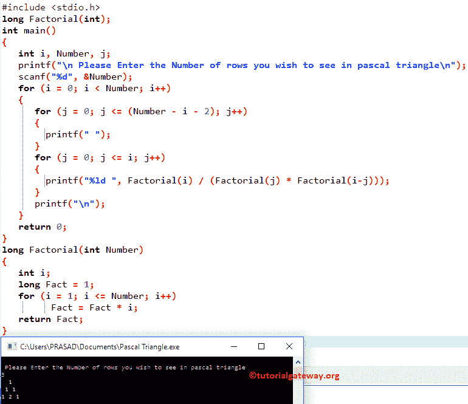

# C 程序：用 C 语言打印帕斯卡三角形

> 原文：<https://www.tutorialgateway.org/print-pascal-triangle-in-c/>

如何用实例编写 C 语言打印帕斯卡三角形的程序？。帕斯卡三角形是一个具有二项式系数数组的三角形。

## 用 C 语言打印帕斯卡三角形的程序

这个帕斯卡三角形在 C 程序中允许用户输入他/她想要打印成帕斯卡三角形的最大行数。我们将打印整数的 C 帕斯卡三角形，直到它到达用户指定的行。

```c
#include <stdio.h>

long Factorial(int);

int main()
{
   int i, Number, j;

   printf("\n Please Enter the Number of rows you wish to see in pascal triangle\n");
   scanf("%d", &Number);

   for (i = 0; i < Number; i++)
   {
      for (j = 0; j <= (Number - i - 2); j++)
      {
      	printf(" ");
	  }

      for (j = 0; j <= i; j++)
      {
      	printf("%ld ", Factorial(i) / (Factorial(j) * Factorial(i-j)));
	  } 

      printf("\n");
   }

   return 0;
}

long Factorial(int Number)
{
   int i;
   long Fact = 1;

   for (i = 1; i <= Number; i++)
         Fact = Fact * i;

   return Fact;
}
```



在这个 c 例子的帕斯卡三角形中，长阶乘(int Number)函数声明将找到给定数字的阶乘。请参考 [C 程序求一个数的阶乘](https://www.tutorialgateway.org/c-program-to-find-factorial-of-a-number/)了解第一个函数涉及的步骤

下面的 [C 编程](https://www.tutorialgateway.org/c-programming/) printf 和 scanf 语句将允许用户输入他/她想要打印的帕斯卡三角形的范围或最大行数。

现在让我们在迭代中看到循环的[嵌套。](https://www.tutorialgateway.org/for-loop-in-c-programming/)

外环–第一次迭代

从上面 c 截图中的帕斯卡三角形，可以观察到 I 的值为 0，Number 为 3，条件(i < 3)为 True。因此，它将进入第二个 for 循环

第一次内循环–第一次迭代
j 值为 0，条件(j<=(3–0–2)为真。因此，它将开始执行循环中的语句。printf(" ")语句将空白空间打印为输出

中的以下 j++语句将使用[增量运算符](https://www.tutorialgateway.org/increment-and-decrement-operators-in-c/)将 j 的值增加 1

C 程序中的帕斯卡三角形第一次内循环——第二次迭代

j 值将为 1，条件(1 < =(3–0–2))为真，因此下面的语句将输出空格

第一个内部循环–第三次迭代

j 值为 2，条件(2 < =(3–0–2))为假。因此，它将从 for 循环中退出。

接下来，它将进入第二个 For 循环

```c
for (j = 0; j <= i; j++) // Second Inner Loop
   {
     	printf("%ld ", Factorial(i) / (Factorial(j) * Factorial(i-j)));
   }
```

第二个内部循环–第一次迭代
我们还没有完成外部循环的第一次迭代，所以 I 值仍然是 0。

j 值为 0，条件(j <= 0)为真。因此，它将开始执行循环中的语句。下面的语句将找到 I 和 j 的阶乘并打印输出

```c
printf("%ld ", Factorial(i) / (Factorial(j) * Factorial(i-j)));
```

阶乘(i) /(阶乘(j) *阶乘(I–j))
它的意思是，阶乘(0) /(阶乘(0) *阶乘(0) ) — >阶乘 0 = 1
= 1/(1 * 1)= 1

j++语句将使用[增量运算符](https://www.tutorialgateway.org/increment-and-decrement-operators-in-c/)将 j 的值增加 1

第二个内部循环–第二次迭代

j 值为 1，条件(1 <= 0) is False. So, it will exit from the for loop. The following printf(“\n”) statement is to terminate the current line

第一次迭代后的最终输出=[空白空间][空白空间] 1

C 程序外环中的帕斯卡三角形——第二次迭代
I 的值为 1，条件(1 < 3)为真。因此，它将进入第二个 for 循环

第一个内环–第一次迭代

j 的值为 0，条件(0 <= 0)为真。因此，空白空间将作为输出打印。接下来，j 值也将增加 1。

第一个内部循环–第二次迭代

j 的值为 1，条件(1 <= 0) is False. So, it will exit from the for loop. Now, it will enter into second For Loop

第二个内部循环–第一次迭代
我们还没有完成外部循环的第二次迭代，所以 I 值仍然是 1。

j 值为 0，条件(0 <= 1)为真。因此，它将开始寻找 I 和 j 的阶乘，并打印输出

阶乘(i) /(阶乘(j) *阶乘(I–j))
它的意思是，阶乘(1) /(阶乘(0) *阶乘(1) ) — >阶乘 0 = 1
= 1/(1 * 1)= 1

第二次内循环–第二次迭代
j 值将为 1，条件(1 < = 1)为真因此，它将开始寻找 I 和 j 的阶乘并打印输出

阶乘(1) /(阶乘(1) *阶乘(0) ) —>阶乘 0 = 1
= 1 / (1 * 1) = 1

第二个内环–第三次迭代

j 值将为 2，条件(2 <= 1)为假，因此它将退出 for 循环。第二次迭代后的最终输出=[空白] 1 1

C 外循环中的帕斯卡三角形–第三次迭代
I 的值为 2，条件(2 < 3)为真。所以它将进入第二个循环

第二个内部循环–第一次迭代
我们还没有完成外部循环的第三次迭代，所以 I 值仍然是 2。

j 值为 0，条件(0 <= 2)为真。因此，它将开始寻找 I 和 j 的阶乘，并打印输出

阶乘(2) /(阶乘(0) *阶乘(2) ) —>阶乘 0 = 1
= 2 / (1 * 2) = 1

第二次内循环–第二次迭代
j 值为 1，条件(1 < = 2)为真。

阶乘(2) /(阶乘(1) *阶乘(1) ) —>阶乘 2 = 2
= 2 / (1 * 1) = 2

c–第三次迭代
中帕斯卡三角形的第二个内环 j = 2，条件(2 < = 2)为真。

阶乘(2) /(阶乘(2) *阶乘(0) )
= 2 / (2 * 1) = 1

第二次内循环–第四次迭代
j = 3，条件(3 < = 2)为假。因此，它将从 for 循环中退出。第三次迭代后的最终输出= 1 2 1

外环–c 语言中帕斯卡三角形的第四次迭代

我的值将是 3，条件(3 < 3) is False. So it will exit from the for loop.

最终输出为:

【空位】【空位】1
=【空位】1 1
1 2 1

## 用递归打印帕斯卡三角形的 C 程序

这个用于 C 中帕斯卡三角形的 [C 程序](https://www.tutorialgateway.org/c-programming-examples/)允许用户输入他/她想要打印为帕斯卡三角形的行数。在这个例子中，我们将使用我们在第一个例子中使用的代码片段。然而，这次我们使用递归函数来寻找阶乘。

请参考 [C 程序求一个数的阶乘](https://www.tutorialgateway.org/c-program-to-find-factorial-of-a-number/)了解第一个函数涉及的步骤，即长阶乘(int Number)

```c
#include <stdio.h>
long Factorial(int Number)
{
  if (Number == 0 || Number == 1)  
    return 1;
  else
    return Number * Factorial (Number -1);
}

int main()
{
   int i, Number, j, Fact;
   printf("\n Please Enter Number of rows you want to see in pascal triangle\n");
   scanf("%d", &Number);
   for (i = 0; i < Number; i++)
   {
      for (j = 0; j <= (Number - i - 2); j++)
      {
      	printf(" ");
      }
      for (j = 0; j <= i; j++)
      {
      	Fact = Factorial(i) / (Factorial(j) * Factorial(i-j));
	printf("%ld ", Fact);
      } 
      printf("\n");
   }
   return 0;
}
```

```c
 Please Enter Number of rows you want to see in pascal triangle
9
        1 
       1 1 
      1 2 1 
     1 3 3 1 
    1 4 6 4 1 
   1 5 10 10 5 1 
  1 6 15 20 15 6 1 
 1 7 21 35 35 21 7 1 
1 8 28 56 70 56 28 8 1 
```