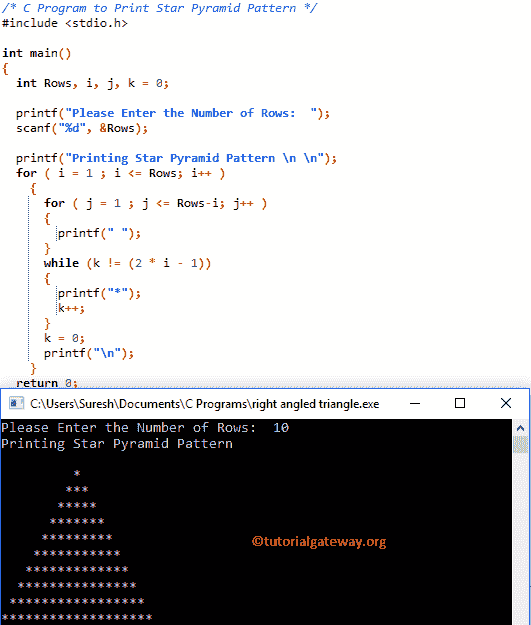

# C 程序：打印星形金字塔图案

> 原文：<https://www.tutorialgateway.org/c-program-to-print-star-pyramid-pattern/>

如何用实例编写打印星形金字塔图案的 C 程序？。并展示如何打印不同符号的金字塔图案(或等边三角形)。

## 使用 While 循环打印星形金字塔图案的 c 程序

这个 C 程序允许用户输入他/她想要打印为等边三角形的最大行数。在这里，我们将打印*符号的金字塔，直到它到达用户指定的行。

```c
/* C Program to Print Star Pyramid Pattern */
#include <stdio.h>

int main() 
{
  int Rows, i, j, k = 0;

  printf("Please Enter the Number of Rows:  ");
  scanf("%d", &Rows);

  printf("Printing Star Pyramid Pattern \n \n");
  for ( i = 1 ; i <= Rows; i++ ) 
    {
      for ( j = 1 ; j <= Rows-i; j++ ) 
      {
      	printf(" ");    	
      }
      while (k != (2 * i - 1))
      {
  	printf("*"); 
  	k++;
      }
      k = 0;
      printf("\n");
    }
  return 0;
}
```



让我们看看的[嵌套](https://www.tutorialgateway.org/for-loop-in-c-programming/)

外环–第一次迭代

从上面的 [C 编程](https://www.tutorialgateway.org/c-programming/)截图可以观察到 I 的值为 1，row 为 10，所以条件(i < = 10)为真。因此，它将进入第二个 for 循环

内部 For 循环–第一次迭代
j 值为 1，条件(j < = 9)为真。因此，它将开始执行循环中的语句。因此，它将开始执行 printf(" ")语句，直到条件失败。

内部 While 循环–第一次迭代

k 值为 0，条件 k！= 2 * I–1(0！= 1)为真。因此，它将开始执行其中的语句。因此，它将开始执行 printf("* ")语句，直到条件失败。

接下来，迭代将从头开始，直到内部和外部循环条件都失败。

## 用 For 循环打印星形金字塔图案的 c 程序

在这个 [C 程序](https://www.tutorialgateway.org/c-programming-examples/)中，我们刚刚用 For 循环替换了 While 循环。我建议你参考 [For Loop](https://www.tutorialgateway.org/for-loop-in-c-programming/) 一文来理解逻辑。

```c
#include <stdio.h>

int main() 
{
  int Rows, i, j, k;

  printf("Please Enter the Number of Rows:  ");
  scanf("%d", &Rows);

  for ( i = 1 ; i <= Rows; i++ ) 
    {
      for ( j = 1 ; j <= Rows-i; j++ ) 
      {
      	printf(" ");    	
      }
      for (k = 1; k <= (2 * i - 1); k++)
      {
   	printf("*"); 
      }
      printf("\n");
    }
  return 0;
}
```

```c
Please Enter the Number of Rows:  12

           *
          ***
         *****
        *******
       *********
      ***********
     *************
    ***************
   *****************
  *******************
 *********************
***********************
```

## 显示星形金字塔图案的 c 程序

这个打印星形金字塔的 C 程序允许用户输入他/她想要打印的符号和行数。这意味着，它允许用户输入自己的角色，而不是打印预定义的星星。

```c
#include <stdio.h>

int main() 
{
  int Rows, i, j, k = 0;
  char ch;

  printf("Please Enter any Symbol :  ");
  scanf("%c", &ch);  

  printf("Please Enter the Number of Rows:  ");
  scanf("%d", &Rows);

  for ( i = 1 ; i <= Rows; i++ ) 
    {
      for ( j = 1 ; j <= Rows-i; j++ ) 
      {
      	printf(" ");    	
	  }
	  while (k != (2 * i - 1))
	  {
	  	printf("%c", ch); 
	  	k++;
	  }
	  k = 0;
      printf("\n");
    }
  return 0;
}
```

```c
Please Enter any Symbol :  $
Please Enter the Number of Rows:  12

           $
          $$$
         $$$$$
        $$$$$$$
       $$$$$$$$$
      $$$$$$$$$$$
     $$$$$$$$$$$$$
    $$$$$$$$$$$$$$$
   $$$$$$$$$$$$$$$$$
  $$$$$$$$$$$$$$$$$$$
 $$$$$$$$$$$$$$$$$$$$$
$$$$$$$$$$$$$$$$$$$$$$$
```