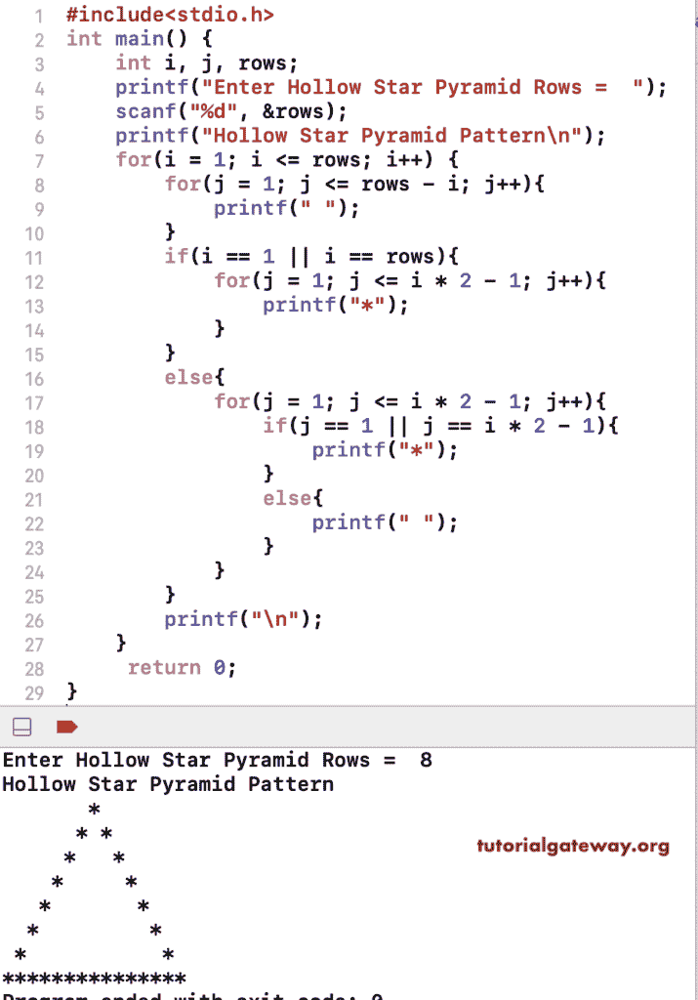

# C 程序：打印空心星号金字塔

> 原文：<https://www.tutorialgateway.org/c-program-to-print-hollow-star-pyramid/>

写一个 C 程序打印星号的空心星号金字塔图案用于循环。这个 C 示例使用嵌套 for 循环和 if-else 语句来打印空心金字塔图案。

```c
#include<stdio.h>
int main()
{
 	int i, j, rows; 
 	printf("Enter Hollow Star Pyramid Rows =  ");
 	scanf("%d", &rows);

    printf("Hollow Star Pyramid Pattern\n");
	for(i = 1; i <= rows; i++)
	{
		for(j = 1; j <= rows - i; j++)
		{
			printf(" ");
		}
        if(i == 1 || i == rows)
        {
            for(j = 1; j <= i * 2 - 1; j++)
            {
                printf("*");
            }
        }
        else
        {
            for(j = 1; j <= i * 2 - 1; j++)
            {
                if(j == 1 || j == i * 2 - 1)
                {
                    printf("*");
                }
                else
                {
                    printf(" ");
                }
            }
        }

		printf("\n");
	}

 	return 0;
}
```



在这个 C 程序中，我们使用 while 循环来打印一个中空的金字塔图案。它允许进入空心金字塔图案符号。

```c
#include<stdio.h>
int main()
{
     int i, j, rows;
    char ch;

    printf("Symbol to Print as Hollow Star Pyramid =  ");
    scanf("%c", & ch);

     printf("Enter Hollow Star Pyramid Rows =  ");
     scanf("%d", &rows);

    printf("Hollow Star Pyramid Pattern\n");
    i = 1;
    while( i <= rows)
    {
        j = 1;
        while( j <= rows - i)
        {
            printf(" ");
            j++;
        }
        if(i == 1 || i == rows)
        {
            j = 1;
            while( j <= i * 2 - 1)
            {
                printf("%c", ch);
                j++;
            }
        }
        else
        {
            j = 1;
            while(j <= i * 2 - 1)
            {
                if(j == 1 || j == i * 2 - 1)
                {
                    printf("%c", ch);
                }
                else
                {
                    printf(" ");
                }
                j++;
            }
        }
        printf("\n");
        i++;
    }

     return 0;
}
```

```c
Symbol to Print as Hollow Star Pyramid =  #
Enter Hollow Star Pyramid Rows =  12
Hollow Star Pyramid Pattern
           #
          # #
         #   #
        #     #
       #       #
      #         #
     #           #
    #             #
   #               #
  #                 #
 #                   #
#######################
```