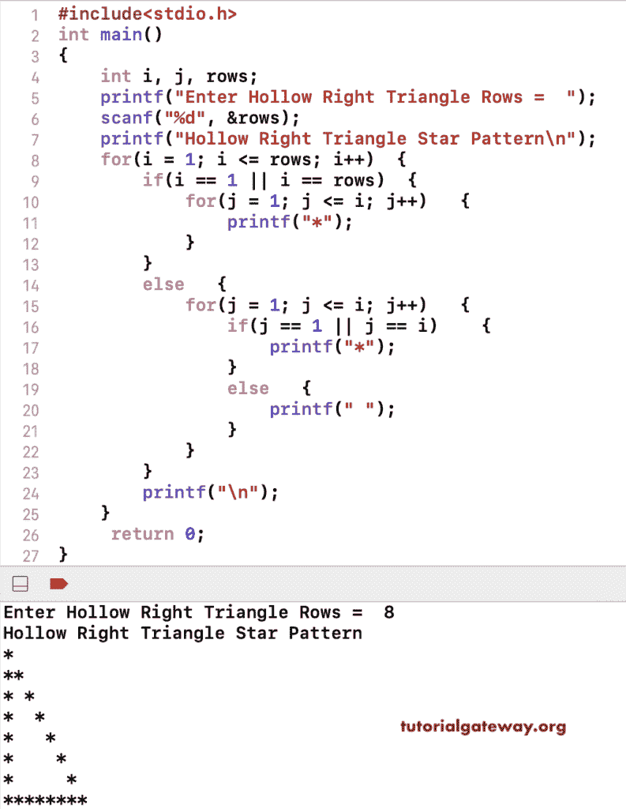

# C 程序：打印空心直角三角形星形图案

> 原文：<https://www.tutorialgateway.org/c-program-to-print-hollow-right-triangle-star-pattern/>

写一个 C 程序打印空心直角三角形星形图案用于循环。这个 C 示例使用 for 循环和 if-else 语句来打印空心的直角三角形星形图案。

```c
#include<stdio.h>
int main()
{
 	int i, j, rows; 
 	printf("Enter Hollow Right Triangle Rows =  ");
 	scanf("%d", &rows);

    printf("Hollow Right Triangle Star Pattern\n");
	for(i = 1; i <= rows; i++)
	{
        if(i == 1 || i == rows)
        {
            for(j = 1; j <= i; j++)
            {
                printf("*");
            }
        }
        else
        {
            for(j = 1; j <= i; j++)
            {
                if(j == 1 || j == i)
                {
                    printf("*");
                }
                else
                {
                    printf(" ");
                }
            }
        }   
		printf("\n");
	}
 	return 0;
}
```



在这个 C 程序中，我们使用 while 循环来打印一个中空的直角三角形图案。它允许输入空心直角三角形图案符号。

```c
#include<stdio.h>
int main()
{
 	int i, j, rows; 
    char ch;

    printf("Symbol to Print Hollow Right Triangle =  ");
    scanf("%c", & ch);

 	printf("Enter Hollow Right Triangle Rows =  ");
 	scanf("%d", &rows);

    printf("Hollow Right Triangle Star Pattern\n");
    i = 1;
	while(i <= rows)
	{
        if(i == 1 || i == rows)
        {
            j = 1;
            while(j <= i)
            {
                printf("%c", ch);
                j++;
            }
        }
        else
        {
            j = 1;
            while(j <= i)
            {
                if(j == 1 || j == i)
                {
                    printf("%c", ch);
                }
                else
                {
                    printf(" ");
                }
                j++;
            }
        }   
		printf("\n");
        i++;
	}
 	return 0;
}
```

```c
Symbol to Print Hollow Right Triangle =  #
Enter Hollow Right Triangle Rows =  10
Hollow Right Triangle Star Pattern
#
##
# #
#  #
#   #
#    #
#     #
#      #
#       #
##########
```