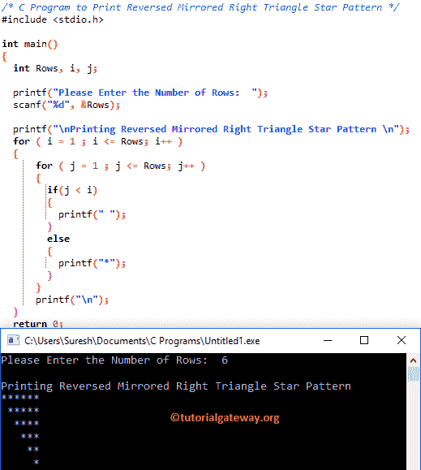

# C 程序：打印星号的倒镜像直角三角形

> 原文：<https://www.tutorialgateway.org/c-program-to-print-reversed-mirrored-right-triangle/>

如何用实例编写 C 程序打印星号的倒镜像直角三角形图案？。并向您展示如何打印带有不同符号的倒镜像直角三角形图案。

## 打印倒镜像直角三角形的 c 程序

这个 C 程序允许用户输入他/她想要打印的最大行数，作为倒镜像直角三角形。我们将打印*符号，直到它到达用户指定的行。

```c
/* C Program to Print Reversed Mirrored Right Triangle Star Pattern */
#include <stdio.h>

int main() 
{
  int Rows, i, j;

  printf("Please Enter the Number of Rows:  ");
  scanf("%d", &Rows);

  printf("\nPrinting Reversed Mirrored Right Triangle Star Pattern \n");
  for ( i = 1 ; i <= Rows; i++ ) 
  {
      for ( j = 1 ; j <= Rows; j++ ) 
      {
      	if(j < i)
      	{
          printf(" ");
	}
	else
	{
	  printf("*");		  	
	}         
      }
      printf("\n");
  }
  return 0;
}
```



让我们看看[嵌套循环](https://www.tutorialgateway.org/for-loop-in-c-programming/)

外环–第一次迭代

从上面的截图可以观察到 I 的值为 1，row 为 6，所以 [C 编程](https://www.tutorialgateway.org/c-programming/)条件(i < = 6)为真。因此，它将进入第二个 for 循环

内部循环–第一次迭代:j 值为 1，条件(j <= 6) is True. So, it will start executing the statements inside the loop. So, it will enter into the  [If 语句](https://www.tutorialgateway.org/if-statement-in-c/))。这里，我们正在检查 j < i (1 < 1)。如果该条件为真，则将执行 printf(" ")。否则，将执行 printf(“*”)。

它将一直发生，直到内部 for 循环中的条件失败。接下来，迭代将从头开始，直到内环和外环条件都失败。

## 返回倒镜像直角三角形的程序

这个打印倒镜像直角三角形的程序允许用户输入他/她想要打印的符号和行数。这意味着，它允许用户输入自己的角色，而不是打印预定义的星星。

```c
#include <stdio.h>

int main() 
{
  int Rows, i, j;
  char Ch;

  printf("Please Enter any Symbol :   ");
  scanf("%c", &Ch); 

  printf("Please Enter the Number of Rows:  ");
  scanf("%d", &Rows);

  printf("\nPrinting Reversed Mirrored Right Triangle Star Pattern \n");
  for ( i = 1 ; i <= Rows; i++ ) 
  {
      for ( j = 1 ; j <= Rows; j++ ) 
      {
      	if(j < i)
      	{
          printf(" ");
	}
	else
	{
	  printf("%c", Ch);		  	
	}         
      }
      printf("\n");
  }
  return 0;
}
```

```c
Please Enter any Symbol :   $
Please Enter the Number of Rows:  10

Printing Reversed Mirrored Right Triangle Star Pattern 
$$$$$$$$$$
 $$$$$$$$$
  $$$$$$$$
   $$$$$$$
    $$$$$$
     $$$$$
      $$$$
       $$$
        $$
         $
```

## 使用 While 循环返回倒镜像直角三角形的 c 程序

在这个 [C 程序](https://www.tutorialgateway.org/c-programming-examples/)中，我们刚刚用 While 循环代替了 For 循环。我建议你参考 [While Loop](https://www.tutorialgateway.org/while-loop-in-c/) 一文来理解逻辑。

```c
#include <stdio.h>

int main() 
{
  int Rows, i = 1, j;
  char Ch;

  printf("Please Enter any Symbol :   ");
  scanf("%c", &Ch); 

  printf("Please Enter the Number of Rows:  ");
  scanf("%d", &Rows);

  while( i <= Rows ) 
  {
      for ( j = 1 ; j <= Rows; j++ ) 
      {
      	if(j < i)
      	{
          printf(" ");
	}
	else
	{
	  printf("%c", Ch);		  	
	}         
      }
      printf("\n");
      i++;
  }
  return 0;
}
```

```c
Please Enter any Symbol :   #
Please Enter the Number of Rows:  9

#########
 ########
  #######
   ######
    #####
     ####
      ###
       ##
        #
```