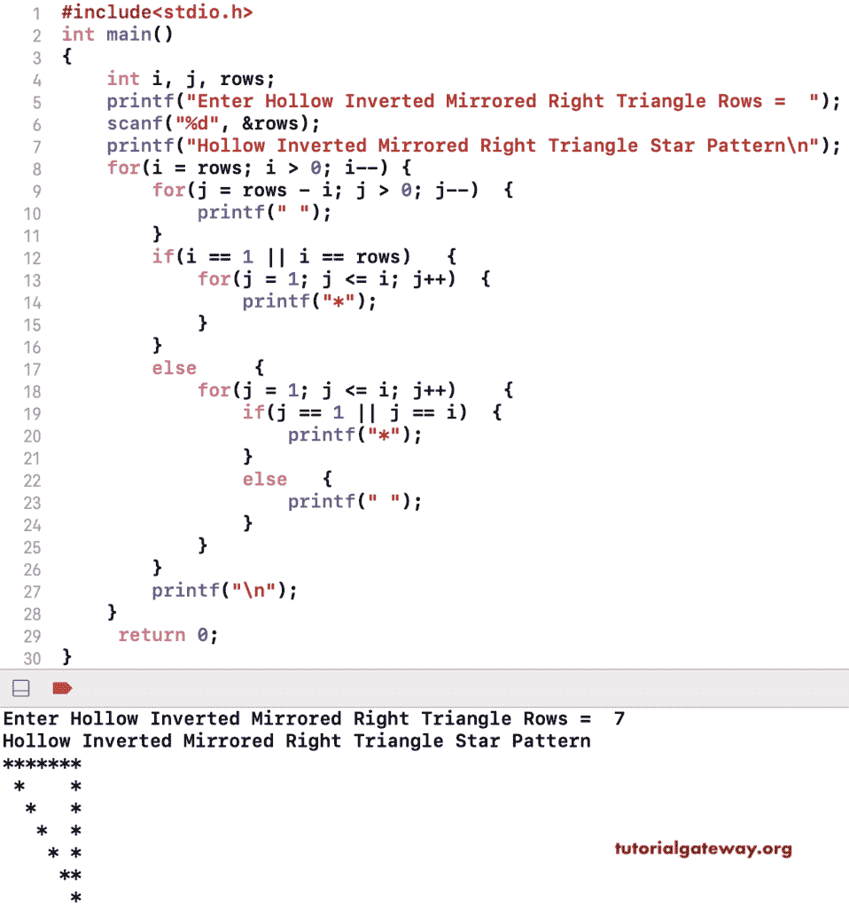

# C 程序：打印空心倒镜像直角三角形星形图案

> 原文：<https://www.tutorialgateway.org/c-program-to-print-hollow-inverted-mirrored-right-triangle-star-pattern/>

写一个 C 程序打印空心倒镜直角三角形星形图案用于循环。

```c
#include<stdio.h>
int main()
{
    int i, j, rows;
    printf("Enter Hollow Inverted Mirrored Right Triangle Rows =  ");
    scanf("%d", &rows);

    printf("Hollow Inverted Mirrored Right Triangle Star Pattern\n");
    for(i = rows; i > 0; i--)
    {
        for(j = rows - i; j > 0; j--)
        {
            printf(" ");
        }

        if(i == 1 || i == rows)
        {
            for(j = 1; j <= i; j++)
            {
                printf("*");
            }
        }
        else
        {
            for(j = 1; j <= i; j++)
            {
                if(j == 1 || j == i)
                {
                    printf("*");
                }
                else
                {
                    printf(" ");
                }
            }
        }
        printf("\n");
    }
     return 0;
}
```



这个 C 程序使用 While 循环打印空心倒镜像直角三角形图案。它允许输入符号打印为空心倒置镜像直角三角形图案。

```c
#include<stdio.h>
int main()
{
    int i, j, rows;
    char ch;

    printf("Symbol for Hollow Inverted Mirrored Right Triangle =  ");
    scanf("%c", &ch);

    printf("Enter Hollow Inverted Mirrored Right Triangle Rows =  ");
    scanf("%d", &rows);

    printf("Hollow Inverted Mirrored Right Triangle Star Pattern\n");
    i = rows;
    while(i > 0)
    {
        j = rows - i;
        while(j > 0)
        {
            printf(" ");
            j--;
        }

        if(i == 1 || i == rows)
        {
            j = 1;
            while(j <= i)
            {
                printf("%c", ch);
                j++;
            }
        }
        else
        {
            j = 1;
            while(j <= i)
            {
                if(j == 1 || j == i)
                {
                    printf("%c", ch);
                }
                else
                {
                    printf(" ");
                }
                j++;
            }
        }
        printf("\n");
        i--;
    }
     return 0;
}
```

```c
Symbol for Hollow Inverted Mirrored Right Triangle =  #
Enter Hollow Inverted Mirrored Right Triangle Rows =  9
Hollow Inverted Mirrored Right Triangle Star Pattern
#########
 #      #
  #     #
   #    #
    #   #
     #  #
      # #
       ##
        #
```