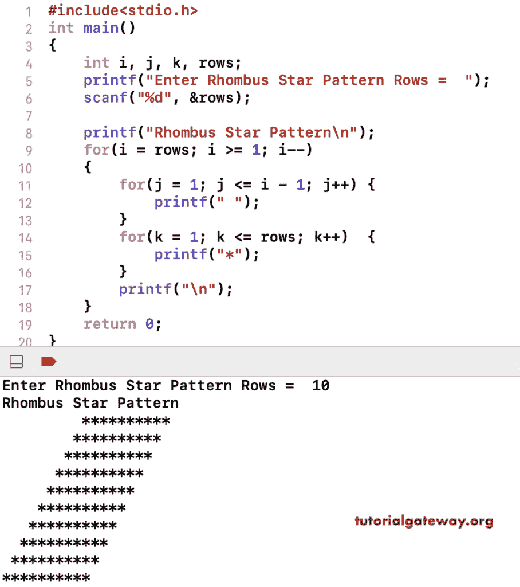

# C 程序：打印星号的菱形图案

> 原文：<https://www.tutorialgateway.org/c-program-to-print-rhombus-star-pattern/>

写一个 C 程序打印星号的菱形图案用于循环。这个 c 示例中的主循环从最后一行迭代到第一行，嵌套循环打印菱形模式。

```c
#include<stdio.h>
int main()
{
    int i, j, k, rows;
    printf("Enter Rhombus Star Pattern Rows =  ");
    scanf("%d", &rows);

    printf("Rhombus Star Pattern\n");
    for(i = rows; i >= 1; i--)
    {
        for(j = 1; j <= i - 1; j++)
        {
            printf(" ");
        }
        for(k = 1; k <= rows; k++)
        {
            printf("*");
        }         
        printf("\n");   
    }
    return 0;
}
```



这个 C 程序允许输入一个符号，并以菱形模式打印该符号。

```c
#include<stdio.h>
int main()
{
    int i, j, k, rows;
    char ch;

    printf("Symbol for Rhombus Pattern =  ");
    scanf("%c", &ch);

    printf("Enter Rhombus Star Pattern Rows =  ");
    scanf("%d", &rows);

    printf("Rhombus Star Pattern\n");
    i = rows;
    while(i >= 1)
    {
        j = 1;
        while(j <= i - 1)
        {
            printf(" ");
            j++;
        }
        k = 1;
        while(k <= rows)
        {
            printf("%c", ch);
            k++;
        }         
        printf("\n"); 
        i--;  
    }
    return 0;
}
```

```c
Symbol for Rhombus Pattern =  #
Enter Rhombus Star Pattern Rows =  9
Rhombus Star Pattern
        #########
       #########
      #########
     #########
    #########
   #########
  #########
 #########
#########
```