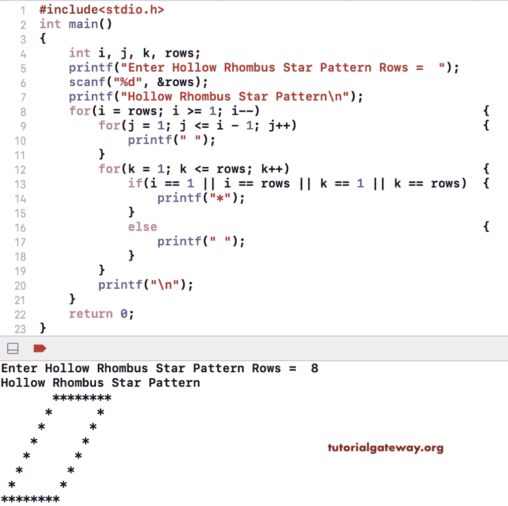

# C 程序：打印空心菱形星形图案

> 原文：<https://www.tutorialgateway.org/c-program-to-print-hollow-rhombus-star-pattern/>

写一个 C 程序打印空心菱形星形图案用于循环。这个 C 例子使用嵌套的 for 循环和 if-else 来打印空心菱形图案。

```c
#include<stdio.h>
int main()
{
    int i, j, k, rows;
    printf("Enter Hollow Rhombus Star Pattern Rows =  ");
    scanf("%d", &rows);

    printf("Hollow Rhombus Star Pattern\n");
    for(i = rows; i >= 1; i--)
    {
        for(j = 1; j <= i - 1; j++)
        {
            printf(" ");
        }
        for(k = 1; k <= rows; k++)
        {
            if(i == 1 || i == rows || k == 1 || k == rows)
            {
                printf("*");
            }
            else
            {
                printf(" ");
            }       
        }         
        printf("\n");   
    }
    return 0;
}
```



这个 C 程序允许输入符号，使用 while 循环以空心菱形模式打印。

```c
#include<stdio.h>
int main()
{
    int i, j, k, rows;
    char ch;

    printf("Symbol for Hollow Rhombus Pattern =  ");
    scanf("%c", &ch);

    printf("Enter Hollow Rhombus Star Pattern Rows =  ");
    scanf("%d", &rows);

    printf("Hollow Rhombus Star Pattern\n");
    i = rows;
    while(i >= 1)
    {
        j = 1;
        while( j <= i - 1)
        {
            printf(" ");
            j++;
        }
        k = 1;
        while( k <= rows)
        {
            if(i == 1 || i == rows || k == 1 || k == rows)
            {
                printf("%c", ch);
            }
            else
            {
                printf(" ");
            }  
            k++;     
        }         
        printf("\n"); 
        i--;  
    }
    return 0;
}
```

```c
Symbol for Hollow Rhombus Pattern =  #
Enter Hollow Rhombus Star Pattern Rows =  9
Hollow Rhombus Star Pattern
        #########
       #       #
      #       #
     #       #
    #       #
   #       #
  #       #
 #       #
#########
```