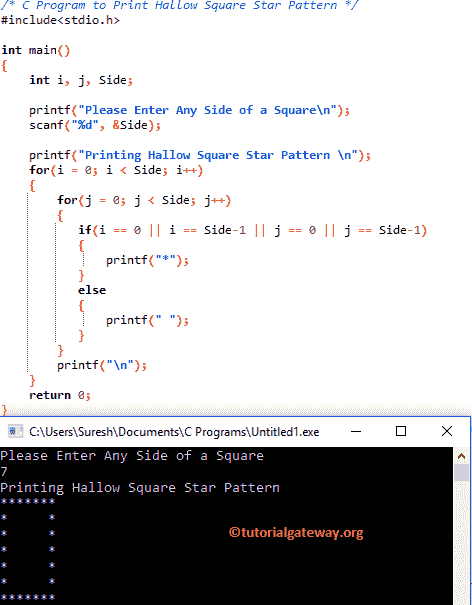

# C 程序：打印空心方形星形图案

> 原文：<https://www.tutorialgateway.org/c-program-to-print-hollow-square-star-pattern/>

如何用实例编写 C 程序打印空心方星形图案？。并展示如何打印不同符号的空心方形图案。

## 打印空心方形星形图案的 c 程序

这个 C 程序允许用户输入正方形的任何一边(在正方形中，所有的边都是相等的)。该值将决定空心正方形的行数和列数。在这里，我们将打印星星，直到它到达用户指定的行和列。

```c
/* C Program to Print Hollow Square Star Pattern */
#include<stdio.h>

int main()
{
    int i, j, Side;

    printf("Please Enter Any Side of a Square\n");
    scanf("%d", &Side);

    printf("Printing Hallow Square Star Pattern \n"); 
    for(i = 0; i < Side; i++)
    {
    	for(j = 0; j < Side; j++)
    	{
    	   if(i == 0 || i == Side-1 || j == 0 || j == Side-1)
    	   {
    		printf("*");
	   }
	   else
	   {
		printf(" ");
	   }         
        }
        printf("\n");
    }
    return 0;
}
```



让我们看看[嵌套循环](https://www.tutorialgateway.org/for-loop-in-c-programming/)

外环–第一次迭代

从上面的截图可以观察到，I 的值为 0，Sides 为 7。因此， [C 编程](https://www.tutorialgateway.org/c-programming/)条件(i < 7)为真。因此，它将进入第二个 for 循环。

内环–第一次迭代
j 值为 0，条件(j < 7)为真。因此，它将开始在循环中执行语句。所以会进入 [If 语句](https://www.tutorialgateway.org/if-statement-in-c/)。这里，我们正在检查 i = 0，j = 0，I = 6(side–1)，还是 j = 6。如果这些条件中的任何一个为真，那么将打印以下语句*

```c
printf("*");
```

它会一直持续到 7，然后内环和外环都会终止。

## 用动态字符显示空心方形星形图案的 c 程序

该[程序](https://www.tutorialgateway.org/c-programming-examples/)允许用户输入他/她想要打印为空心方形图案的符号。

```c
#include<stdio.h>

int main()
{
    int i, j, Side;
    char Ch;

    printf("Please Enter any Symbol\n");
    scanf("%c", &Ch);

    printf("Please Enter Any Side of a Square\n");
    scanf("%d", &Side);

    printf("Printing Hallow Square Star Pattern \n"); 
    for(i = 1; i <= Side; i++)
    {
    	for(j = 1; j <= Side; j++)
    	{
    	  if(i == 1 || i == Side || j == 1 || j == Side)
    	  {
    	     printf("%c", Ch);
	  }
	  else
	  {
	     printf(" ");
	  }         
        }
        printf("\n");
    }
    return 0;
}
```

```c
Please Enter any Symbol
#
Please Enter Any Side of a Square
12
Printing Hallow Square Star Pattern 
############
#          #
#          #
#          #
#          #
#          #
#          #
#          #
#          #
#          #
#          #
############
```