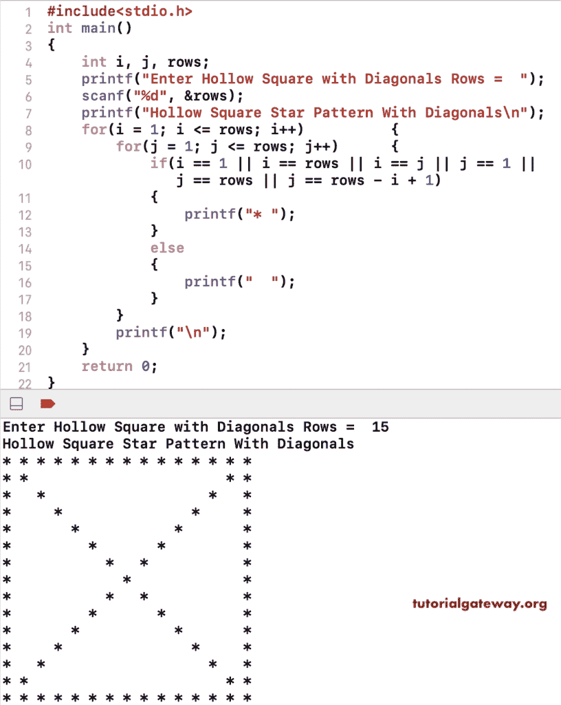

# C 程序：用对角线打印空心正方形图案

> 原文：<https://www.tutorialgateway.org/c-program-to-print-hollow-square-pattern-with-diagonals/>

写一个 C 程序，打印带有对角线的空心方形星形图案，用于循环。这个 c 示例使用嵌套 for 循环来迭代行和列，如果不是，则检查对角线，以打印带有对角线的空心方形星形图案。

```c
#include<stdio.h>
int main()
{
    int i, j, rows;
    printf("Enter Hollow Square with Diagonals Rows =  ");
    scanf("%d", &rows);

    printf("Hollow Square Star Pattern With Diagonals\n");
    for(i = 1; i <= rows; i++)
    {
        for(j = 1; j <= rows; j++)
        {
            if(i == 1 || i == rows || i == j || j == 1 || j == rows || j == rows - i + 1)
            {
                printf("* ");
            }
            else
            {
                printf("  ");
            }         
        }
        printf("\n");   
    }
    return 0;
}
```



这个 C 程序允许输入符号，使用 while 循环打印带有对角线的空心正方形图案。

```c
#include<stdio.h>
int main()
{
    int i, j, rows;
    char ch;

    printf("Symbol for Hollow Square with Diagonals =  ");
    scanf("%c", &ch);

    printf("Enter Hollow Square with Diagonals Rows =  ");
    scanf("%d", &rows);

    printf("Hollow Square Pattern With Diagonals\n");
    i = 1;
    while(i <= rows)
    {
        j = 1;
        while(j <= rows)
        {
            if(i == 1 || i == rows || i == j || j == 1 || j == rows || j == rows - i + 1)
            {
                printf("%c ", ch);
            }
            else
            {
                printf("  ");
            } 
            j++;        
        }
        printf("\n");  
        i++; 
    }
    return 0;
}
```

```c
Symbol for Hollow Square with Diagonals =  #
Enter Hollow Square with Diagonals Rows =  12
Hollow Square Pattern With Diagonals
# # # # # # # # # # # # 
# #                 # # 
#   #             #   # 
#     #         #     # 
#       #     #       # 
#         # #         # 
#         # #         # 
#       #     #       # 
#     #         #     # 
#   #             #   # 
# #                 # # 
# # # # # # # # # # # # 
```