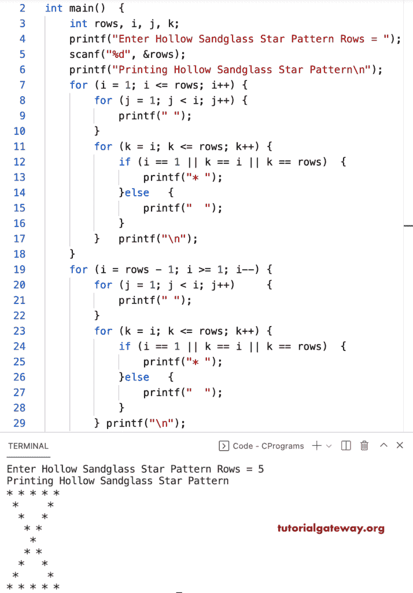

# C 程序：打印星号的空心沙漏图案

> 原文：<https://www.tutorialgateway.org/c-program-to-print-hollow-sandglass-star-pattern/>

写一个 C 程序打印星号的空心沙漏图案用于循环。

```c
#include <stdio.h>

int main()
{
	int rows, i, j, k;

	printf("Enter Hollow Sandglass Star Pattern Rows = ");
	scanf("%d", &rows);

	printf("Printing Hollow Sandglass Star Pattern\n");

	for (i = 1; i <= rows; i++)
	{
		for (j = 1; j < i; j++)
		{
			printf(" ");
		}
		for (k = i; k <= rows; k++)
		{
			if (i == 1 || k == i || k == rows)
			{
				printf("* ");
			}
			else
			{
				printf("  ");
			}
		}
		printf("\n");
	}

	for (i = rows - 1; i >= 1; i--)
	{
		for (j = 1; j < i; j++)
		{
			printf(" ");
		}
		for (k = i; k <= rows; k++)
		{
			if (i == 1 || k == i || k == rows)
			{
				printf("* ");
			}
			else
			{
				printf("  ");
			}
		}
		printf("\n");
	}
}
```



这个 C 例子使用 while 循环来打印星号的空心沙漏图案。

```c
#include <stdio.h>

int main()
{
	int rows, i, j, k;

	printf("Enter Hollow Sandglass Star Pattern Rows = ");
	scanf("%d", &rows);

	printf("Printing Hollow Sandglass Star Pattern\n");
	i = 1;
	while (i <= rows)
	{
		j = 1;
		while (j < i)
		{
			printf(" ");
			j++;
		}
		k = i;
		while (k <= rows)
		{
			if (i == 1 || k == i || k == rows)
			{
				printf("* ");
			}
			else
			{
				printf("  ");
			}
			k++;
		}
		printf("\n");
		i++;
	}

	i = rows - 1;
	while (i >= 1)
	{
		j = 1;
		while (j < i)
		{
			printf(" ");
			j++;
		}
		k = i;
		while (k <= rows)
		{
			if (i == 1 || k == i || k == rows)
			{
				printf("* ");
			}
			else
			{
				printf("  ");
			}
			k++;
		}
		printf("\n");
		i--;
	}
}
```

```c
Enter Hollow Sandglass Star Pattern Rows = 11
Printing Hollow Sandglass Star Pattern
* * * * * * * * * * * 
 *                 * 
  *               * 
   *             * 
    *           * 
     *         * 
      *       * 
       *     * 
        *   * 
         * * 
          * 
         * * 
        *   * 
       *     * 
      *       * 
     *         * 
    *           * 
   *             * 
  *               * 
 *                 * 
* * * * * * * * * * * 
```

这个 C 程序使用 do while 循环显示星星的空心沙漏图案。

```c
#include <stdio.h>

int main()
{
	int rows, i, j, k;

	printf("Enter Hollow Sandglass Star Pattern Rows = ");
	scanf("%d", &rows);

	printf("Printing Hollow Sandglass Star Pattern\n");
	i = 1;
	do
	{
		j = 1;
		do
		{
			printf(" ");
		} while (j++ <= i);
		k = i;
		do
		{
			if (i == 1 || k == i || k == rows)
			{
				printf("* ");
			}
			else
			{
				printf("  ");
			}
		} while (++k <= rows);
		printf("\n");
	} while (++i <= rows);

	i = rows - 1;
	do
	{
		j = 1;
		do
		{
			printf(" ");
		} while (j++ <= i);
		k = i;
		do
		{
			if (i == 1 || k == i || k == rows)
			{
				printf("* ");
			}
			else
			{
				printf("  ");
			}
		} while (++k <= rows);
		printf("\n");
	} while (--i >= 1);
}
```

```c
Enter Hollow Sandglass Star Pattern Rows = 14
Printing Hollow Sandglass Star Pattern
  * * * * * * * * * * * * * * 
   *                       * 
    *                     * 
     *                   * 
      *                 * 
       *               * 
        *             * 
         *           * 
          *         * 
           *       * 
            *     * 
             *   * 
              * * 
               * 
              * * 
             *   * 
            *     * 
           *       * 
          *         * 
         *           * 
        *             * 
       *               * 
      *                 * 
     *                   * 
    *                     * 
   *                       * 
  * * * * * * * * * * * * * * 
```

该 [C 示例](https://www.tutorialgateway.org/c-programming-examples/)代码允许用户输入字符并打印给定字符的空心沙漏图案。

```c
#include <stdio.h>

void HollowSandglassPattern(int rows, char ch);

int main()
{
	int rows;
	char ch;

	printf("Enter Character for Hollow Sandglass Pattern = ");
	scanf("%c", &ch);

	printf("Enter Hollow Sandglass Star Pattern Rows = ");
	scanf("%d", &rows);

	printf("Printing Hollow Sandglass Star Pattern\n");
	HollowSandglassPattern(rows, ch);
}

void HollowSandglassPattern(int rows, char ch)
{
	int i, j, k;

	for (i = 1; i <= rows; i++)
	{
		for (j = 1; j < i; j++)
		{
			printf(" ");
		}
		for (k = i; k <= rows; k++)
		{
			if (i == 1 || k == i || k == rows)
			{
				printf("%c ", ch);
			}
			else
			{
				printf("  ");
			}
		}
		printf("\n");
	}

	for (i = rows - 1; i >= 1; i--)
	{
		for (j = 1; j < i; j++)
		{
			printf(" ");
		}
		for (k = i; k <= rows; k++)
		{
			if (i == 1 || k == i || k == rows)
			{
				printf("%c ", ch);
			}
			else
			{
				printf("  ");
			}
		}
		printf("\n");
	}
}
```

```c
Enter Character for Hollow Sandglass Pattern = $
Enter Hollow Sandglass Star Pattern Rows = 16
Printing Hollow Sandglass Star Pattern
$ $ $ $ $ $ $ $ $ $ $ $ $ $ $ $ 
 $                           $ 
  $                         $ 
   $                       $ 
    $                     $ 
     $                   $ 
      $                 $ 
       $               $ 
        $             $ 
         $           $ 
          $         $ 
           $       $ 
            $     $ 
             $   $ 
              $ $ 
               $ 
              $ $ 
             $   $ 
            $     $ 
           $       $ 
          $         $ 
         $           $ 
        $             $ 
       $               $ 
      $                 $ 
     $                   $ 
    $                     $ 
   $                       $ 
  $                         $ 
 $                           $ 
$ $ $ $ $ $ $ $ $ $ $ $ $ $ $ $ 
```