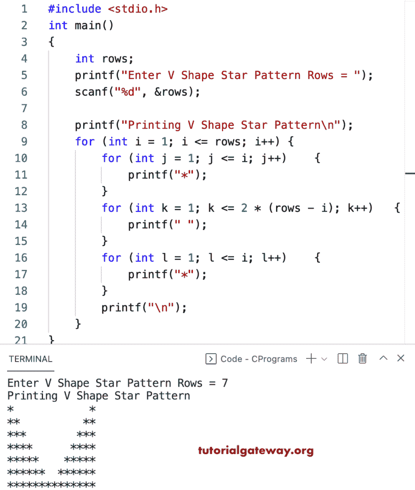

# C 程序：打印 V 星图案

> 原文：<https://www.tutorialgateway.org/c-program-to-print-v-star-pattern/>

写一个 C 程序打印 V 星图案用于循环。

```c
#include <stdio.h>

int main()
{

	int rows;

	printf("Enter V Shape Star Pattern Rows = ");
	scanf("%d", &rows);

	printf("Printing V Shape Star Pattern\n");

	for (int i = 1; i <= rows; i++)
	{
		for (int j = 1; j <= i; j++)
		{
			printf("*");
		}
		for (int k = 1; k <= 2 * (rows - i); k++)
		{
			printf(" ");
		}
		for (int l = 1; l <= i; l++)
		{
			printf("*");
		}
		printf("\n");
	}
}
```



## 使用 while 循环打印 V 星图案的 c 程序

```c
#include <stdio.h>

int main()
{

	int i, j, k, l, rows;

	printf("Enter V Shape Star Pattern Rows = ");
	scanf("%d", &rows);

	printf("Printing V Shape Star Pattern\n");
	i = 1;
	while (i <= rows)
	{
		j = 1;
		while (j <= i)
		{
			printf("*");
			j++;
		}
		k = 1;
		while (k <= 2 * (rows - i))
		{
			printf(" ");
			k++;
		}
		l = 1;
		while (l <= i)
		{
			printf("*");
			l++;
		}
		printf("\n");
		i++;
	}
}
```

```c
Enter V Shape Star Pattern Rows = 13
Printing V Shape Star Pattern
*                        *
**                      **
***                    ***
****                  ****
*****                *****
******              ******
*******            *******
********          ********
*********        *********
**********      **********
***********    ***********
************  ************
**************************
```

本 [C 示例](https://www.tutorialgateway.org/c-programming-examples/)使用 do while 循环打印字母 V 形星形图案。

```c
#include <stdio.h>

int main()
{

	int i, j, k, l, rows;

	printf("Enter V Shape Star Pattern Rows = ");
	scanf("%d", &rows);

	printf("Printing V Shape Star Pattern\n");
	i = 1;
	do
	{
		j = 1;
		do
		{
			printf("*");

		} while (++j <= i);
		k = 1;
		while (k <= 2 * (rows - i))
		{
			printf(" ");
			k++;
		}
		l = 1;
		do
		{
			printf("*");
		} while (++l <= i);
		printf("\n");

	} while (++i <= rows);
}
```

```c
Enter V Shape Star Pattern Rows = 16
Printing V Shape Star Pattern
*                              *
**                            **
***                          ***
****                        ****
*****                      *****
******                    ******
*******                  *******
********                ********
*********              *********
**********            **********
***********          ***********
************        ************
*************      *************
**************    **************
***************  ***************
********************************
```

在这个 C 例子中，ShapeVPattern 函数允许输入任何字符，并打印给定字符的字母 V 模式。

```c
#include <stdio.h>

void ShapeVPattern(int rows, char ch)
{
	for (int i = 1; i <= rows; i++)
	{
		for (int j = 1; j <= i; j++)
		{
			printf("%c", ch);
		}
		for (int k = 1; k <= 2 * (rows - i); k++)
		{
			printf(" ");
		}
		for (int l = 1; l <= i; l++)
		{
			printf("%c", ch);
		}
		printf("\n");
	}
}

int main()
{
	int rows;
	char ch;

	printf("Enter Character for V Pattern = ");
	scanf("%c", &ch);

	printf("Enter V Shape Star Pattern Rows = ");
	scanf("%d", &rows);

	printf("Printing V Shape Pattern\n");
	ShapeVPattern(rows, ch);
}
```

```c
Enter Character for V Pattern = $
Enter V Shape Star Pattern Rows = 19
Printing V Shape Pattern
$                                    $
$$                                  $$
$$$                                $$$
$$$$                              $$$$
$$$$$                            $$$$$
$$$$$$                          $$$$$$
$$$$$$$                        $$$$$$$
$$$$$$$$                      $$$$$$$$
$$$$$$$$$                    $$$$$$$$$
$$$$$$$$$$                  $$$$$$$$$$
$$$$$$$$$$$                $$$$$$$$$$$
$$$$$$$$$$$$              $$$$$$$$$$$$
$$$$$$$$$$$$$            $$$$$$$$$$$$$
$$$$$$$$$$$$$$          $$$$$$$$$$$$$$
$$$$$$$$$$$$$$$        $$$$$$$$$$$$$$$
$$$$$$$$$$$$$$$$      $$$$$$$$$$$$$$$$
$$$$$$$$$$$$$$$$$    $$$$$$$$$$$$$$$$$
$$$$$$$$$$$$$$$$$$  $$$$$$$$$$$$$$$$$$
$$$$$$$$$$$$$$$$$$$$$$$$$$$$$$$$$$$$$$
```