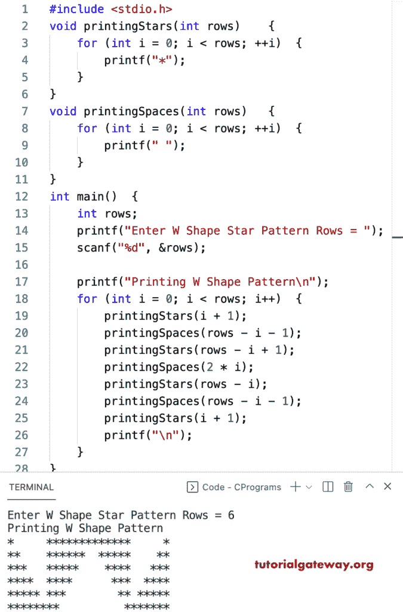

# C 程序：打印星号的`W`图案

> 原文：<https://www.tutorialgateway.org/c-program-to-print-w-star-pattern/>

写一个 C 程序打印星号的`W`图案用于循环。在这段 C 代码中，printingStars 函数迭代并打印星星，printingSpaces 打印空格以打印 W 形状。

```c
#include <stdio.h>

void printingStars(int rows)
{
	for (int i = 0; i < rows; ++i)
	{
		printf("*");
	}
}
void printingSpaces(int rows)
{
	for (int i = 0; i < rows; ++i)
	{
		printf(" ");
	}
}

int main()
{
	int rows;

	printf("Enter W Shape Star Pattern Rows = ");
	scanf("%d", &rows);

	printf("Printing W Shape Pattern\n");
	for (int i = 0; i < rows; i++)
	{
		printingStars(i + 1);
		printingSpaces(rows - i - 1);
		printingStars(rows - i + 1);
		printingSpaces(2 * i);
		printingStars(rows - i);
		printingSpaces(rows - i - 1);
		printingStars(i + 1);
		printf("\n");
	}
}
```



这个 C 程序使用 while 循环来显示 W 星号图案。

```c
#include <stdio.h>

void printingStars(int rows)
{
	int i = 0;
	while (i < rows)
	{
		printf("*");
		++i;
	}
}
void printingSpaces(int rows)
{
	int i = 0;
	while (i < rows)
	{
		printf(" ");
		++i;
	}
}

int main()
{
	int rows;

	printf("Enter W Shape Star Pattern Rows = ");
	scanf("%d", &rows);

	printf("Printing W Shape Pattern\n");
	int i = 0;
	while (i < rows)
	{
		printingStars(i + 1);
		printingSpaces(rows - i - 1);
		printingStars(rows - i + 1);
		printingSpaces(2 * i);
		printingStars(rows - i);
		printingSpaces(rows - i - 1);
		printingStars(i + 1);
		printf("\n");
		i++;
	}
}
```

```c
Enter W Shape Star Pattern Rows = 12
Printing W Shape Pattern
*           *************************           *
**          ************  ***********          **
***         ***********    **********         ***
****        **********      *********        ****
*****       *********        ********       *****
******      ********          *******      ******
*******     *******            ******     *******
********    ******              *****    ********
*********   *****                ****   *********
**********  ****                  ***  **********
*********** ***                    ** ***********
**************                      *************
```

在这个 [C 示例](https://www.tutorialgateway.org/c-programming-examples/)中，WStars 函数允许输入任何字符，并打印给定字符的 W 模式。

```c
#include <stdio.h>

void printingWStars(int rows, char ch)
{
	for (int i = 0; i < rows; ++i)
	{
		printf("%c", ch);
	}
}

void printingWSpaces(int rows)
{
	for (int i = 0; i < rows; ++i)
	{
		printf(" ");
	}
}

int main()
{
	int rows;
	char ch;

	printf("Enter Character for W Pattern = ");
	scanf("%c", &ch);

	printf("Enter W Shape Star Pattern Rows = ");
	scanf("%d", &rows);

	printf("Printing W Shape Pattern\n");
	for (int i = 0; i < rows; i++)
	{
		printingWStars(i + 1, ch);
		printingWSpaces(rows - i - 1);
		printingWStars(rows - i + 1, ch);
		printingWSpaces(2 * i);
		printingWStars(rows - i, ch);
		printingWSpaces(rows - i - 1);
		printingWStars(i + 1, ch);
		printf("\n");
	}
}
```

```c
Enter Character for W Pattern = @
Enter W Shape Star Pattern Rows = 16
Printing W Shape Pattern
@               @@@@@@@@@@@@@@@@@@@@@@@@@@@@@@@@@               @
@@              @@@@@@@@@@@@@@@@  @@@@@@@@@@@@@@@              @@
@@@             @@@@@@@@@@@@@@@    @@@@@@@@@@@@@@             @@@
@@@@            @@@@@@@@@@@@@@      @@@@@@@@@@@@@            @@@@
@@@@@           @@@@@@@@@@@@@        @@@@@@@@@@@@           @@@@@
@@@@@@          @@@@@@@@@@@@          @@@@@@@@@@@          @@@@@@
@@@@@@@         @@@@@@@@@@@            @@@@@@@@@@         @@@@@@@
@@@@@@@@        @@@@@@@@@@              @@@@@@@@@        @@@@@@@@
@@@@@@@@@       @@@@@@@@@                @@@@@@@@       @@@@@@@@@
@@@@@@@@@@      @@@@@@@@                  @@@@@@@      @@@@@@@@@@
@@@@@@@@@@@     @@@@@@@                    @@@@@@     @@@@@@@@@@@
@@@@@@@@@@@@    @@@@@@                      @@@@@    @@@@@@@@@@@@
@@@@@@@@@@@@@   @@@@@                        @@@@   @@@@@@@@@@@@@
@@@@@@@@@@@@@@  @@@@                          @@@  @@@@@@@@@@@@@@
@@@@@@@@@@@@@@@ @@@                            @@ @@@@@@@@@@@@@@@
@@@@@@@@@@@@@@@@@@                              @@@@@@@@@@@@@@@@@
```