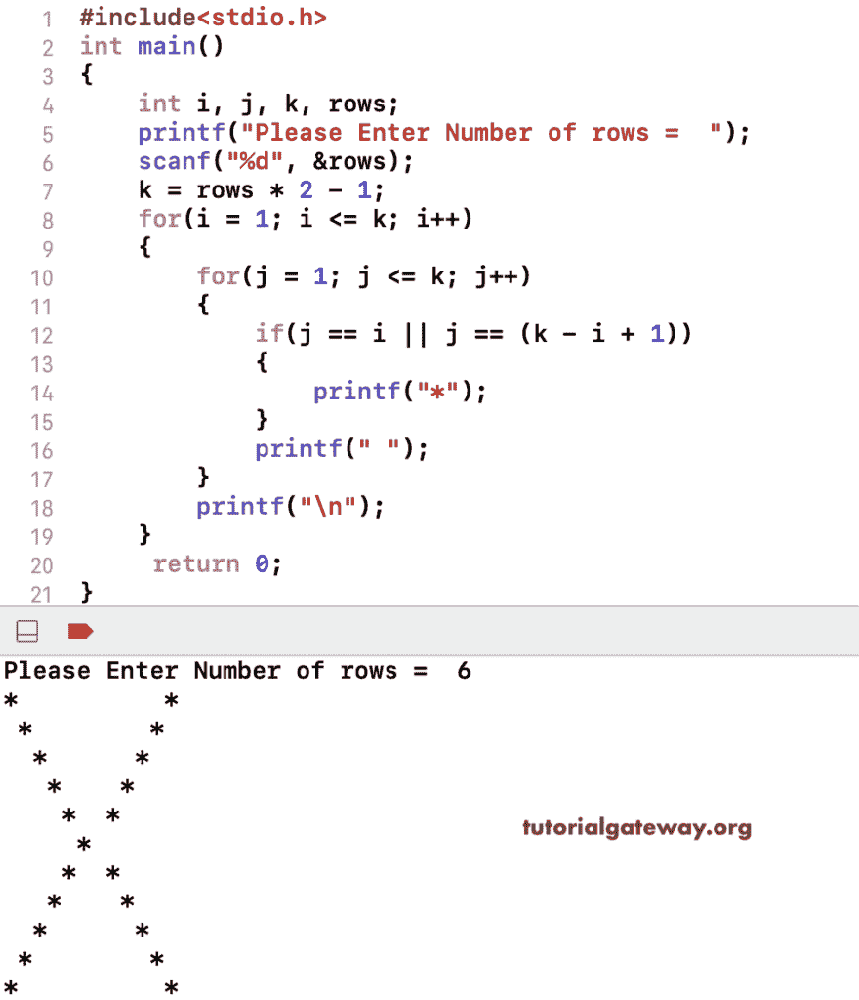

# C 程序：打印`X`星形图案

> 原文：<https://www.tutorialgateway.org/c-program-to-print-x-star-pattern/>

写一个 C 程序打印`X`星形图案用于循环。这个 c 例子使用嵌套的 for 循环和 if 条件来定位 X 模式。

```c
#include<stdio.h>
int main()
{
 	int i, j, k, rows; 
 	printf("Please Enter Number of rows =  ");
 	scanf("%d", &rows);

	k = rows * 2 - 1;

	for(i = 1; i <= k; i++)
	{
		for(j = 1; j <= k; j++)
		{
			if(j == i || j == (k - i + 1))
			{
				printf("*");
			}
			printf(" ");
		}
		printf("\n");
	}
 	return 0;
}
```



这个 C 程序使用 while 循环来打印`X`星形图案。

```c
#include<stdio.h>
int main()
{
 	int i, j, k, rows; 
 	printf("Please Enter Number of rows =  ");
 	scanf("%d", &rows);

	k = rows * 2 - 1;
    i = 1;

	while(i <= k)
	{
        j = 1;
		while(j <= k)
		{
			if(j == i || j == (k - i + 1))
			{
				printf("*");
			}
			printf(" ");
            j++;
		}
		printf("\n");
        i++;
	}
 	return 0;
}
```

```c
Please Enter Number of rows =  8
*              * 
 *            *  
  *          *   
   *        *    
    *      *     
     *    *      
      *  *       
       *        
      *  *       
     *    *      
    *      *     
   *        *    
  *          *   
 *            *  
*              * 
```

在这个 [C 程序](https://www.tutorialgateway.org/c-programming-examples/)中，我们输入一个符号，并使用函数以 X 模式打印该符号。

```c
#include<stdio.h>

void xPatternFunc(int rows, char symbol)
{
    int i, j, k;

    k = rows * 2 - 1;

	for(i = 1; i <= k; i++)
	{
		for(j = 1; j <= k; j++)
		{
			if(j == i || j == (k - i + 1))
			{
				printf("%c", symbol);
			}
			printf(" ");
		}
		printf("\n");
	}
}
int main()
{
 	int rows;
    char symbol;

    printf("Please Enter Symbol to print =  ");
    scanf("%c", &symbol);

 	printf("Please Enter Number of rows =  ");
 	scanf("%d", &rows);

    xPatternFunc(rows, symbol);
 	return 0;
}
```

```c
Please Enter Symbol to print =  $
Please Enter Number of rows =  7
$            $ 
 $          $  
  $        $   
   $      $    
    $    $     
     $  $      
      $       
     $  $      
    $    $     
   $      $    
  $        $   
 $          $  
$            $ 
```