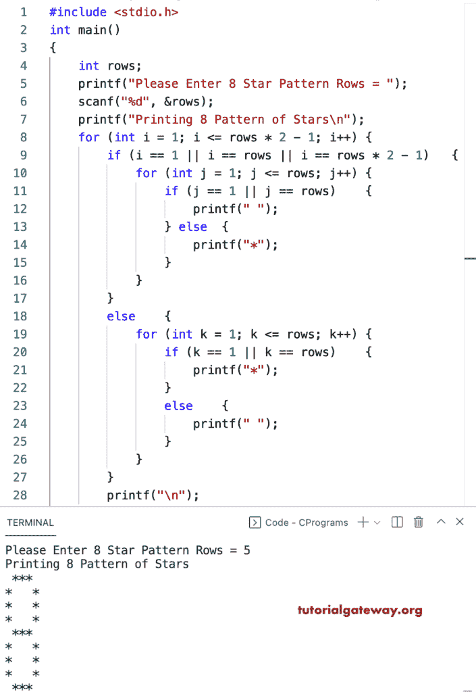

# C 程序：打印星号的`8`图案

> 原文：<https://www.tutorialgateway.org/c-program-to-print-8-star-pattern/>

写一个 C 程序打印星号的`8`图案用于循环。

```c
#include <stdio.h>

int main()
{
	int rows;

	printf("Please Enter 8 Star Pattern Rows = ");
	scanf("%d", &rows);

	printf("Printing 8 Pattern of Stars\n");

	for (int i = 1; i <= rows * 2 - 1; i++)
	{
		if (i == 1 || i == rows || i == rows * 2 - 1)
		{
			for (int j = 1; j <= rows; j++)
			{
				if (j == 1 || j == rows)
				{
					printf(" ");
				}
				else
				{
					printf("*");
				}
			}
		}
		else
		{
			for (int k = 1; k <= rows; k++)
			{
				if (k == 1 || k == rows)
				{
					printf("*");
				}
				else
				{
					printf(" ");
				}
			}
		}
		printf("\n");
	}
}
```



## 使用 while 循环打印星号的`8`图案的 c 程序

```c
#include <stdio.h>

int main()
{
	int i, j, k, rows;

	printf("Please Enter 8 Star Pattern Rows = ");
	scanf("%d", &rows);

	printf("Printing 8 Pattern of Stars\n");
	i = 1;
	while (i <= rows * 2 - 1)
	{
		if (i == 1 || i == rows || i == rows * 2 - 1)
		{
			j = 1;
			while (j <= rows)
			{
				if (j == 1 || j == rows)
				{
					printf(" ");
				}
				else
				{
					printf("*");
				}
				j++;
			}
		}
		else
		{
			k = 1;
			while (k <= rows)
			{
				if (k == 1 || k == rows)
				{
					printf("*");
				}
				else
				{
					printf(" ");
				}
				k++;
			}
		}
		printf("\n");
		i++;
	}
}
```

```c
Please Enter 8 Star Pattern Rows = 10
Printing 8 Pattern of Stars
 ******** 
*        *
*        *
*        *
*        *
*        *
*        *
*        *
*        *
 ******** 
*        *
*        *
*        *
*        *
*        *
*        *
*        *
*        *
 ******** 
```

这个 C 程序使用 do while 循环打印星号的 8 位图案。

```c
#include <stdio.h>

int main()
{
	int i, j, k, rows;

	printf("Please Enter 8 Pattern Rows = ");
	scanf("%d", &rows);

	printf("Printing 8 Pattern of Stars\n");
	i = 1;
	do
	{
		if (i == 1 || i == rows || i == rows * 2 - 1)
		{
			j = 1;
			do
			{
				if (j == 1 || j == rows)
				{
					printf(" ");
				}
				else
				{
					printf("*");
				}
			} while (++j <= rows);
		}
		else
		{
			k = 1;
			do
			{
				if (k == 1 || k == rows)
				{
					printf("*");
				}
				else
				{
					printf(" ");
				}
			} while (++k <= rows);
		}
		printf("\n");
	} while (++i <= rows * 2 - 1);
}
```

```c
Please Enter 8 Pattern Rows = 12
Printing 8 Pattern of Stars
 ********** 
*          *
*          *
*          *
*          *
*          *
*          *
*          *
*          *
*          *
*          *
 ********** 
*          *
*          *
*          *
*          *
*          *
*          *
*          *
*          *
*          *
*          *
 ********** 
```

在本 [C 示例](https://www.tutorialgateway.org/c-programming-examples/)中，printingPattern8 函数允许行&字符，并打印给定字符的 8 位模式。

```c
#include <stdio.h>

void printingPattern8(int rows, char ch);

int main()
{
	int rows;
	char ch;

	printf("Enter Character for 8 Pattern = ");
	scanf("%c", &ch);

	printf("Please Enter 8 Pattern Rows = ");
	scanf("%d", &rows);

	printf("Printing 8 Pattern of Stars\n");
	printingPattern8(rows, ch);
}

void printingPattern8(int rows, char ch)
{
	for (int i = 1; i <= rows * 2 - 1; i++)
	{
		if (i == 1 || i == rows || i == rows * 2 - 1)
		{
			for (int j = 1; j <= rows; j++)
			{
				if (j == 1 || j == rows)
				{
					printf(" ");
				}
				else
				{
					printf("%c", ch);
				}
			}
		}
		else
		{
			for (int k = 1; k <= rows; k++)
			{
				if (k == 1 || k == rows)
				{
					printf("%c", ch);
				}
				else
				{
					printf(" ");
				}
			}
		}
		printf("\n");
	}
}
```

```c
Enter Character for 8 Pattern = ^
Please Enter 8 Pattern Rows = 14
Printing 8 Pattern of Stars
 ^^^^^^^^^^^^ 
^            ^
^            ^
^            ^
^            ^
^            ^
^            ^
^            ^
^            ^
^            ^
^            ^
^            ^
^            ^
 ^^^^^^^^^^^^ 
^            ^
^            ^
^            ^
^            ^
^            ^
^            ^
^            ^
^            ^
^            ^
^            ^
^            ^
^            ^
 ^^^^^^^^^^^^ 
```