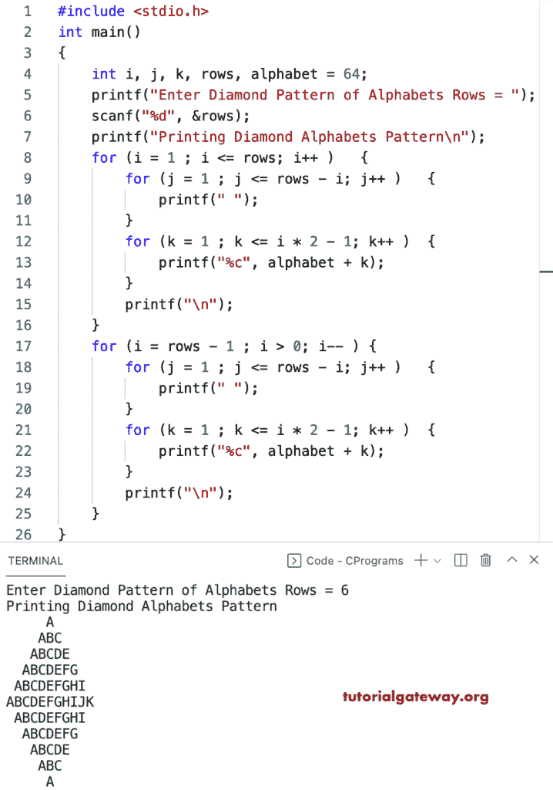

# C 程序：打印字母的菱形图案

> 原文：<https://www.tutorialgateway.org/c-program-to-print-diamond-alphabets-pattern/>

写一个 C 程序打印字母的菱形图案用于循环。

```c
#include <stdio.h>

int main()
{
	int i, j, k, rows, alphabet = 64;

	printf("Enter Diamond Pattern of Alphabets Rows = ");
	scanf("%d", &rows);

	printf("Printing Diamond Alphabets Pattern\n");
	for (i = 1 ; i <= rows; i++ ) 
	{
		for (j = 1 ; j <= rows - i; j++ ) 
		{
			printf(" ");	
		}
		for (k = 1 ; k <= i * 2 - 1; k++ ) 
		{
			printf("%c", alphabet + k);
		}
		printf("\n");
	}

	for (i = rows - 1 ; i > 0; i-- ) 
	{
		for (j = 1 ; j <= rows - i; j++ ) 
		{
			printf(" ");
		}
		for (k = 1 ; k <= i * 2 - 1; k++ ) 
		{
			printf("%c", alphabet + k);
		}
		printf("\n");
	}
}
```



这是另一种编写 C 程序来显示字母菱形图案的方法。

```c
#include <stdio.h>

int main()
{
	int i, j, k, rows, alphabet = 65;

	printf("Enter Diamond Pattern of Alphabets Rows = ");
	scanf("%d", &rows);

	printf("Printing Diamond Alphabets Pattern\n");

	for (i = 0; i <= rows - 1; i++)
	{
		for (j = rows - 1; j >= i; j--)
		{
			printf(" ");
		}
		for (k = 0; k <= i; k++)
		{
			printf("%c ", alphabet + k);
		}
		printf("\n");;
	}

	for (i = 0; i <= rows - 1; i++)
	{
		for (j = -1; j <= i; j++)
		{
			printf(" ");
		}
		for (k = 0; k <= rows - i - 2; k++)
		{
			printf("%c ", alphabet + k);
		}
		printf("\n");;
	}
}
```

```c
Enter Diamond Pattern of Alphabets Rows = 10
Printing Diamond Alphabets Pattern
          A 
         A B 
        A B C 
       A B C D 
      A B C D E 
     A B C D E F 
    A B C D E F G 
   A B C D E F G H 
  A B C D E F G H I 
 A B C D E F G H I J 
  A B C D E F G H I 
   A B C D E F G H 
    A B C D E F G 
     A B C D E F 
      A B C D E 
       A B C D 
        A B C 
         A B 
          A 
```

这个 [C 示例](https://www.tutorialgateway.org/c-programming-examples/)使用 while 循环打印字母的菱形图案。

```c
#include <stdio.h>

int main()
{
	int i, j, k, l, rows, alphabet = 64;

	printf("Enter Diamond Pattern of Alphabets Rows = ");
	scanf("%d", &rows);

	printf("Printing Diamond Alphabets Pattern\n");

	for (i = 1; i <= rows; i++)
	{
		for (j = 1; j <= rows - i; j++)
		{
			printf(" ");
		}
		for (k = i; k >= 1; k--)
		{
			printf("%c", alphabet + k);
		}
		for (l = 2; l <= i; l++)
		{
			printf("%c", alphabet + l);
		}
		printf("\n");
	}

	for (i = rows - 1; i > 0; i--)
	{
		for (j = 1; j <= rows - i; j++)
		{
			printf(" ");
		}
		for (k = i; k >= 1; k--)
		{
			printf("%c", alphabet + k);
		}
		for (l = 2; l <= i; l++)
		{
			printf("%c", alphabet + l);
		}
		printf("\n");
	}
}
```

```c
Enter Diamond Pattern of Alphabets Rows = 13
Printing Diamond Alphabets Pattern
            A
           BAB
          CBABC
         DCBABCD
        EDCBABCDE
       FEDCBABCDEF
      GFEDCBABCDEFG
     HGFEDCBABCDEFGH
    IHGFEDCBABCDEFGHI
   JIHGFEDCBABCDEFGHIJ
  KJIHGFEDCBABCDEFGHIJK
 LKJIHGFEDCBABCDEFGHIJKL
MLKJIHGFEDCBABCDEFGHIJKLM
 LKJIHGFEDCBABCDEFGHIJKL
  KJIHGFEDCBABCDEFGHIJK
   JIHGFEDCBABCDEFGHIJ
    IHGFEDCBABCDEFGHI
     HGFEDCBABCDEFGH
      GFEDCBABCDEFG
       FEDCBABCDEF
        EDCBABCDE
         DCBABCD
          CBABC
           BAB
            A
```