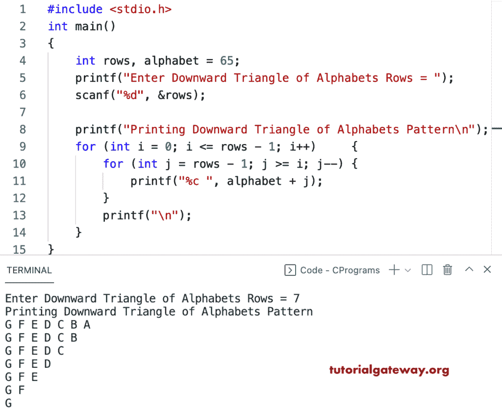

# C 程序：打印字母的向下三角形图案

> 原文：<https://www.tutorialgateway.org/c-program-to-print-downward-triangle-alphabets-pattern/>

写一个 C 程序来打印字母的向下的三角形图案，用于循环。

```c
#include <stdio.h>

int main()
{
	int rows, alphabet = 65;

	printf("Enter Downward Triangle of Alphabets Rows = ");
	scanf("%d", &rows);

	printf("Printing Downward Triangle of Alphabets Pattern\n");
	for (int i = 0; i <= rows - 1; i++)
	{
		for (int j = rows - 1; j >= i; j--)
		{
			printf("%c ", alphabet + j);
		}
		printf("\n");
	}
}
```



这个 [C 示例](https://www.tutorialgateway.org/c-programming-examples/)使用 while 循环打印字母的向下三角形模式。

```c
#include <stdio.h>

int main()
{

	int i, j, rows, alphabet = 65;

	printf("Enter Downward Triangle of Alphabets Rows = ");
	scanf("%d", &rows);

	printf("Printing Downward Triangle of Alphabets Pattern\n");

	i = 0;
	while (i <= rows - 1)
	{
		j = rows - 1;
		while (j >= i)
		{
			printf("%c ", alphabet + j);
			j--;
		}
		printf("\n");
		i++;
	}
}
```

```c
Enter Downward Triangle of Alphabets Rows = 10
Printing Downward Triangle of Alphabets Pattern
J I H G F E D C B A 
J I H G F E D C B 
J I H G F E D C 
J I H G F E D 
J I H G F E 
J I H G F 
J I H G 
J I H 
J I 
J 
```

这个 C 程序使用 do while 循环来显示字母的向下三角形模式。

```c
#include <stdio.h>

int main()
{

	int i, j, rows, alphabet = 65;

	printf("Enter Downward Triangle of Alphabets Rows = ");
	scanf("%d", &rows);

	printf("Printing Downward Triangle Alphabets Pattern\n");

	i = 0;
	do
	{
		j = rows - 1;
		do
		{
			printf("%c ", alphabet + j);

		} while (--j >= i);
		printf("\n");

	} while (++i <= rows - 1);
}
```

```c
Enter Downward Triangle of Alphabets Rows = 16
Printing Downward Triangle Alphabets Pattern
P O N M L K J I H G F E D C B A 
P O N M L K J I H G F E D C B 
P O N M L K J I H G F E D C 
P O N M L K J I H G F E D 
P O N M L K J I H G F E 
P O N M L K J I H G F 
P O N M L K J I H G 
P O N M L K J I H 
P O N M L K J I 
P O N M L K J 
P O N M L K 
P O N M L 
P O N M 
P O N 
P O 
P
```