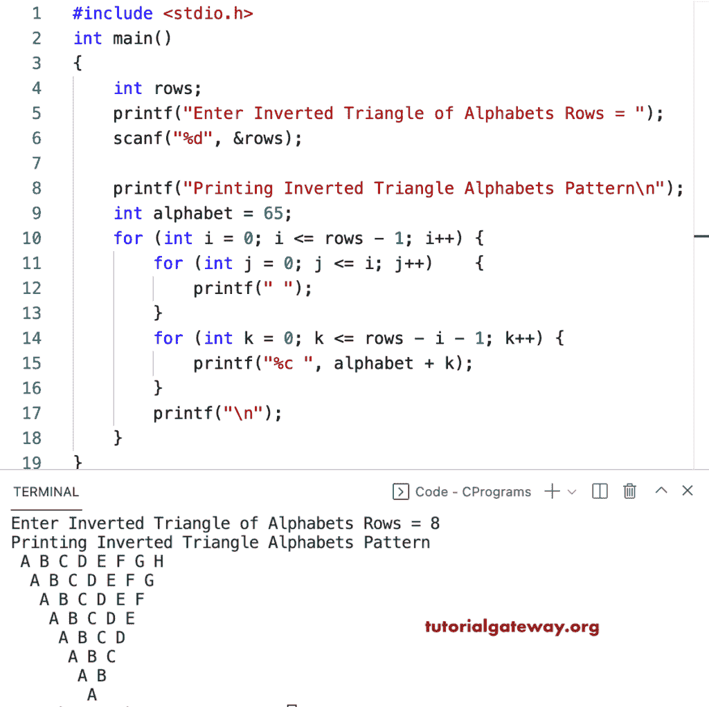

# C 程序：打印倒三角字母图案

> 原文：<https://www.tutorialgateway.org/c-program-to-print-inverted-triangle-alphabets-pattern/>

写一个 C 程序打印倒三角字母图案用于循环。

```c
#include <stdio.h>

int main()
{
	int rows;

	printf("Enter Inverted Triangle of Alphabets Rows = ");
	scanf("%d", &rows);

	printf("Printing Inverted Triangle Alphabets Pattern\n");
	int alphabet = 65;

	for (int i = 0; i <= rows - 1; i++)
	{
		for (int j = 0; j <= i; j++)
		{
			printf(" ");
		}
		for (int k = 0; k <= rows - i - 1; k++)
		{
			printf("%c ", alphabet + k);
		}
		printf("\n");
	}
}
```



这个 C 示例使用 while 循环打印字母的倒三角模式。

```c
#include <stdio.h>

int main()
{
	int rows, i, j, k, alphabet;

	printf("Enter Inverted Triangle of Alphabets Rows = ");
	scanf("%d", &rows);

	printf("Printing Inverted Triangle Alphabets Pattern\n");
	alphabet = 65;

	i = 0;

	while (i <= rows - 1)
	{

		j = 0;
		while (j <= i)
		{
			printf(" ");
			j++;
		}

		k = 0;
		while (k <= rows - i - 1)
		{
			printf("%c ", alphabet + k);
			k++;
		}
		printf("\n");
		i++;
	}
}
```

```c
Enter Inverted Triangle of Alphabets Rows = 13
Printing Inverted Triangle Alphabets Pattern
 A B C D E F G H I J K L M 
  A B C D E F G H I J K L 
   A B C D E F G H I J K 
    A B C D E F G H I J 
     A B C D E F G H I 
      A B C D E F G H 
       A B C D E F G 
        A B C D E F 
         A B C D E 
          A B C D 
           A B C 
            A B 
             A 
```

在这个 [C 模式](https://www.tutorialgateway.org/c-programming-examples/)的例子中，我们使用 do while 循环来显示字母的倒三角。

```c
#include <stdio.h>

int main()
{
	int rows, i, j, k, alphabet;

	printf("Enter Inverted Triangle of Alphabets Rows = ");
	scanf("%d", &rows);

	printf("Printing Inverted Triangle Alphabets Pattern\n");
	alphabet = 65;

	i = 0;

	do
	{
		j = 0;
		do
		{
			printf(" ");

		} while (j++ <= i);

		k = 0;
		do
		{
			printf("%c ", alphabet + k);

		} while (++k <= rows - i - 1);

		printf("\n");

	} while (++i <= rows - 1);
}
```

```c
Enter Inverted Triangle of Alphabets Rows = 16
Printing Inverted Triangle Alphabets Pattern
  A B C D E F G H I J K L M N O P 
   A B C D E F G H I J K L M N O 
    A B C D E F G H I J K L M N 
     A B C D E F G H I J K L M 
      A B C D E F G H I J K L 
       A B C D E F G H I J K 
        A B C D E F G H I J 
         A B C D E F G H I 
          A B C D E F G H 
           A B C D E F G 
            A B C D E F 
             A B C D E 
              A B C D 
               A B C 
                A B 
                 A 
```